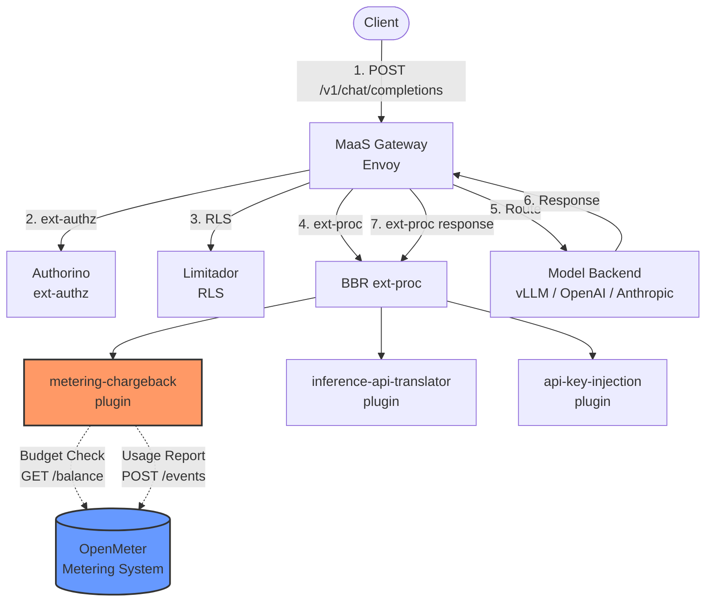
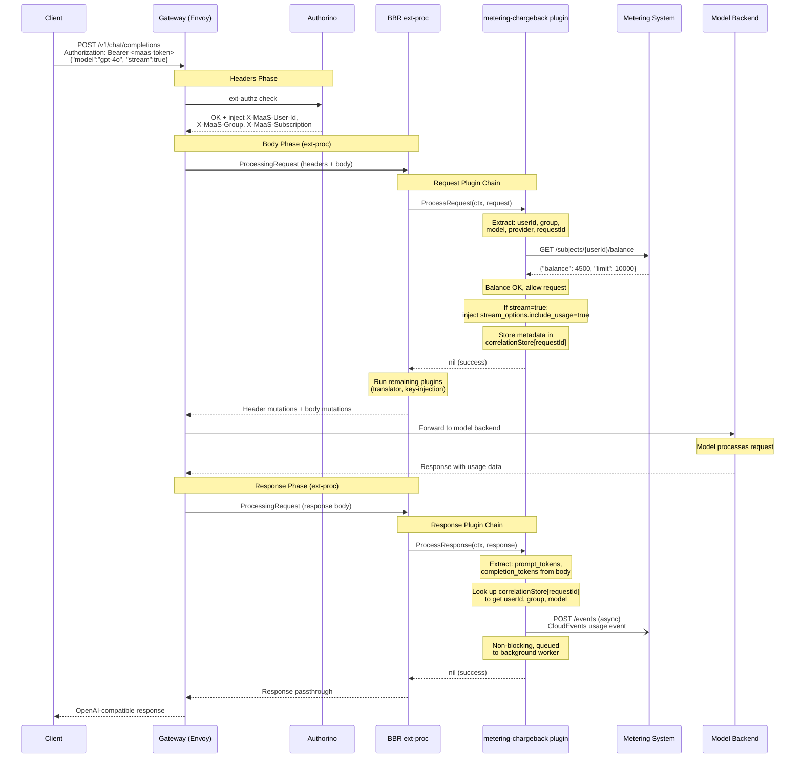
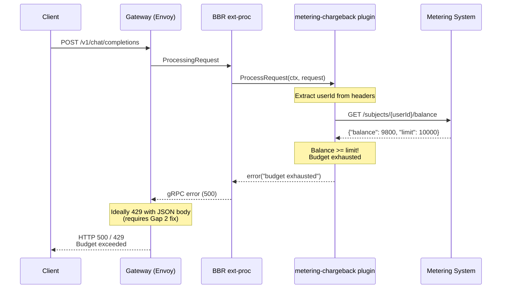
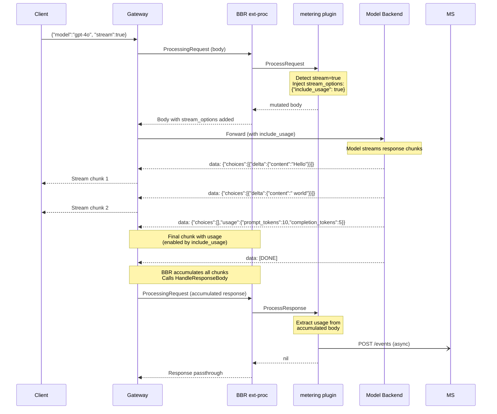
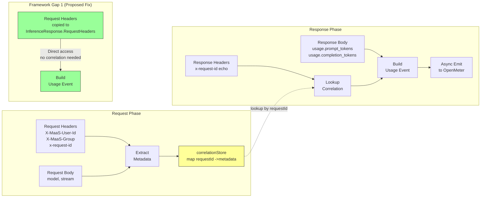
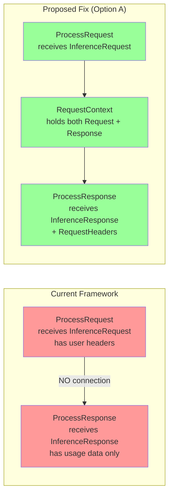
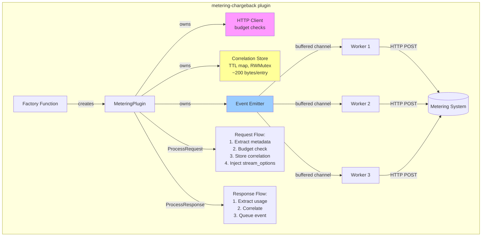
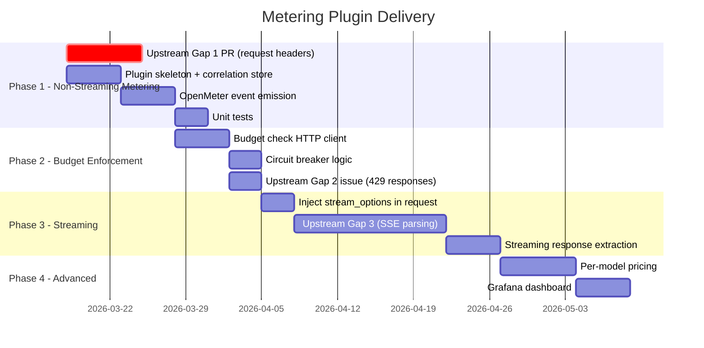

# Metering and Chargeback BBR Plugin -- Design Document

**Status**: Draft
**Date**: March 2026
**Author**: Noy Itzikowitz
**Release Target**: RHOAI 3.4+

---

## Problem

MaaS needs to meter LLM token consumption per user/group/model and enforce budget-based access control. Today there is no mechanism to:

1. Report token usage (prompt + completion tokens) to an external metering system per request
2. Enforce budget limits -- block requests when a user/group has exhausted their token budget
3. Handle streaming responses where token usage is only available in the final SSE chunk

Without metering, MaaS cannot offer chargeback, cost allocation, or budget enforcement for inference workloads.

---

## Requirements

| # | Requirement | Priority |
|---|-------------|----------|
| 1 | Report token usage per request to an external metering system (e.g., OpenMeter) | P0 |
| 2 | Include user identity, group, model, and provider in each metering event | P0 |
| 3 | Budget enforcement -- pre-flight check before allowing a request | P0 |
| 4 | Streaming support -- inject `stream_options: {"include_usage": true}` to ensure usage data is available | P0 |
| 5 | Async metering emission -- do not block the response path for metering | P1 |
| 6 | Graceful degradation -- metering system unavailability must not block inference | P1 |
| 7 | Production grade -- no storing of request/response bodies (only metadata), bounded memory | P0 |

---

## Architecture

### High-Level Component Diagram



### Request Flow Sequence Diagram



### Budget Denial Flow



### Streaming Token Extraction Flow



### Correlation Architecture



### Metering Event Schema (OpenMeter-compatible)

```json
{
  "specversion": "1.0",
  "id": "<request-id>",
  "source": "maas-gateway",
  "type": "inference.tokens.used",
  "subject": "<user-id>",
  "time": "2026-03-17T12:00:00Z",
  "data": {
    "model": "gpt-4o",
    "provider": "openai",
    "group": "team-a",
    "subscription": "premium",
    "prompt_tokens": 150,
    "completion_tokens": 42,
    "total_tokens": 192
  }
}
```

OpenMeter uses CloudEvents format. A Meter is defined server-side to aggregate these events by subject (user) over time windows.

### Budget Check (Pre-flight)

```
GET /api/v1/subjects/<user-id>/entitlements/<meter-id>/balance
--> { "balance": 4500, "limit": 10000 }

If balance >= limit --> deny request (return 429 / budget exhausted)
```

---

## BBR Framework Gaps

### Gap 1: No Request-Response Correlation (CRITICAL)

**Current state**: `ProcessRequest` receives `*InferenceRequest` and `ProcessResponse` receives `*InferenceResponse`. There is no mechanism for a plugin to store state during request processing and access it during response processing.

The server-side `RequestContext` persists across both phases, but plugins never see it. The `ProcessResponse` signature only passes `*InferenceResponse`, which contains response headers from the upstream provider -- NOT the original request headers (where user identity lives).

**Impact**: The metering plugin cannot correlate response token usage with the user/model from the request. It needs to know WHO made the request to emit a usage event, but that information is only available during `ProcessRequest`.



**Proposed solution (recommended)**: Modify the BBR framework's `HandleResponseBody` to pass request-phase headers to response plugins. The `RequestContext` already holds both `Request` and `Response` -- the change is to make request headers available during response processing.

**Option A: Pass request headers to `InferenceResponse` (recommended)**

Before calling `runResponsePlugins`, copy the original request headers into `InferenceResponse`:

```go
// In handlers/response.go HandleResponseBody, before runResponsePlugins:
reqCtx.Response.RequestHeaders = reqCtx.Request.Headers  // NEW field
```

```go
// Updated framework/types.go
type InferenceResponse struct {
    InferenceMessage
    RequestHeaders map[string]string  // NEW: original request headers, read-only
}
```

This is minimal, safe (read-only copy), and gives response plugins everything they need: the user identity headers (`X-MaaS-User-Id`, `X-MaaS-Group`) from the request, alongside the response body with token usage.

**Option B: Shared `PluginContext` map**

Add a `Metadata map[string]any` field to a shared context that persists across request and response.

**Option C: Go `context.Context` propagation**

Use `context.WithValue` if the framework passes the same `ctx` to both phases.

**Recommendation**: Option A is simplest, safest, and most production-ready. It requires a small upstream change (~10 lines). We should contribute this to the inference gateway.

**Action**: File upstream issue AND PR on `kubernetes-sigs/gateway-api-inference-extension` implementing Option A.

**Workaround (short-term)**: In-process concurrent map keyed by `x-request-id` header.

### Gap 2: Structured Error Responses (P1)

**Current state**: A `RequestProcessor` returning an error causes a gRPC status error to Envoy, which becomes HTTP 500 to the client.

**Impact**: Budget denial should return HTTP 429 with `{"error": {"message": "token budget exceeded"}}`.

**Proposed solution**: Support Envoy `ImmediateResponse` in BBR error handling.

### Gap 3: Streaming Response Handling (P1)

**Current state**: BBR accumulates SSE chunks and tries `json.Unmarshal` on the concatenated bytes. SSE format is NOT valid JSON.

**Impact**: Response plugins cannot process streaming responses.

**Related upstream issue**: [#2482](https://github.com/kubernetes-sigs/gateway-api-inference-extension/issues/2482) -- active work on SSE usage extraction in EPP.

---

## Plugin Design

### Plugin Type: `metering-chargeback`

Implements both `RequestProcessor` and `ResponseProcessor`.

### Configuration

```json
{
  "meteringEndpoint": "http://openmeter.metering-system.svc:8888",
  "budgetCheckEnabled": true,
  "budgetCheckPath": "/api/v1/subjects/{subject}/entitlements/{meter}/balance",
  "usageReportPath": "/api/v1/events",
  "meterSlug": "inference-tokens",
  "failOpen": true,
  "asyncBufferSize": 1000,
  "httpTimeoutMs": 500,
  "userHeader": "X-MaaS-User-Id",
  "groupHeader": "X-MaaS-Group",
  "subscriptionHeader": "X-MaaS-Subscription",
  "providerHeader": "X-Gateway-Destination-Provider"
}
```

### Plugin Internal Architecture



### RequestProcessor Flow

```
ProcessRequest(ctx, request):
  1. Extract metadata from headers (lightweight, no body storage):
     - userId    = request.Headers["X-MaaS-User-Id"]
     - group     = request.Headers["X-MaaS-Group"]
     - subscription = request.Headers["X-MaaS-Subscription"]
     - provider  = request.Headers["X-Gateway-Destination-Provider"]
     - model     = request.Body["model"]
     - requestId = request.Headers["x-request-id"] or generate UUID
     - isStreaming = request.Body["stream"] == true

  2. Budget check (if enabled):
     - HTTP GET to metering system: /subjects/{userId}/balance
     - If balance >= limit --> return error ("budget exhausted")
     - If metering system unreachable and failOpen=true --> allow
     - If metering system unreachable and failOpen=false --> deny

  3. Store metadata for response correlation:
     - correlationStore[requestId] = {userId, group, model, provider, timestamp}
     - TTL: 30s default

  4. If streaming:
     - Inject stream_options.include_usage=true into body

  5. Ensure request ID is in headers for correlation
```

### ResponseProcessor Flow

```
ProcessResponse(ctx, response):
  1. Extract token usage from response body:
     - OpenAI: usage.prompt_tokens, usage.completion_tokens
     - Anthropic: usage.input_tokens, usage.output_tokens

  2. Correlate with request metadata:
     - Look up requestId from response headers or body["id"]
     - Retrieve from correlationStore
     - If not found --> emit with partial data (graceful degradation)

  3. Build and emit usage event (async):
     - Queue to eventChannel for background emission

  4. Cleanup correlation entry
```

### Correlation Store (In-Process)

```go
type correlationEntry struct {
    UserID       string
    Group        string
    Subscription string
    Model        string
    Provider     string
    Timestamp    time.Time
    IsStreaming   bool
}

type correlationStore struct {
    mu      sync.RWMutex
    entries map[string]correlationEntry  // keyed by request ID
    ttl     time.Duration
}
```

- Entries are small (~200 bytes each) -- no body storage
- TTL-based cleanup goroutine evicts stale entries
- Bounded map size with eviction when full
- Thread-safe with RWMutex

### Async Event Emission

```go
type eventEmitter struct {
    client  *http.Client
    url     string
    channel chan UsageEvent
    wg      sync.WaitGroup
}
```

- Buffered channel (configurable, default 1000)
- Multiple worker goroutines (default 3)
- Retry with exponential backoff (max 3 attempts)
- Events dropped if channel full (counter metric incremented)
- Graceful shutdown via channel close + WaitGroup

---

## Upstream Issues to File

| # | Issue | Repo | Priority | Impact | Action |
|---|-------|------|----------|--------|--------|
| 1 | **Pass request headers to response plugins** -- Add `RequestHeaders` field to `InferenceResponse`, populated from `RequestContext` before `runResponsePlugins` | kubernetes-sigs/gateway-api-inference-extension | P0 | Without this, response plugins cannot access user identity from request | File issue + contribute PR (~10 lines) |
| 2 | **ImmediateResponse support** -- Allow plugins to return structured HTTP error responses (e.g., 429 with JSON body) instead of gRPC errors | kubernetes-sigs/gateway-api-inference-extension | P1 | Budget denial returns 500 instead of 429 | File issue |
| 3 | **SSE-aware response processing** -- Parse SSE streaming format to extract final chunk with usage data | kubernetes-sigs/gateway-api-inference-extension | P1 | Streaming metering requires manual parsing | File issue |

---

## File Structure

```
ai-gateway-payload-processing/
  pkg/plugins/
    metering_chargeback/
      plugin.go              # Plugin struct, factory, ProcessRequest, ProcessResponse
      correlation.go         # In-process correlation store with TTL
      emitter.go             # Async event emitter with buffered channel
      budget.go              # Budget check HTTP client
      providers/
        openmeter.go         # OpenMeter-specific event format and API client
        openmeter_test.go
      tests/
        plugin_test.go
```

---

## Delivery Phases



### Phase 1: Non-Streaming Metering (P0)
- RequestProcessor: extract user/group/model, correlation store
- ResponseProcessor: extract token usage, emit async event
- OpenMeter integration (CloudEvents format)
- Requires: upstream Gap 1 fix (or workaround)

### Phase 2: Budget Enforcement (P0)
- Pre-flight HTTP callout to metering system
- Block request if budget exhausted
- Fail-open/fail-closed configuration

### Phase 3: Streaming Support (P1)
- Inject `stream_options: {"include_usage": true}` in request body
- SSE-aware response parsing (requires upstream Gap 3)

### Phase 4: Advanced Features (P2)
- Per-model pricing, Limitador integration, dashboards

---

## Open Questions

1. **Which metering system?** OpenMeter is the reference, but the plugin should be backend-agnostic via the provider pattern.
2. **Where does budget configuration live?** In the metering system or in MaaS CRDs?
3. **Who configures the metering endpoint?** Admin via BBR plugin config, or MaaS controller via ConfigMap?
4. **Should metering be opt-in per model?** Or always-on?
5. **x-request-id availability**: Is the gateway guaranteed to set this header?

---

## Existing Upstream Work

| Issue/PR | Status | Relevance |
|----------|--------|-----------|
| [#2586](https://github.com/kubernetes-sigs/gateway-api-inference-extension/issues/2586) -- ResponseProcessor initialization bug | Fixed (PR #2589, Mar 15) | Response plugins now wired in runner |
| [#2449](https://github.com/kubernetes-sigs/gateway-api-inference-extension/issues/2449) -- Response plugin integration tests | Open, assigned | Tests for response plugin execution |
| [#2482](https://github.com/kubernetes-sigs/gateway-api-inference-extension/issues/2482) -- Streaming usage extraction bug | Open, assigned | SSE streaming usage not extracted correctly -- directly related to Gap 3 |
| [#2019](https://github.com/kubernetes-sigs/gateway-api-inference-extension/issues/2019) -- Cost reporting via dynamic metadata | Closed | EPP-side cost reporting design |
| [#2354](https://github.com/kubernetes-sigs/gateway-api-inference-extension/issues/2354) -- Mirror request plugins to response path | Closed | Original issue that added response plugin support |
| [#2430](https://github.com/kubernetes-sigs/gateway-api-inference-extension/issues/2430) -- Move EPP and BBR to llm-d repo | Open | BBR may move repos |
| **Gap 1: Request-response correlation** | **NOT FILED** | No existing issue. We need to file this. |
| **Gap 2: ImmediateResponse / structured errors** | **NOT FILED** | No existing issue. |

---

## References

- [OpenMeter Documentation](https://openmeter.io/docs)
- [OpenMeter CloudEvents Ingestion](https://openmeter.io/docs/getting-started/ingest)
- [BBR Pluggable Framework](https://github.com/kubernetes-sigs/gateway-api-inference-extension/tree/main/pkg/bbr)
- [Egress Inference Support -- Solution Overview](https://github.com/noyitz/maas-designs/blob/main/vsr-maas-integration/phase-1-design-v1.3.md)
- [vLLM stream usage flag](https://docs.vllm.ai/en/latest/serving/openai_compatible_server.html)
- Slack thread: wg-maas #metering (Feb-Mar 2026)
- JIRA: RHAIRFE-1315 (Consistent Usage and Rate Limiting Tracking)
