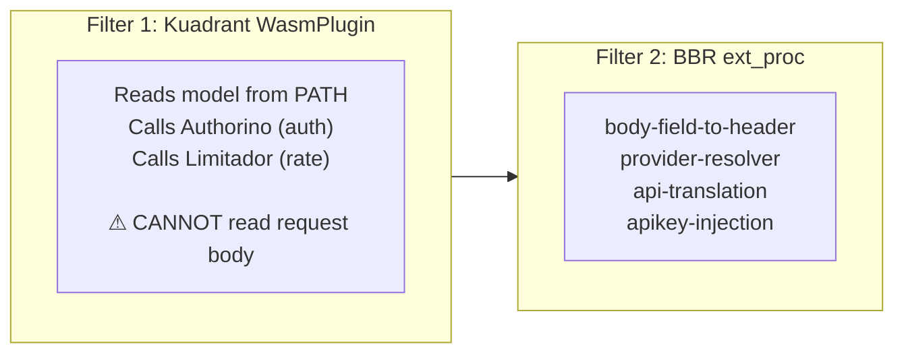
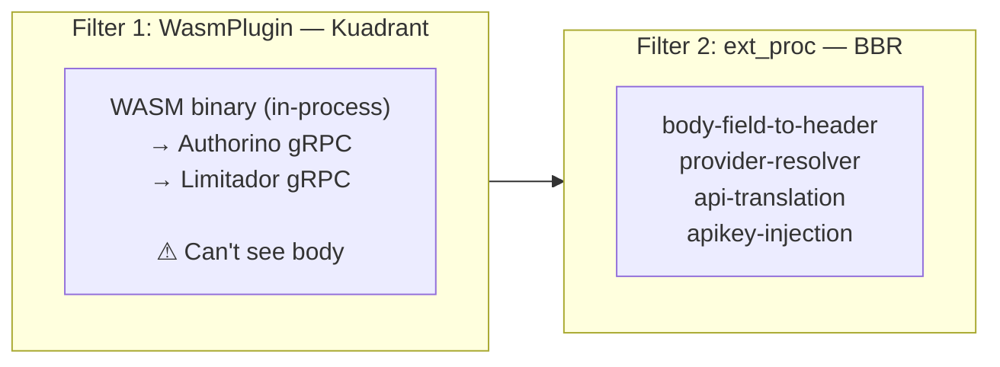
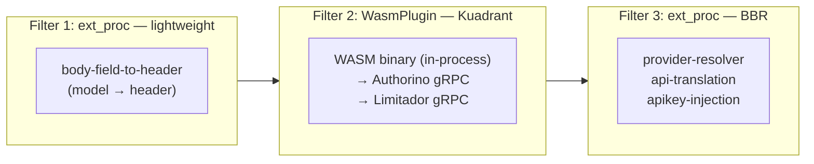
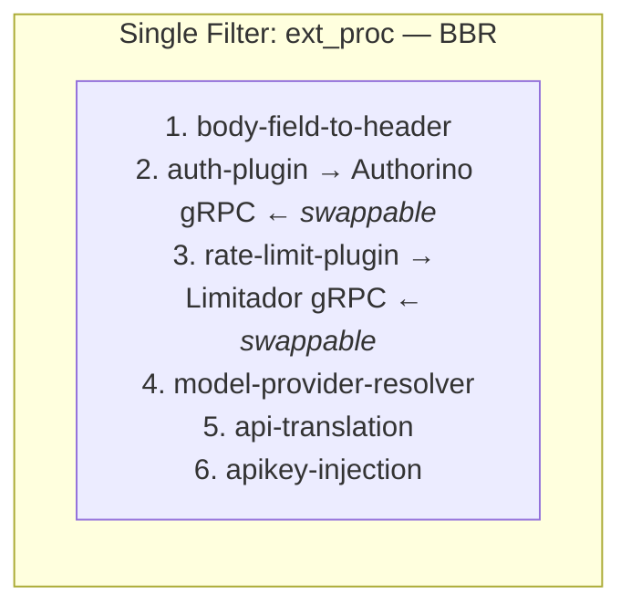
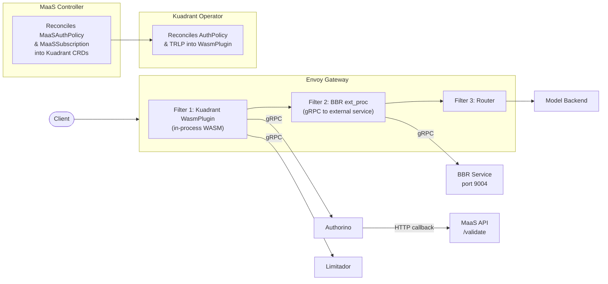
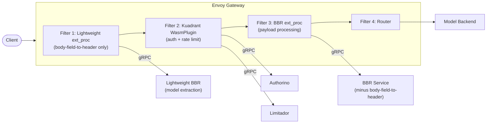
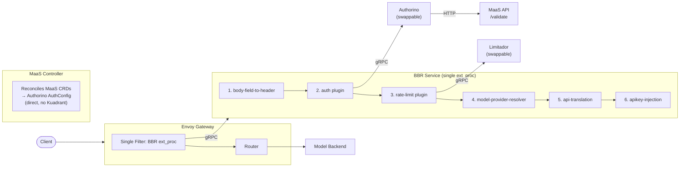

# Proposal: Unified Gateway Flow via Pluggable BBR

**Date:** April 15, 2026
**Author:** Noy Itzikowitz

---

## Executive Summary

This is a proposal for the unified entry point requirement in RHOAI 3.5 ([RHAIRFE-1304](https://redhat.atlassian.net/browse/RHAIRFE-1304)) that leverages the existing BBR plugin framework while keeping core components (Authorino, Limitador) in place. It breaks the current coupling where auth and rate limiting are wrapped together in a single filter, forcing BBR to work around their limitations. By making auth and rate limiting pluggable BBR plugins, it also opens a clean path to integrate other auth mechanisms or external metering and circuit-breaker systems in the future.

The core idea: **BBR becomes the single orchestration layer**, with auth and rate-limiting as swappable plugins that call Kuadrant's core components (Authorino, Limitador) directly via gRPC. This decouples the gateway flow from the Kuadrant operator's orchestration layer (WasmPlugin, CRD translation) while preserving Kuadrant's proven auth and rate-limiting backends — and enabling future pluggability.

---

## Problem Statement

### The Unified Entry Point Challenge

Today, model inference requests include the **model name** and **namespace** in the URL path:

```
POST https://maas.example.com/ llm / granite-3b /v1/chat/completions
                                ^^^   ^^^^^^^^^^
                            namespace  model name
```

Industry standard (OpenAI-compatible) APIs use a single endpoint with the model in the **request body**:

```
POST https://maas.example.com/v1/chat/completions
Body: {"model": "granite-3b", "messages": [...]}
```

To align with industry standards (RHAIRFE-1304), we need to remove the model from the URL path.

### Why This Breaks the Current Architecture

The root cause is **filter ordering in Envoy**. Today, the Kuadrant WasmPlugin (auth + rate limiting) runs as the **first filter**, before BBR (payload processing). Kuadrant uses the model name from the URL path to determine which AuthPolicy and TokenRateLimitPolicy apply to the request. **Kuadrant's WasmPlugin cannot read the request body** — it only sees headers and the path. If the model is no longer in the path, Kuadrant has no way to identify which model the request targets, and per-model auth and rate-limiting break.



> If model is removed from path → Kuadrant can't identify the model → auth/rate-limit break

### Why We Can't Simply Swap the Filter Order

A natural thought: swap BBR and Kuadrant so BBR runs first, extracts the model from the body, and Kuadrant can use it. **This doesn't work** because:

1. **Heavy payload processing should only run after auth passes.** api-translation, apikey-injection, and provider-resolver do significant work (external CRD lookups, request body transformation, secret access). Running these before auth means unauthenticated requests consume resources unnecessarily.

2. **Some payload plugins depend on auth data.** For example, subscription-based routing and metering need to know the user identity, which comes from the auth step.

3. **For external models, api-translation replaces the user's API key** with the provider's API key. If Kuadrant runs after BBR, it sees the provider key (`sk-ant-...`) instead of the user key (`sk-oai-...`). Auth and rate limiting break — Kuadrant can't identify the user.

### Why Splitting BBR Into Lightweight + Heavy Doesn't Scale

Since we can't swap the filter order, another approach is to split the BBR plugin chain in two: take the `body-field-to-header` plugin out of BBR and deploy it as a separate lightweight ext_proc that runs **before** Kuadrant. This lightweight ext_proc would extract the model from the request body and inject it as a header, so Kuadrant can see it. The remaining "heavy" BBR plugins (provider-resolver, api-translation, apikey-injection) stay as a second ext_proc **after** Kuadrant.

While this solves the immediate problem, it introduces a new one — **three separate Envoy filters**:

```
Filter 1: ext_proc (lightweight)    →  gRPC hop to lightweight BBR service
Filter 2: WasmPlugin (Kuadrant)     →  in-process WASM + gRPC to Authorino + gRPC to Limitador
Filter 3: ext_proc (BBR)            →  gRPC hop to BBR service (remaining plugins)
```

This means two separate ext_proc gRPC hops per request (one to the lightweight service, one to the main BBR service), two ext_proc services to deploy and maintain, and the tight Kuadrant coupling remains unchanged. It solves the immediate unified-entry-point problem but does not address the underlying architectural constraints.

### The Tight Coupling Problem

Beyond the unified entry point, the current architecture has three layers of CRD indirection:

```
MaaSAuthPolicy → MaaS Controller → Kuadrant AuthPolicy → Kuadrant Operator → Authorino AuthConfig
MaaSSubscription → MaaS Controller → Kuadrant TRLP → Kuadrant Operator → Limitador Rules
```

**Example: onboarding a single model.** When an admin adds a new model (e.g., `granite-3b`) and grants access to two teams with different rate limits, the following resources are created:

| Layer | Resources Created |
|-------|-------------------|
| KServe | 1 LLMInferenceService, 1 HTTPRoute (auto-generated) |
| MaaS | 1 MaaSModelRef, 2 MaaSAuthPolicy (one per team), 2 MaaSSubscription (one per team) |
| Kuadrant (generated) | 1 AuthPolicy (aggregated), 1 TokenRateLimitPolicy (aggregated) |
| Authorino (generated) | 1 AuthConfig (with auth rules for both teams) |
| Limitador | Rate-limit rules configured per subscription |

That's **9+ resources across 4 layers** for a single model with two teams. The auth rules and subscription data are duplicated at each layer — MaaS CRDs hold the source of truth, then the same information is translated into Kuadrant CRDs, which are translated again into Authorino/Limitador configs. Each translation is a reconciliation loop that can fail, drift, or race.

This coupling introduces:
- **Data duplication across layers** — auth rules and rate-limit configurations exist in three places (MaaS CRDs, Kuadrant CRDs, backend configs), each requiring reconciliation
- **Deployment complexity** — Kuadrant operator requires CSV patching for OpenShift Gateway controller recognition, race conditions with `MissingDependency` status
- **Architectural constraints** — WasmPlugin can't see request body, forcing model-in-path pattern
- **Limited pluggability** — auth and rate-limiting are locked to Authorino and Limitador via Kuadrant's CRDs; no path to swap auth backends or replace Limitador with a metering system
- **Multiple Envoy filters** — WasmPlugin + ext_proc adds latency and operational complexity
- **Duplicate body opening** — Limitador's TokenRateLimitPolicy opens the response body to extract token counts, while BBR also opens the response body for api-translation. Two separate components parsing the same body

---

## Proposed Solution: Auth and Rate Limiting as BBR Plugins

The root cause of all the issues above is that auth and rate limiting live in a separate Envoy filter (Kuadrant WasmPlugin) that runs before BBR and cannot see the request body.

The proposal is simple: **move auth and rate limiting into the BBR plugin chain itself.** BBR already parses the request body — so an auth plugin running inside BBR naturally has access to the model name, the request payload, and any data extracted by earlier plugins via CycleState.

Instead of three filters coordinating across process boundaries, we have a single ext_proc with a well-defined plugin chain:

1. **body-field-to-header** — extract model from body (existing plugin)
2. **auth plugin** — call Authorino (or any auth backend) via gRPC, write identity to CycleState
3. **rate-limit plugin** — call Limitador (or any metering system) via gRPC, enforce limits
4. **model-provider-resolver** — resolve provider info (existing plugin)
5. **api-translation** — translate request format (existing plugin)
6. **apikey-injection** — inject provider credentials (existing plugin)

The auth and rate-limit plugins are **swappable** — they implement the same BBR `RequestProcessor` interface as all other plugins. Authorino and Limitador ship as default backends ("batteries included"), but can be replaced with Keycloak, OpenMeter, or any other backend by changing a Helm value.

This solves the unified entry point, eliminates multiple filter hops, and reduces the CRD translation chain from 3 layers to 1.

---

## Architecture Comparison

### Side-by-Side Overview

#### Approach A: Current (2 filters, tight Kuadrant coupling)



> **⚠ Model MUST be in URL path.** Kuadrant reads the model from the path to match per-model policies.
> Per-model HTTPRoutes required for policy targeting.

#### Approach B: Lightweight ext_proc before Kuadrant (3 filters)



> **⚠ 3 filters, 2 ext_proc services to deploy, 2 gRPC hops.** Kuadrant coupling remains unchanged.

#### Approach C: Unified BBR Pipeline (this proposal — 1 filter, pluggable)



> **✅ Single filter, single gRPC hop.** No Kuadrant dependency.
> Auth + rate-limit as swappable BBR plugins. Model read from body natively.

---

### Approach A: Current Architecture (Today)

Two Envoy filters in the gateway filter chain:

1. **Kuadrant WasmPlugin** (runs in-process in Envoy)
   - Calls Authorino via gRPC for authentication/authorization
   - Calls Limitador via gRPC for rate limiting
2. **BBR ext_proc** (external gRPC service)
   - body-field-to-header, provider-resolver, api-translation, apikey-injection



**Filter chain order:**
```
Request → Kuadrant WasmPlugin (auth + rate limit) → BBR ext_proc (payload processing) → Router → Backend
```

**CRD translation chain:**
```
MaaSAuthPolicy → (MaaS Controller) → AuthPolicy → (Kuadrant Operator) → AuthConfig → Authorino
MaaSSubscription → (MaaS Controller) → TRLP → (Kuadrant Operator) → Limitador config
```

#### Limitations

- WasmPlugin cannot read the request body — model must be in URL path
- Per-model HTTPRoutes required for per-model policy targeting
- Three layers of CRD translation (MaaS → Kuadrant → Authorino/Limitador)
- Kuadrant operator deployment complexity (CSV patching, race conditions)

---

### Approach B: Lightweight ext_proc Before Kuadrant

Adds a third Envoy filter before Kuadrant to extract the model from the body:



**Filter chain order:**
```
Request → Lightweight ext_proc (model→header) → Kuadrant WasmPlugin → BBR ext_proc → Router → Backend
```

#### Pros
- Solves unified entry point — Kuadrant can see model via header
- Minimal change to existing architecture
- Kuadrant policies continue to work

#### Cons
- **Three Envoy filters** — additional latency and complexity
- **Two ext_proc services** to deploy and maintain
- Kuadrant coupling remains — all deployment complexity persists
- Still locked to Authorino + Limitador via Kuadrant
- Does not address the fundamental tight-coupling problem

---

### Approach C: Unified BBR Pipeline (This Proposal)

Consolidate everything into a single BBR ext_proc with pluggable auth and rate-limit plugins:



**Filter chain order:**
```
Request → BBR ext_proc (auth + rate limit + payload processing) → Router → Backend
```

**CRD translation chain (simplified):**
```
MaaSAuthPolicy → (MaaS Controller) → AuthConfig → Authorino    (2 hops, not 3)
MaaSSubscription → (BBR plugin reads directly via informer)     (1 hop)
```

---

## Detailed Design

### Plugin Chain

The BBR ext_proc runs the following plugin chain sequentially. Each plugin implements the standard `RequestProcessor` interface:

```go
type RequestProcessor interface {
    ProcessRequest(ctx context.Context, cycleState *CycleState, 
                   request *InferenceRequest) error
}
```

| Order | Plugin | Type | Responsibility |
|-------|--------|------|---------------|
| 1 | `body-field-to-header` | Built-in (upstream) | Extract `model` from body → `X-Gateway-Model-Name` header |
| 2 | `authorino-auth` | **New** (pluggable) | Call Authorino `Check()` gRPC, write identity to CycleState |
| 3 | `limitador-ratelimit` | **New** (pluggable) | Call Limitador `ShouldRateLimit()` gRPC, enforce token limits |
| 4 | `model-provider-resolver` | Existing | Look up ExternalModel CRD, resolve provider info |
| 5 | `api-translation` | Existing | Translate OpenAI ↔ provider format |
| 6 | `apikey-injection` | Existing | Inject provider-specific auth headers |

### CycleState as the Plugin Contract

Plugins communicate via CycleState keys. This is the interface contract — any auth plugin that writes these keys is compatible with any rate-limit plugin that reads them:

```
Auth plugin WRITES:                Rate-limit plugin READS:
  username                           username
  groups                             model (from body-field-to-header)
  subscription-key                   subscription-key
  subscription-name                  subscription-name
  key-id

Provider-resolver WRITES:          api-translation / apikey-injection READ:
  provider                           provider
  model                              model
  credential-ref-name                credential-ref-name
  credential-ref-namespace           credential-ref-namespace
```

### Auth Plugin: `authorino-auth`

Default implementation that calls Authorino's ext_authz gRPC API.

> **Note:** The following code is an AI-generated example to illustrate the concept. Actual implementation may differ.

```go
func (p *AuthorinoAuthPlugin) ProcessRequest(ctx context.Context, 
    cycleState *framework.CycleState, req *framework.InferenceRequest) error {
    
    // 1. Extract Authorization header
    authHeader := req.Headers["authorization"]
    if authHeader == "" {
        return &errcommon.Error{Code: errcommon.Unauthorized, Msg: "missing authorization"}
    }

    // 2. Build ext_authz CheckRequest
    checkReq := &authv3.CheckRequest{
        Attributes: &authv3.AttributeContext{
            Request: &authv3.AttributeContext_Request{
                Http: &authv3.AttributeContext_HttpRequest{
                    Headers: req.Headers,
                    Path:    req.Headers[":path"],
                    Method:  req.Headers[":method"],
                },
            },
        },
    }

    // 3. Call Authorino via gRPC
    resp, err := p.authClient.Check(ctx, checkReq)
    if err != nil {
        return &errcommon.Error{Code: errcommon.Internal, Msg: "auth service unavailable"}
    }

    // 4. Check result
    if resp.Status.Code != int32(codes.OK) {
        return &errcommon.Error{Code: errcommon.Forbidden, Msg: "access denied"}
    }

    // 5. Extract identity from response headers and write to CycleState
    cycleState.Set("username", resp.OkResponse.Headers["x-maas-username"])
    cycleState.Set("groups", resp.OkResponse.Headers["x-maas-group"])
    cycleState.Set("subscription-key", resp.OkResponse.Headers["x-maas-subscription-key"])
    
    return nil // continue to next plugin
}
```

**Error handling:** Returning a non-nil error short-circuits the plugin chain. The BBR framework maps error codes to HTTP status codes (401, 403, 429, etc.) and sends an immediate response to Envoy.

### Rate-Limit Plugin: `limitador-ratelimit`

Default implementation that calls Limitador's RLS gRPC API.

> **Note:** The following code is an AI-generated example to illustrate the concept. Actual implementation may differ.

```go
func (p *LimitadorPlugin) ProcessRequest(ctx context.Context,
    cycleState *framework.CycleState, req *framework.InferenceRequest) error {

    // 1. Read identity from CycleState (written by auth plugin)
    username, _ := cycleState.Get("username")
    model, _ := cycleState.Get("model")
    subKey, _ := cycleState.Get("subscription-key")

    // 2. Build RLS request with descriptors
    rlsReq := &rlsv3.RateLimitRequest{
        Domain: "maas",
        Descriptors: []*rlsv3.RateLimitDescriptor{
            {Entries: []*rlsv3.RateLimitDescriptor_Entry{
                {Key: "username", Value: username},
                {Key: "model", Value: model},
                {Key: "subscription_key", Value: subKey},
            }},
        },
    }

    // 3. Call Limitador via gRPC
    resp, err := p.rlsClient.ShouldRateLimit(ctx, rlsReq)
    if err != nil {
        return &errcommon.Error{Code: errcommon.Internal, Msg: "rate limit service unavailable"}
    }

    // 4. Check result
    if resp.OverallCode == rlsv3.RateLimitResponse_OVER_LIMIT {
        return &errcommon.Error{Code: errcommon.TooManyRequests, Msg: "rate limit exceeded"}
    }

    return nil // allowed, continue
}
```

### Pluggability: Swapping Backends

The plugin chain is configured via Helm values. Swapping a backend is a one-line change:

```yaml
# Default: Authorino + Limitador
plugins:
  - type: body-field-to-header
    name: model-extractor
    json:
      fieldName: model
      headerName: X-Gateway-Model-Name
  - type: authorino-auth            # ← default auth plugin
    name: auth
    json:
      endpoint: "authorino-authorino-authorization.auth-system.svc.cluster.local:50051"
  - type: limitador-ratelimit        # ← default rate-limit plugin
    name: rate-limit
    json:
      endpoint: "limitador-limitador.kuadrant-system.svc.cluster.local:8081"
  - type: model-provider-resolver
    name: model-provider-resolver
  - type: api-translation
    name: api-translation
  - type: apikey-injection
    name: apikey-injection
```


### MaaS Controller Changes

The MaaS controller would stop creating Kuadrant CRDs and instead:

| Current | Proposed |
|---------|----------|
| Creates Kuadrant `AuthPolicy` targeting per-model HTTPRoute | Creates Authorino `AuthConfig` directly (skip Kuadrant middleman) |
| Creates Kuadrant `TokenRateLimitPolicy` targeting per-model HTTPRoute | Configures Limitador limits directly via its API, or BBR rate-limit plugin reads `MaaSSubscription` CRDs via informer |
| Depends on Kuadrant operator to reconcile policies | Direct communication with auth/rate-limit backends |

---

## Comparison Matrix

| Aspect | A: Current | B: Extra ext_proc | C: Unified BBR (Proposed) |
|--------|-----------|-------------------|--------------------------|
| **Envoy filters** | 2 (WasmPlugin + ext_proc) | 3 (ext_proc + WasmPlugin + ext_proc) | 1 (ext_proc only) |
| **Services to deploy** | Kuadrant operator + Authorino + Limitador + BBR | Same + lightweight BBR | Authorino + Limitador + BBR |
| **Kuadrant dependency** | Required (operator + WasmPlugin) | Required | **Removed** |
| **Model in URL path** | Required | Not required | **Not required** |
| **Body visibility for auth** | No (WasmPlugin can't see body) | No (model promoted to header first) | **Yes** (ext_proc sees body natively) |
| **Per-model HTTPRoutes** | Required for policy targeting | Potentially required | **Not required** |
| **Auth pluggability** | Locked to Authorino via Kuadrant | Locked to Authorino via Kuadrant | **Pluggable** (any auth backend) |
| **Rate-limit pluggability** | Locked to Limitador via Kuadrant | Locked to Limitador via Kuadrant | **Pluggable** (Limitador, metering, etc.) |
| **CRD translation hops** | 3 (MaaS → Kuadrant → Backend) | 3 | **1-2** (MaaS → Backend directly) |
| **Deployment complexity** | High (CSV patching, race conditions) | Higher (+ extra service) | **Low** (standard Helm chart) |
| **Latency (filters)** | 1 WASM eval + 1 gRPC hop | 1 gRPC + 1 WASM + 1 gRPC | **1 gRPC hop** |
| **Backend calls** | Authorino gRPC + Limitador gRPC | Same | Same (from within BBR) |
| **Single point of failure** | BBR down = external models broken | Same | BBR down = everything down |
| **Standards alignment** | WasmPlugin (Istio-specific) | Standard ext_proc | **Standard ext_proc** |
| **Upstream BBR alignment** | Partial (BBR for payload only) | Partial | **Full** (BBR as the vertical) |
| **Change required** | None (status quo) | New lightweight ext_proc + deploy config | New auth + rate-limit plugins + controller update |

---

## Pros and Cons

### Approach C: Unified BBR (This Proposal)

#### Pros

1. **Solves unified entry point natively** — BBR sees the request body, so the model name is available to auth and rate-limit plugins without any workaround. No model in path required.

2. **Decouples from Kuadrant operator orchestration** — Talks directly to Kuadrant's core components (Authorino, Limitador) instead of going through the operator's CRD translation layer. This eliminates the CSV patching, WasmPlugin management, and `MissingDependency` race conditions while still leveraging Kuadrant's proven backends.

3. **Single Envoy filter** — One gRPC hop from Envoy to BBR, vs. two filters (current) or three filters (Approach B). Lower latency at the filter level.

4. **True pluggability** — Auth and rate-limiting are BBR plugins that can be swapped via Helm values. Future backends (Keycloak, OpenMeter, custom OIDC) are plugin implementations, not architectural changes.

5. **Simpler CRD chain** — MaaS controller talks directly to backends (Authorino AuthConfig, Limitador API) or BBR plugins read MaaS CRDs via informers. Cuts out the Kuadrant middleman.

6. **Aligns with upstream direction** — The 3.5 plan already calls for "Pluggable BBR framework as a vertical." This proposal is the natural conclusion of that direction.

7. **Fewer moving parts** — Streamline the deployment by talking directly to Kuadrant's core components: Authorino (auth) and Limitador (rate-limit), orchestrated by BBR.

8. **Consistent extension model** — Everything in the gateway is a BBR plugin. Auth, rate-limit, payload processing, guardrails (TrustyAI), metering — all follow the same pattern.

#### Cons

1. **Single point of failure** — If BBR goes down, both auth and payload processing are unavailable. Today, Kuadrant WasmPlugin continues to enforce auth even if BBR is down.
   - *Mitigation:* BBR already supports HA replicas. The `failure_mode_allow: false` setting ensures fail-closed behavior. In practice, BBR being down already breaks external model support today.

2. **Non-standard auth pattern** — Using ext_proc for authentication is not the canonical Envoy pattern (that would be ext_authz). Security auditors may question this.
   - *Mitigation:* ext_proc is a standard Envoy API. The BBR auth plugin still calls Authorino's standard ext_authz gRPC API — the call just originates from BBR instead of from Envoy's filter chain.

3. **New plugin development** — Two new BBR plugins need to be built (auth + rate-limit).
   - *Mitigation:* These are straightforward gRPC client calls with CycleState integration. The provider-resolver and apikey-injection plugins already demonstrate the pattern. Estimated effort: ~1-2 weeks per plugin.

4. **MaaS controller refactor** — Controller needs to stop creating Kuadrant CRDs and start creating Authorino AuthConfig or configuring Limitador directly.
   - *Mitigation:* This actually simplifies the controller — fewer CRDs to manage, fewer translation layers.

5. **Loss of Kuadrant policy model** — Kuadrant provides sophisticated policy merging (gateway-level defaults overridden by route-level policies). This logic would need to be replicated in BBR plugins or the MaaS controller.
   - *Mitigation:* The current MaaS controller already handles policy aggregation (many-to-many MaaSAuthPolicy → single AuthPolicy per model). The Kuadrant layer adds little beyond translation.

6. **Upstream framework changes may be needed** — The BBR plugin interface may need minor extensions (e.g., formal `AuthPlugin` interface, richer error response bodies).
   - *Mitigation:* Current `RequestProcessor` interface already supports returning typed errors that map to HTTP status codes. Minimal changes expected.

---

## Open Questions

1. **Routing without per-model HTTPRoutes** — If there's no model in the path, how does the Envoy router know which backend to forward to? Options:
   - BBR sets a target endpoint header and a single HTTPRoute uses header-based matching
   - BBR uses ext_proc's dynamic routing capability to set the upstream cluster
   - A single catch-all HTTPRoute forwards all `/v1/*` to a load balancer that BBR has configured

2. **Subscription selection** — Today, the AuthPolicy calls `maas-api /internal/v1/subscriptions/select` as a metadata step. In the new model, should this be a separate plugin or part of the auth plugin?

3. **Telemetry** — Today, Kuadrant's TelemetryPolicy extracts metrics labels from `auth.identity`. In the new model, how do we expose per-request metrics (model, user, subscription, tier)?

4. **Gateway-level default deny** — Today, a gateway-level TokenRateLimitPolicy with 0-token rate blocks all unsubscribed models. In the new model, the rate-limit plugin would need equivalent default-deny logic.

5. **Upstream BBR framework changes** — Do we need to propose changes to the `gateway-api-inference-extension` BBR framework to better support auth/rate-limit plugin patterns?

6. **Multiple gateways** — If multiple gateways exist (e.g., internal + external), each with different auth requirements, how do per-gateway plugin chains work?

---

## Components Changed

| Component | Changes |
|-----------|---------|
| `ai-gateway-payload-processing` | New `authorino-auth` and `limitador-ratelimit` plugins, updated `cmd/main.go`, updated Helm chart |
| `models-as-a-service/maas-controller` | Stop creating Kuadrant CRDs. Create Authorino AuthConfig directly or configure BBR plugins via CRD/ConfigMap |
| `models-as-a-service/deployment` | Simplify Kuadrant integration: direct communication with Authorino/Limitador, streamline deploy script |
| `gateway-api-inference-extension` | Potential upstream proposals for auth/rate-limit plugin patterns in BBR framework |

---

## References

- RHAIRFE-1304: Unified entry point to Inference Gateway
- RHAIRFE-1898: Intelligent model selection via BBR
- RHAIRFE-1901: TrustyAI Request Guard via BBR
- [Inference Gateway Plan - 3.5 and beyond](/Users/nitzikow/Downloads/Inference%20Gateway%20Plan%20-%203.5%20and%20beyond.pdf)
- [BBR Plugin Framework Proposal (upstream)](https://github.com/kubernetes-sigs/gateway-api-inference-extension/tree/main/docs/proposals/1964-pluggable-bbr-framework)
- [Envoy ext_proc protocol](https://www.envoyproxy.io/docs/envoy/latest/api-v3/extensions/filters/http/ext_proc/v3/ext_proc.proto)
