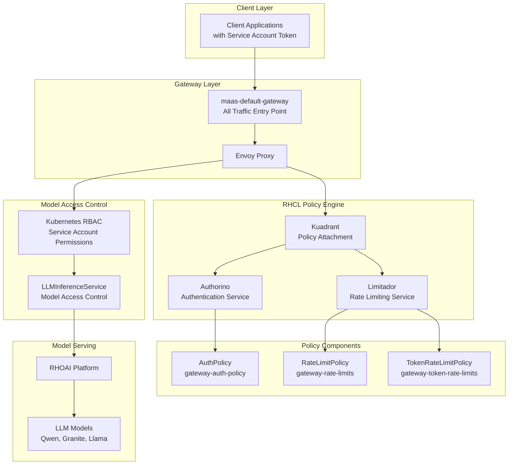
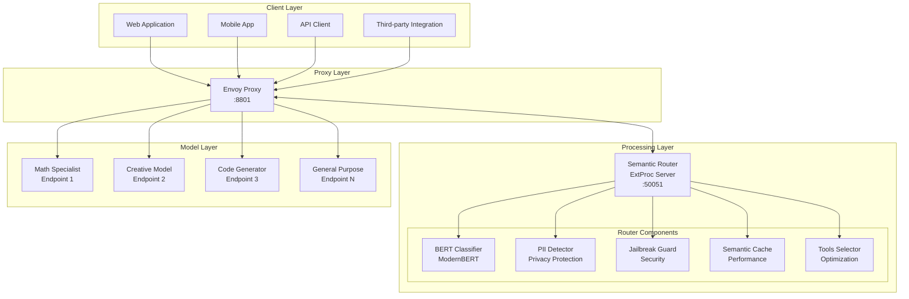
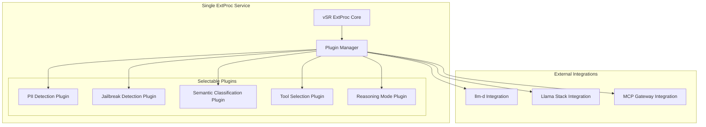
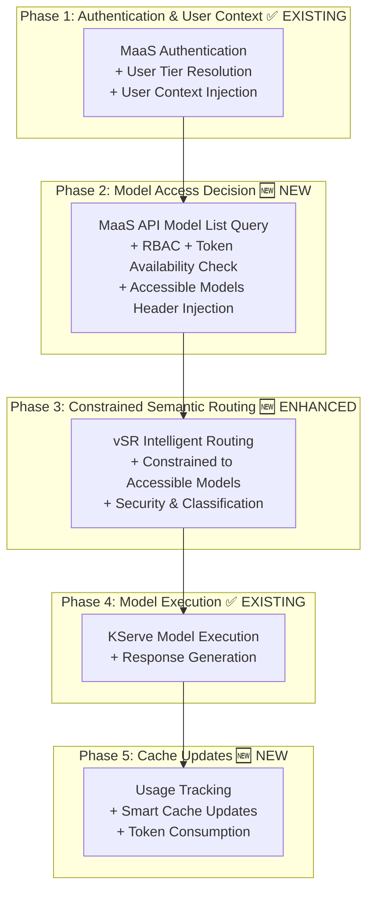
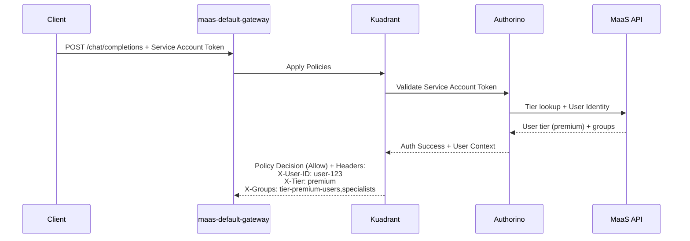
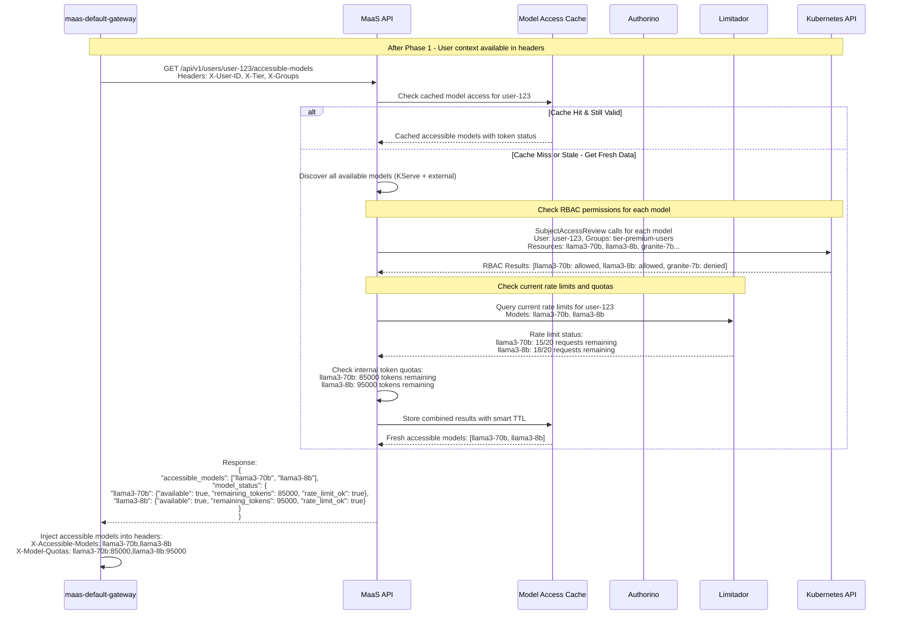
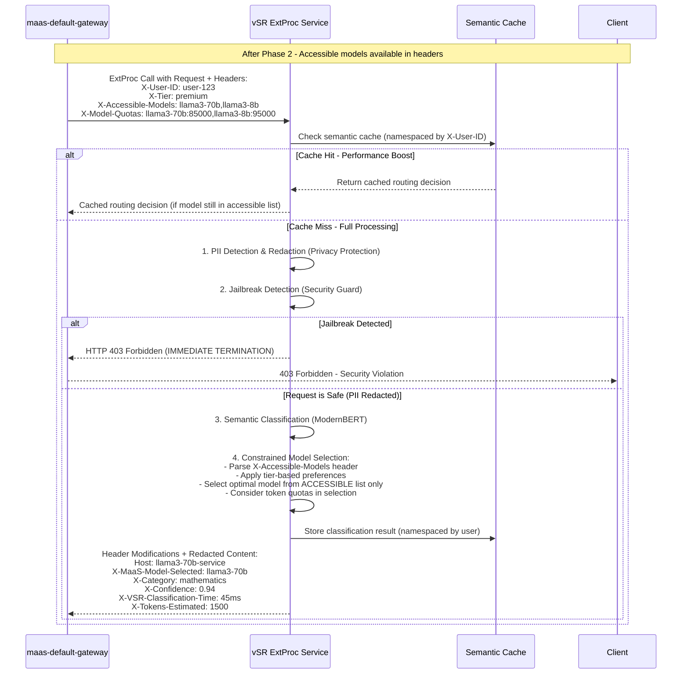
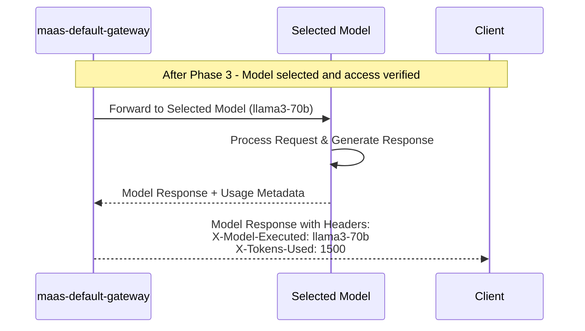
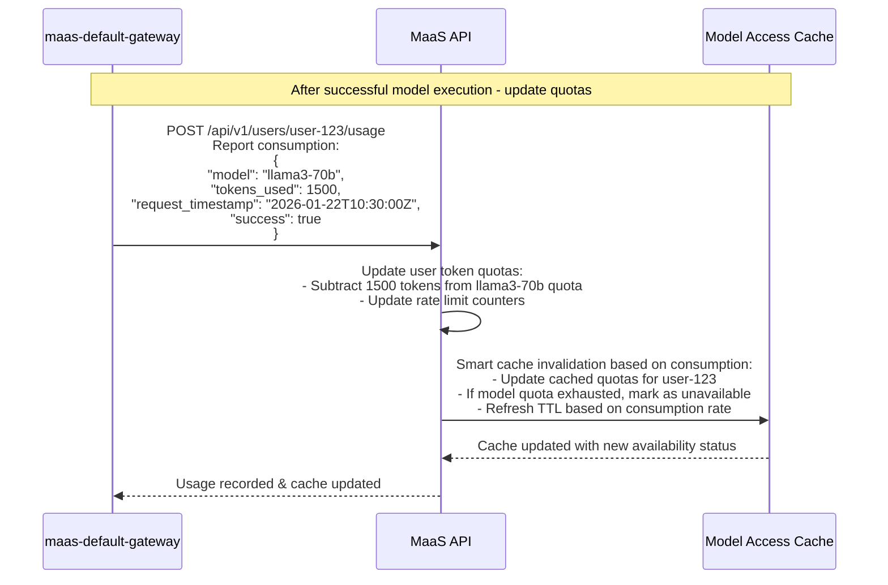

# Design Proposal: vLLM Semantic Router (vSR) Integration with Models-as-a-Service (MaaS)

**Document Status**: Design Proposal  
**Date**: January 2026  
**Author**: Noy Itzikowitz  
**Target Branch**: [maas-billing/main](https://github.com/noyitz/maas-billing/tree/main)

## Executive Summary

This design proposal presents the integration architecture for vLLM Semantic Router (vSR) with the Models-as-a-Service (MaaS) platform. The integration enhances the MaaS platform with intelligent semantic routing capabilities while maintaining enterprise-grade security, rate limiting, and billing features.

The proposal recommends an **Enhanced Hybrid Authorization-First Architecture** that combines MaaS's proven security and policy enforcement with vSR's intelligent routing capabilities. This architecture eliminates authorization bottlenecks through pre-authorization with model constraints, enabling seamless user experiences while maintaining strict access controls.

**Key Benefits:**
- **Intelligent Routing**: Semantic classification directs requests to optimal models based on content analysis
- **Elimination of Authorization Failures**: Pre-authorization ensures vSR selects only from user-accessible models  
- **Enterprise Security**: PII detection, jailbreak prevention, and comprehensive audit trails
- **Modular Composition**: Plugin-based architecture supports future ecosystem integration
- **Operational Excellence**: Leverages existing production-ready infrastructure from both platforms

## 1. Architecture Overview

### 1.1 Design Principles

The integration architecture is designed around the following core principles:

- **Security First**: Authentication and authorization occur before semantic processing
- **Performance Optimization**: Single request parsing through composable pipeline architecture  
- **Modular Composition**: Plugin-based design supports selective feature activation and ecosystem integration
- **Enterprise Grade**: Leverages proven production infrastructure from both platforms
- **Operational Simplicity**: Unified management through existing CLI and deployment tools

### 1.2 Current Platform Architectures

#### MaaS Platform Architecture

The MaaS platform provides a complete Models-as-a-Service solution with policy-based access control:



**Key Components:**
- **MaaS API**: Go-based API with token management (ephemeral + named API keys) and tier resolution
- **Gateway API**: Single entry point for all traffic with policy enforcement
- **Kuadrant/Authorino**: Authentication, authorization, and policy enforcement with 300s caching
- **Limitador**: Rate limiting service with tier-based policies (free/premium/enterprise)
- **RHOAI Model Serving**: Backend LLM model execution platform

#### vSR Platform Architecture

The vSR system implements intelligent Mixture-of-Models architecture using Envoy Proxy with External Processor integration:



**Key Components:**
- **vSR CLI**: Comprehensive deployment and management CLI with multi-environment support
- **Envoy ExtProc**: Production-ready gRPC service (port 50051) for semantic routing
- **ModernBERT Classifiers**: Multi-task classification for category detection, PII scanning, and jailbreak prevention
- **Semantic Cache**: Performance optimization with similarity-based caching
- **Tool Selection**: Automatic optimization to reduce token usage and improve accuracy

### 1.3 Modular Composition Strategy

The integration employs a **composable pipeline approach** that enables selective component activation while avoiding multiple request parsing passes through Envoy proxy.

#### Option 1: Plugin-Based Composition (Recommended)



**Configuration Example:**
```yaml
vsr_composition:
  # Security-first components (always enabled for enterprise)
  security_pipeline:
    pii_detection: true
    jailbreak_prevention: true
    content_filtering: true
  
  # Routing intelligence (configurable based on use case)
  routing_pipeline:
    semantic_classification: true
    model_selection: true
    tool_selection: false  # Disabled if MCP Gateway handles this
    
  # Orchestration components (selective based on ecosystem)
  orchestration_pipeline:
    reasoning_mode: true
    context_management: false  # Disabled if llm-d handles this
    
  # External component integration
  external_integrations:
    llm_d_enabled: true
    llama_stack_enabled: false
    mcp_gateway_enabled: true
```

**Benefits:**
- ✅ **Single Request Parse**: One ExtProc service, multiple internal plugins
- ✅ **Selective Activation**: Enable only needed components per deployment
- ✅ **Security First**: PII/Jailbreak detection remains in security-critical path
- ✅ **Ecosystem Integration**: Clean interfaces for llm-d, Llama Stack, MCP Gateway
- ✅ **Performance Optimization**: Avoid unnecessary processing overhead

## 2. Enhanced Hybrid Architecture

### 2.1 Integration Flow Overview

The integration implements a **multi-phase enhanced flow** that maximizes security, eliminates authorization bottlenecks, and enables intelligent routing:



**Legend:**
- ✅ **EXISTING**: Components that exist today and require no changes
- 🆕 **NEW**: New components to be implemented
- 🆕 **ENHANCED**: Existing components that require enhancements

#### Phase 1: Authentication & User Context Generation ✅ EXISTING - No Changes Required

- ✅ **Standard RHCL Flow**: Existing Authorino/Limitador logic unchanged
- ✅ **MaaS Authentication**: Current security and authentication patterns maintained
- ✅ **User Context Available**: Headers available for downstream processing



#### Phase 2: Model Access Decision & Header Injection 🆕 NEW - Implementation Required

- 🆕 **MaaS API Endpoint**: `/api/v1/users/{userId}/accessible-models` 
- 🆕 **RHCL Integration**: MaaS API calls to Kubernetes API (RBAC) and Limitador (rate limits)
- 🆕 **Smart Caching**: Cache with token-aware TTL and quota tracking
- 🆕 **Header Injection**: Gateway logic to inject accessible models into request headers
- 🆕 **Combined Access Logic**: RBAC + rate limits + token quotas in single decision



#### Phase 3: Constrained Semantic Routing 🆕 ENHANCED - vSR ExtProc Enhancements Required

- 🆕 **Header-Based Constraints**: Parse X-Accessible-Models for routing constraints
- 🆕 **Quota-Aware Selection**: Consider token quotas in model selection logic
- ✅ **Security Features**: Existing PII detection and jailbreak prevention (unchanged)
- ✅ **Semantic Classification**: Existing ModernBERT classification (unchanged)
- 🆕 **Multi-Tenant Security**: User-isolated semantic cache to prevent cross-user data exposure in shared MaaS environment

> **Why User-Namespaced Cache is Required for MaaS Integration:**
> 
> vSR's existing semantic cache is designed for single-user deployments where global caching is safe. However, MaaS is a **multi-tenant platform** where multiple users share the same vSR instance. Without user namespacing:
> - User A could receive cached routing decisions from User B's similar prompts
> - Semantic similarity could leak one user's prompt patterns to another user
> - This violates enterprise security, compliance (GDPR), and data isolation requirements
> 
> The solution: Cache keys must include user ID (`user-123:hash(prompt)`) to ensure complete user isolation in the shared environment.



#### Phase 4: Model Execution ✅ EXISTING - KServe Execution Unchanged

- ✅ **Model Serving**: Existing KServe infrastructure handles model execution
- ✅ **Response Generation**: Standard model response processing
- ✅ **Usage Metadata**: Token consumption tracking available



#### Phase 5: Smart Cache Updates 🆕 NEW - Smart Cache Management Required

- 🆕 **Usage Tracking API**: New endpoint for real-time token consumption reporting
- 🆕 **Smart Cache Invalidation**: Intelligent cache updates based on quota consumption  
- 🆕 **Dynamic Availability**: Real-time model availability based on quota exhaustion
- 🆕 **Consumption-Based TTL**: Cache TTL adjusted based on user consumption patterns




### 2.2 Request Flow Headers

```http
# Phase 1: Client Request
POST /chat/completions
Authorization: Bearer sa-token-xyz
Content-Type: application/json
{"messages": [{"role": "user", "content": "Solve this calculus problem..."}]}

# Phase 1: After Authentication & User Context (✅ EXISTING - Unchanged)
POST /chat/completions
Authorization: Bearer sa-token-xyz
X-User-ID: math-user-123                    # ✅ User identification
X-Tier: premium                             # ✅ User subscription tier
X-Groups: "tier-premium-users,specialists"  # ✅ Kubernetes groups for RBAC

# Phase 2: After MaaS API Model Access Decision (🆕 NEW)
POST /chat/completions
Authorization: Bearer sa-token-xyz
X-User-ID: math-user-123                    # ✅ Passed through
X-Tier: premium                             # ✅ Passed through
X-Accessible-Models: llama3-70b,llama3-8b  # 🆕 Pre-authorized accessible models
X-Model-Quotas: llama3-70b:85000,llama3-8b:95000  # 🆕 Token quotas per model

# Phase 3: After vSR Constrained Semantic Routing (🆕 ENHANCED)
POST /models/llama3-70b/chat/completions    # 🆕 Path rewritten for model routing
Authorization: Bearer sa-token-xyz
X-User-ID: math-user-123                    # ✅ Passed through
X-Tier: premium                             # ✅ Passed through
X-MaaS-Model-Selected: llama3-70b          # 🆕 Selected from accessible list
X-Category: mathematics                     # 🆕 Semantic classification
X-Confidence: 0.94                         # 🆕 vSR classification confidence
X-VSR-Classification-Time: 45ms            # 🆕 vSR performance metrics
X-Tokens-Estimated: 1500                   # 🆕 Estimated token usage

# Phase 4: Successful Model Execution (✅ EXISTING - Enhanced headers)
HTTP/1.1 200 OK
Content-Type: application/json
X-Model-Executed: llama3-70b               # 🆕 Actually executed model
X-Tokens-Used: 1500                        # 🆕 Actual token consumption
X-Request-Duration: 2.5s                   # ✅ Existing metric
X-MaaS-Quota-Remaining: 83500              # 🆕 Remaining tokens after execution
{"choices": [{"message": {"content": "The derivative of x² is 2x..."}}]}
```

## 3. Implementation Strategy

### 3.1 Implementation Requirements

#### RHCL (Red Hat Connectivity Link) - No Changes Required
- ✅ **Token Validation**: Existing Kubernetes `TokenReview` for Service Account tokens (unchanged)
- ✅ **Tier Resolution**: Existing HTTP metadata lookup to MaaS API for user tier mapping (unchanged)
- ✅ **Context Injection**: Existing `X-User-ID`, `X-Tier`, `X-Groups` injection (unchanged)
- ✅ **Limitador Integration**: Existing rate limiting infrastructure (unchanged)

#### MaaS (Models-as-a-Service) - Centralized Model Access Logic
- ✅ **MaaS API**: Existing Go API with token management and tier resolution
- ✅ **Storage Configuration**: Existing in-memory, disk, and external database options
- ✅ **Token Management**: Existing ephemeral tokens and named API keys with expiration
- ✅ **Policy Infrastructure**: Existing AuthPolicy with tier-based enforcement
- 🆕 **Model Access Decision Engine**: New centralized engine combining RBAC + rate limits + token quotas
- 🆕 **Smart Access Cache**: New caching layer with intelligent quota-based invalidation
- 🆕 **Model Accessibility API**: New endpoint `/api/v1/users/{userId}/accessible-models`
- 🆕 **Usage Tracking API**: New endpoint `/api/v1/users/{userId}/usage` for real-time quota updates
- 🆕 **External Model Registry**: Enhanced model discovery beyond KServe (parallel work)
- 🆕 **Enhanced Billing Integration**: Updated billing collector for vSR usage patterns

#### vSR (vLLM Semantic Router) - MaaS API Integration
- ✅ **ExtProc Service**: Existing Envoy External Processor implementation (port 50051)
- ✅ **vSR CLI**: Existing deployment and management CLI (unchanged)
- ✅ **Kubernetes Infrastructure**: Existing deployment manifests (unchanged)
- ✅ **Security Features**: Existing PII detection and jailbreak prevention
- 🆕 **MaaS API Client**: New HTTP client for model access decisions
- 🆕 **Multi-Tenant Cache Enhancement**: User-namespaced semantic cache to prevent data leakage
- 🆕 **Usage Reporting**: New capability to report token consumption back to MaaS API
- 🆕 **Constrained Model Selection**: Parse MaaS API responses for intelligent routing

### 3.2 External Model Support Requirements (Parallel Work)

The integration requires extending MaaS to support external (non-KServe) models. This work can be developed in parallel to the core vSR integration:

#### MaaS API Components Requiring External Model Support:

1. **Model Discovery Service** (`internal/models/discovery.go`):
   - **Current**: Only discovers KServe `InferenceService` and `LLMInferenceService`
   - **Required**: Interface for external model registries
   - **Implementation**: Plugin-based discovery for vLLM, Ollama, external HTTP endpoints

2. **Model Registry** (`internal/models/registry.go` - new file):
   - **Required**: Unified model registry supporting:
     - KServe models (existing)
     - External HTTP endpoints with metadata
     - Model capabilities (pricing, rate limits, categories)
   - **API Endpoints**:
     ```
     POST /api/v1/models/register    # Register external model
     GET /api/v1/models             # List all models (KServe + external)
     PUT /api/v1/models/{id}        # Update model metadata
     DELETE /api/v1/models/{id}     # Remove external model
     ```

3. **Authorization Engine** (`internal/auth/model_access.go` - new file):
   - **Current**: RBAC only covers KServe resources (`InferenceService`, `LLMInferenceService`)
   - **Required**: RBAC rules for external models
   - **Implementation**: Custom resource types or extended RBAC mappings

4. **Gateway Routing** (`deployment/base/gateway/envoy-config.yaml`):
   - **Current**: Static KServe service routing
   - **Required**: Dynamic upstream configuration for external models
   - **Implementation**: Envoy cluster discovery integration

#### vSR Components Requiring External Model Support:

5. **Model Metadata Interface** (`pkg/models/metadata.go` - new file):
   - **Required**: Standard interface for model capabilities across providers
   - **Purpose**: Enable vSR routing decisions based on model characteristics
   - **Schema**:
     ```go
     type ModelMetadata struct {
         ID           string            `json:"id"`
         Provider     string            `json:"provider"`     // "kserve", "vllm", "ollama"
         Endpoint     string            `json:"endpoint"`
         Categories   []string          `json:"categories"`   // "math", "coding", "creative"
         Pricing      PricingInfo       `json:"pricing"`
         RateLimits   RateLimitInfo     `json:"rate_limits"`
         Capabilities ModelCapabilities `json:"capabilities"`
     }
     ```

6. **External Model Client** (`pkg/clients/external_models.go` - new file):
   - **Required**: HTTP client adapters for different external model providers
   - **Purpose**: Normalize API calls across different model providers

#### Specific File Locations for External Model Support:

```
maas/maas-api/
├── internal/
│   ├── models/
│   │   ├── discovery.go           # ← Extend for external discovery
│   │   ├── registry.go            # ← New unified registry
│   │   └── external_providers.go  # ← New provider interfaces
│   ├── auth/
│   │   └── model_access.go        # ← New RBAC for external models
│   └── handlers/
│       └── external_models.go     # ← New API handlers
├── pkg/
│   ├── models/
│   │   └── metadata.go            # ← New model metadata interface
│   └── clients/
│       └── external_models.go     # ← New external model clients
└── deployment/
    └── base/gateway/
        └── dynamic-config.yaml    # ← New dynamic routing config

vsr/src/semantic-router/
├── pkg/
│   ├── models/
│   │   ├── metadata.go            # ← Model metadata interface
│   │   └── external_adapter.go    # ← External model adapters
│   └── clients/
│       └── maas_client.go         # ← Enhanced MaaS API client
```

#### Parallel Development Opportunities:
- **External Model Registry**: Independent of vSR integration timeline
- **Dynamic Gateway Configuration**: Can be developed separately
- **Model Metadata Standards**: Can be defined as independent specification
- **Provider Client Libraries**: Modular development per provider


## 4. Error Handling and OpenAI Compatibility

The integration provides OpenAI-compatible error responses for seamless application integration:

### 4.1 Standard Error Responses

**Authentication Failure:**
```json
{
  "error": {
    "message": "Invalid authentication credentials",
    "type": "invalid_request_error", 
    "code": "invalid_api_key"
  }
}
```

**Quota Exceeded with Intelligent Fallback:**
```json
{
  "error": {
    "message": "Token quota exceeded for model llama3-70b. Using fallback model llama3-8b.",
    "type": "quota_exceeded_error",
    "code": "model_quota_exceeded",
    "param": "model",
    "fallback_applied": true,
    "fallback_model": "llama3-8b",
    "retry_after": null
  }
}
```

**All Models Quota Exceeded:**
```json
{
  "error": {
    "message": "Token quota exceeded for all accessible models. Please try again later.",
    "type": "quota_exceeded_error", 
    "code": "all_models_quota_exceeded",
    "retry_after": 3600
  }
}
```

**Security Violation:**
```json
{
  "error": {
    "message": "Request blocked for safety violations",
    "type": "policy_violation",
    "code": "content_policy_violation"
  }
}
```

### 4.2 OpenAI-Compatible Quota Headers

```http
X-RateLimit-Limit-Requests: 20        # Request limit for user/tier
X-RateLimit-Limit-Tokens: 100000      # Token quota limit for user/tier  
X-RateLimit-Remaining-Requests: 15    # Remaining requests in period
X-RateLimit-Remaining-Tokens: 85000   # Remaining token quota
X-RateLimit-Reset-Requests: 1674083820 # When request limit resets
X-RateLimit-Reset-Tokens: 1674083820  # When token quota resets
X-RateLimit-Reset-After: 60           # Seconds until quota reset
X-MaaS-Quota-Source: maas-api         # Source of quota information
```

## 5. Conclusion

This design proposal presents a comprehensive integration strategy that combines the best of both MaaS and vSR platforms while maintaining architectural simplicity and operational efficiency. The refined architecture centralizes all model access logic in the MaaS API, eliminates unnecessary RHCL changes, and enables intelligent semantic routing with real-time quota awareness.

**Key Architectural Advantages:**
- **Simplified Integration**: No changes required to existing RHCL (Authorino/Limitador) infrastructure
- **Centralized Logic**: All model access decisions consolidated in MaaS API for consistency and maintainability
- **Real-time Intelligence**: vSR routing decisions based on live quota and availability data
- **Performance Optimized**: Single request parse with user-namespaced caching and direct API integration

The solution leverages extensive existing infrastructure, reducing implementation risk and time-to-market while preparing for future ecosystem evolution. With over 60% of the required infrastructure already production-ready and a clear separation of concerns, this approach delivers immediate value while establishing a robust foundation for long-term growth.

The centralized model access approach positions the integrated platform for success in the evolving LLM infrastructure landscape, providing a clean foundation for external model support and ecosystem integrations.