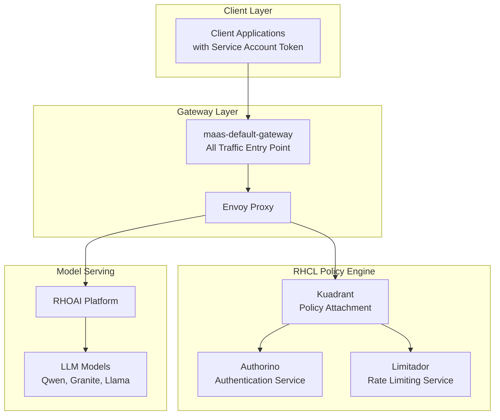
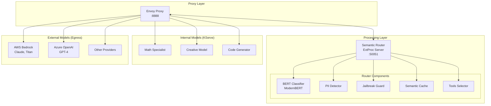
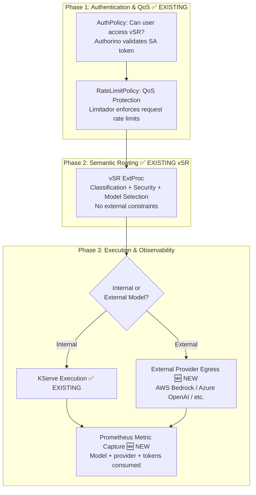
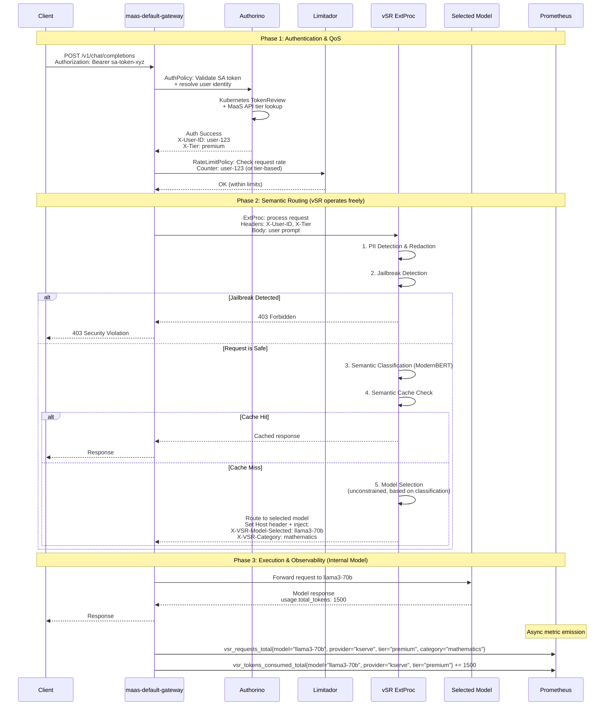
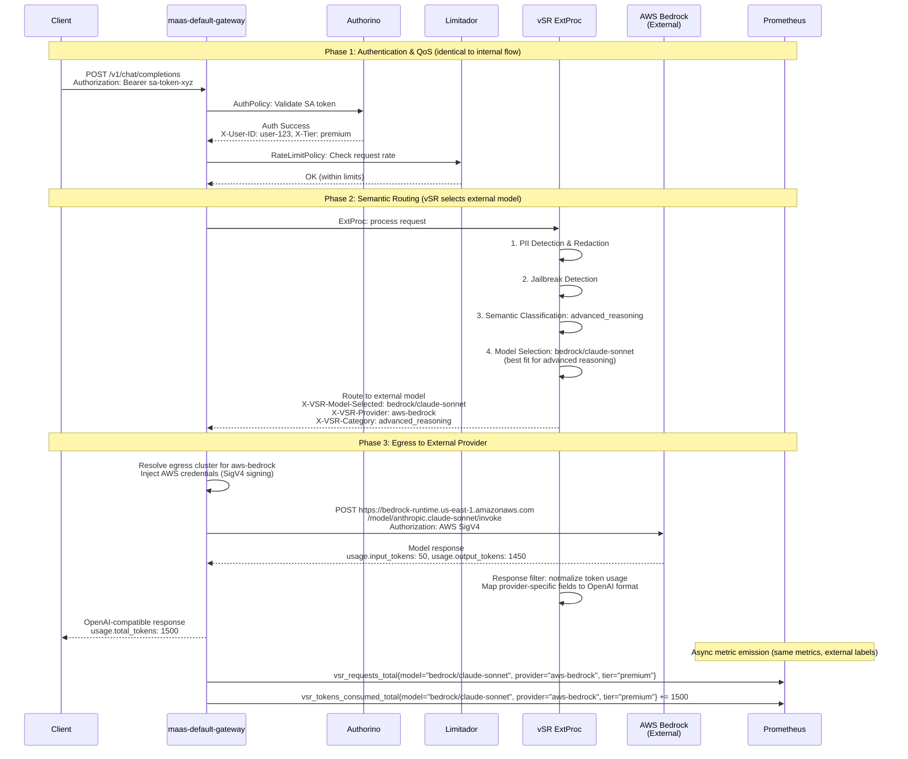
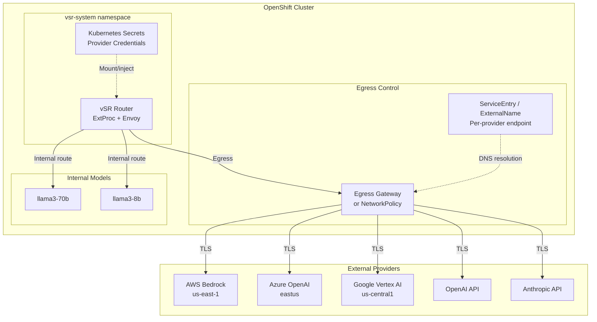
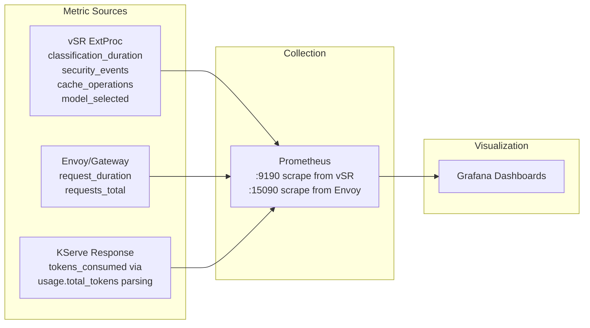
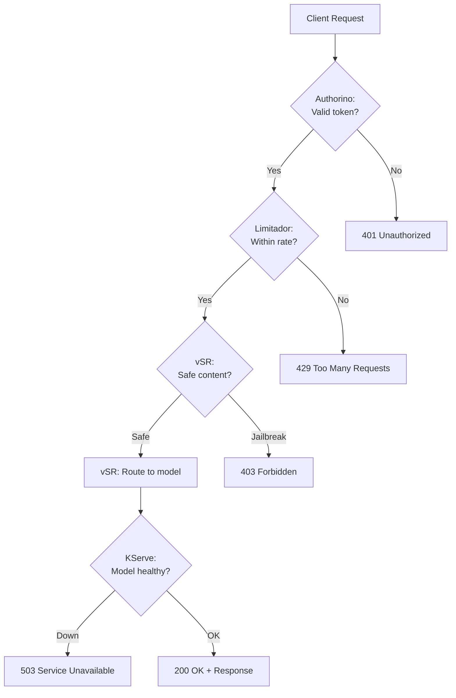
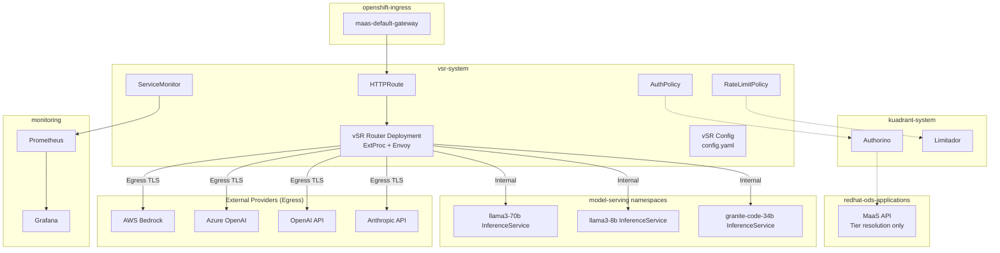

# Design Proposal: vLLM Semantic Router (vSR) Integration with Models-as-a-Service (MaaS)

## Phase 1: Simplified Integration

**Version**: 1.2
**Document Status**: Draft
**Date**: February 2026
**Author**: Noy Itzikowitz
**Previous Versions**: [v1.0](https://github.com/noyitz/maas-designs) (Dec 2025), [v1.1](https://github.com/noyitz/maas-designs) (Jan 2026)

---

## Executive Summary

This document defines the **Phase 1** integration strategy for vLLM Semantic Router (vSR) with the Models-as-a-Service (MaaS) platform. Phase 1 prioritizes a minimal, production-ready integration that gets vSR running behind MaaS security and QoS policies with the least amount of new development.

**Key design decisions for Phase 1:**

- **AuthPolicy protects vSR access** -- a single authorization check determines whether the user can use the semantic router. No per-model RBAC at the gateway level.
- **RateLimitPolicy provides QoS protection** -- rate limiting applies to the entire vSR endpoint to prevent DDoS and abuse. It is not used for per-model accounting or billing.
- **No model lists or quotas in headers** -- vSR receives no `X-Accessible-Models` or `X-Model-Quotas` headers. It routes freely based on its own semantic classification and configured model pool.
- **Internal and external models** -- vSR can route to both internal KServe models and external providers (AWS Bedrock, Azure OpenAI, Google Vertex AI, etc.) through a unified egress architecture. The routing decision is transparent to the client.
- **Observability captures model selection and token usage** -- the actual model selected by vSR and the tokens consumed are emitted as Prometheus metrics for monitoring and future billing readiness. This is capture-only, not enforcement. External model usage is captured with the same metrics, including provider labels.

**What Phase 1 defers to later phases:**
- Per-model RBAC and quota-constrained routing (Phase 2)
- Token-based rate limiting via Limitador (Phase 2)
- Smart cache invalidation and usage tracking APIs (Phase 2)
- Dynamic billing and cost allocation (Phase 3)
- Per-provider cost tracking and budget enforcement (Phase 3)

---

## 1. Architecture Overview

### 1.1 Phase 1 Design Principles

- **Simplicity over completeness**: Ship a working integration with minimal new components
- **Security first**: Users must authenticate before reaching vSR
- **QoS over accounting**: Rate limits prevent abuse, not track spend
- **Observability from day one**: Capture routing decisions and token usage in Prometheus so future phases have data to build on
- **No header pollution**: Keep the request flow clean -- vSR operates with its own intelligence, unconstrained by gateway-injected model lists

### 1.2 Phase 1 vs. Previous Proposals

| Aspect | v1.0 (Dec 2025) | v1.1 (Jan 2026) | v1.2 Phase 1 (Feb 2026) |
|--------|-----------------|-----------------|------------------------|
| Auth scope | Per-model (Phase 3 re-auth) | Per-model (via X-Accessible-Models) | **vSR access only** (binary: allowed/denied) |
| Rate limiting | Per-model + token quotas | Per-model + token quotas via MaaS API | **Entire vSR endpoint** (QoS/DDoS only) |
| Model constraints | Header injection + fallback | X-Accessible-Models + X-Model-Quotas | **None** -- vSR routes freely |
| Fallback logic | Phase 4.5 circuit breaker | Implicit via constrained selection | **Not applicable** -- no model constraints to fall back from |
| Usage tracking | Phase 5 smart cache + billing API | Usage tracking API + cache invalidation | **Prometheus metrics only** (capture, not enforce) |
| RHCL changes | WASM/Lua circuit breaker | No changes | **No changes** |
| MaaS API changes | Multiple new endpoints | accessible-models + usage APIs | **No new endpoints** |
| vSR changes | ExtProc + fallback API | Header parsing + constrained selection | **Metric emission only** |
| External models | Not addressed | Not addressed | **Egress support for AWS Bedrock, Azure OpenAI, etc.** |

### 1.3 Current Platform Architectures

#### MaaS Platform



#### vSR Platform



---

## 2. Phase 1 Integration Architecture

### 2.1 Integration Flow Overview

Phase 1 implements a **three-phase flow**: authenticate, protect, route, execute, and observe.



**Legend:**
- ✅ **EXISTING**: Components that exist today and require no changes (or minimal config)
- 🆕 **NEW**: New components to be implemented

### 2.2 Detailed Sequence



#### External Model Sequence (AWS Bedrock Example)



### 2.3 Phase-by-Phase Detail

#### Phase 1: Authentication & QoS Protection

Uses existing RHCL (Kuadrant/Authorino/Limitador) with standard configuration. **No code changes to RHCL components.**

**AuthPolicy** -- vSR Access Authorization:

```yaml
apiVersion: kuadrant.io/v1
kind: AuthPolicy
metadata:
  name: vsr-access-policy
  namespace: vsr-system
spec:
  targetRef:
    group: gateway.networking.k8s.io
    kind: HTTPRoute
    name: vsr-route
  rules:
    authentication:
      sa-token:
        kubernetesTokenReview:
          audiences:
            - vsr-api
    metadata:
      user-tier:
        http:
          url: "http://maas-api.redhat-ods-applications.svc:8080/api/v1/tier"
          method: GET
          headers:
            Authorization:
              selector: auth.identity.token
          credentials:
            authorizationHeader:
              prefix: Bearer
    response:
      success:
        headers:
          x-user-id:
            plain:
              selector: auth.identity.username
          x-tier:
            plain:
              selector: auth.metadata.user-tier.tier
```

This is the same pattern MaaS uses today. The only difference is the `targetRef` points to the vSR HTTPRoute instead of a model-specific route.

**RateLimitPolicy** -- QoS / DDoS Protection:

```yaml
apiVersion: kuadrant.io/v1
kind: RateLimitPolicy
metadata:
  name: vsr-qos-rate-limit
  namespace: vsr-system
spec:
  targetRef:
    group: gateway.networking.k8s.io
    kind: HTTPRoute
    name: vsr-route
  limits:
    global-qos:
      rates:
        - limit: 100
          window: 1m
      counters:
        - expression: auth.identity.username
    tier-free:
      rates:
        - limit: 10
          window: 1m
      counters:
        - expression: auth.identity.username
      when:
        - predicate: auth.metadata.user-tier.tier == 'free'
    tier-premium:
      rates:
        - limit: 60
          window: 1m
      counters:
        - expression: auth.identity.username
      when:
        - predicate: auth.metadata.user-tier.tier == 'premium'
    tier-enterprise:
      rates:
        - limit: 300
          window: 1m
      counters:
        - expression: auth.identity.username
      when:
        - predicate: auth.metadata.user-tier.tier == 'enterprise'
```

**Key design choice**: Rate limits are **request-count-based only** (not token-based). This is intentional for Phase 1:
- Token-based rate limiting requires response-body parsing (TokenRateLimitPolicy) which adds complexity
- QoS/DDoS protection is effectively achieved by capping request frequency
- Token consumption is captured via Prometheus for visibility, but not enforced at the gateway

#### Phase 2: Semantic Routing (vSR)

vSR operates as it does today with **no constraints from MaaS**. It receives the authenticated request with `X-User-ID` and `X-Tier` headers (for cache namespacing and observability) but no model lists or quotas.

**What vSR does (unchanged from standalone operation):**
1. PII detection and redaction
2. Jailbreak detection (blocks malicious prompts with 403)
3. Semantic classification via ModernBERT (domain, intent, complexity)
4. Semantic cache lookup (namespaced by `X-User-ID` for multi-tenant isolation)
5. Model selection based on classification result and configured routing rules

**What vSR adds for Phase 1 (new):**
- Injects `X-VSR-Model-Selected` header with the chosen model name
- Injects `X-VSR-Category` header with the classification result
- These headers are used downstream for Prometheus metric labeling only

**Multi-tenant cache isolation:**

Even in Phase 1, the semantic cache must be namespaced by user to prevent cross-tenant data leakage. vSR uses `X-User-ID` to scope cache entries:

```
Cache key: hash(X-User-ID + prompt_embedding)
```

This ensures User A never receives cached routing decisions from User B's similar prompts.

#### Phase 3: Execution & Observability

**Model Execution** -- KServe handles inference as it does today. No changes.

**Prometheus Metric Capture** -- The new component in Phase 1. After the response returns from KServe, metrics are emitted capturing the routing decision and token consumption.

### 2.4 Request Flow Headers

```http
# Client Request
POST /v1/chat/completions
Authorization: Bearer sa-token-xyz
Content-Type: application/json
{"messages": [{"role": "user", "content": "Solve this calculus problem..."}]}

# After Phase 1: Auth + QoS (✅ EXISTING headers)
POST /v1/chat/completions
Authorization: Bearer sa-token-xyz
X-User-ID: math-user-123             # ✅ User identity (from Authorino)
X-Tier: premium                      # ✅ Subscription tier (from Authorino)

# After Phase 2: vSR Semantic Routing (no model constraints injected)
# Example A: Internal model selected
POST /v1/chat/completions
Authorization: Bearer sa-token-xyz
X-User-ID: math-user-123             # ✅ Passed through
X-Tier: premium                      # ✅ Passed through
X-VSR-Model-Selected: llama3-70b     # 🆕 vSR's unconstrained model choice
X-VSR-Provider: kserve               # 🆕 Internal provider
X-VSR-Category: mathematics          # 🆕 Semantic classification result
Host: llama3-70b-service             # 🆕 Routing target (set by vSR ExtProc)

# Example B: External model selected
POST /v1/chat/completions
Authorization: Bearer sa-token-xyz
X-User-ID: math-user-123             # ✅ Passed through
X-Tier: premium                      # ✅ Passed through
X-VSR-Model-Selected: bedrock/claude-sonnet  # 🆕 External model choice
X-VSR-Provider: aws-bedrock          # 🆕 External provider
X-VSR-Category: advanced_reasoning   # 🆕 Semantic classification result
# Host/routing handled internally by vSR (egress to Bedrock endpoint)

# Phase 3: Response (after model execution)
HTTP/1.1 200 OK
Content-Type: application/json
X-VSR-Model-Selected: llama3-70b     # Passed through for client visibility
{"choices": [...], "usage": {"prompt_tokens": 50, "completion_tokens": 1450, "total_tokens": 1500}}
```

**Headers NOT present in Phase 1** (deferred to Phase 2+):
- ~~`X-Accessible-Models`~~ -- No model list injection
- ~~`X-Model-Quotas`~~ -- No per-model quota information
- ~~`X-MaaS-Model-Selected`~~ -- Replaced by `X-VSR-Model-Selected` (vSR decides, not MaaS)
- ~~`X-Tokens-Estimated`~~ -- No pre-estimation needed when there are no quota constraints
- ~~`X-MaaS-Quota-Remaining`~~ -- No quota enforcement in Phase 1

---

## 3. Egress & External Model Architecture

### 3.1 Overview

Phase 1 supports routing to external LLM providers alongside internal KServe models. From the client's perspective, the experience is identical -- the same `/v1/chat/completions` endpoint, the same auth flow, the same OpenAI-compatible response format. vSR decides whether an internal or external model is the best fit based on semantic classification, and handles the routing transparently.

**Supported external providers in Phase 1:**

| Provider | Authentication | Endpoint Pattern | Response Format |
|----------|---------------|-----------------|-----------------|
| AWS Bedrock | IAM (SigV4) or Access Keys | `bedrock-runtime.{region}.amazonaws.com` | Bedrock-native (normalized by vSR) |
| Azure OpenAI | API Key or Azure AD | `{resource}.openai.azure.com` | OpenAI-compatible |
| Google Vertex AI | Service Account (OAuth2) | `{region}-aiplatform.googleapis.com` | Vertex-native (normalized by vSR) |
| OpenAI | API Key | `api.openai.com` | OpenAI-native |
| Anthropic | API Key | `api.anthropic.com` | Anthropic-native (normalized by vSR) |

### 3.2 Egress Architecture



### 3.3 Credential Management

External provider credentials are stored in Kubernetes Secrets and mounted into the vSR pod. vSR's model configuration references the secret name for each provider.

```yaml
# AWS Bedrock credentials
apiVersion: v1
kind: Secret
metadata:
  name: vsr-aws-bedrock-credentials
  namespace: vsr-system
type: Opaque
data:
  AWS_ACCESS_KEY_ID: <base64>
  AWS_SECRET_ACCESS_KEY: <base64>
  AWS_REGION: dXMtZWFzdC0x  # us-east-1
---
# Azure OpenAI credentials
apiVersion: v1
kind: Secret
metadata:
  name: vsr-azure-openai-credentials
  namespace: vsr-system
type: Opaque
data:
  AZURE_OPENAI_API_KEY: <base64>
  AZURE_OPENAI_ENDPOINT: <base64>
---
# Generic API key provider (OpenAI, Anthropic)
apiVersion: v1
kind: Secret
metadata:
  name: vsr-openai-credentials
  namespace: vsr-system
type: Opaque
data:
  OPENAI_API_KEY: <base64>
```

**AWS Bedrock with IRSA (preferred for production):**

For AWS Bedrock on OpenShift, the preferred approach is IAM Roles for Service Accounts (IRSA) via the Cloud Credential Operator or Pod Identity Webhook. This avoids storing long-lived AWS keys:

```yaml
apiVersion: v1
kind: ServiceAccount
metadata:
  name: vsr-router
  namespace: vsr-system
  annotations:
    # EKS/ROSA: IRSA
    eks.amazonaws.com/role-arn: "arn:aws:iam::123456789012:role/vsr-bedrock-access"
    # Or STS-based (OpenShift on AWS)
    openshift.io/cloud-credentials: "vsr-aws-credentials"
```

The IAM role should have a minimal policy:

```json
{
  "Version": "2012-10-17",
  "Statement": [
    {
      "Effect": "Allow",
      "Action": [
        "bedrock:InvokeModel",
        "bedrock:InvokeModelWithResponseStream"
      ],
      "Resource": "arn:aws:bedrock:us-east-1::foundation-model/*"
    }
  ]
}
```

### 3.4 Network Egress Configuration

#### Option A: Kubernetes NetworkPolicy (Simpler)

```yaml
apiVersion: networking.k8s.io/v1
kind: NetworkPolicy
metadata:
  name: vsr-egress-allow-providers
  namespace: vsr-system
spec:
  podSelector:
    matchLabels:
      app: vsr-router
  policyTypes:
    - Egress
  egress:
    # Allow DNS resolution
    - to: []
      ports:
        - protocol: UDP
          port: 53
        - protocol: TCP
          port: 53
    # Allow internal cluster traffic (KServe models)
    - to:
        - namespaceSelector: {}
    # Allow external HTTPS to provider endpoints
    - to:
        - ipBlock:
            cidr: 0.0.0.0/0
            except:
              - 10.0.0.0/8
              - 172.16.0.0/12
              - 192.168.0.0/16
      ports:
        - protocol: TCP
          port: 443
```

#### Option B: Istio ServiceEntry (More Control)

If the cluster uses Istio service mesh, use ServiceEntry resources to explicitly declare allowed external hosts:

```yaml
apiVersion: networking.istio.io/v1
kind: ServiceEntry
metadata:
  name: aws-bedrock
  namespace: vsr-system
spec:
  hosts:
    - "bedrock-runtime.us-east-1.amazonaws.com"
    - "bedrock-runtime.us-west-2.amazonaws.com"
  location: MESH_EXTERNAL
  ports:
    - number: 443
      name: https
      protocol: TLS
  resolution: DNS
---
apiVersion: networking.istio.io/v1
kind: ServiceEntry
metadata:
  name: azure-openai
  namespace: vsr-system
spec:
  hosts:
    - "*.openai.azure.com"
  location: MESH_EXTERNAL
  ports:
    - number: 443
      name: https
      protocol: TLS
  resolution: DNS
---
apiVersion: networking.istio.io/v1
kind: ServiceEntry
metadata:
  name: openai-api
  namespace: vsr-system
spec:
  hosts:
    - "api.openai.com"
  location: MESH_EXTERNAL
  ports:
    - number: 443
      name: https
      protocol: TLS
  resolution: DNS
---
apiVersion: networking.istio.io/v1
kind: ServiceEntry
metadata:
  name: anthropic-api
  namespace: vsr-system
spec:
  hosts:
    - "api.anthropic.com"
  location: MESH_EXTERNAL
  ports:
    - number: 443
      name: https
      protocol: TLS
  resolution: DNS
```

### 3.5 Response Normalization

External providers return responses in different formats. vSR's ExtProc response filter normalizes all responses to the OpenAI-compatible format before returning to the client. This is transparent to the client.

| Provider | Native Token Fields | Normalized To (OpenAI format) |
|----------|-------------------|-------------------------------|
| AWS Bedrock | `inputTokenCount`, `outputTokenCount` | `usage.prompt_tokens`, `usage.completion_tokens`, `usage.total_tokens` |
| Azure OpenAI | `usage.prompt_tokens`, `usage.completion_tokens` | Already OpenAI-compatible (pass-through) |
| Google Vertex AI | `usageMetadata.promptTokenCount`, `candidatesTokenCount` | `usage.prompt_tokens`, `usage.completion_tokens`, `usage.total_tokens` |
| OpenAI | `usage.prompt_tokens`, `usage.completion_tokens` | Native format (pass-through) |
| Anthropic | `usage.input_tokens`, `usage.output_tokens` | `usage.prompt_tokens`, `usage.completion_tokens`, `usage.total_tokens` |

vSR already has adapters for multiple providers in its `pkg/openai/` and `pkg/anthropic/` packages. Phase 1 extends these adapters to emit Prometheus metrics with the normalized token counts.

### 3.6 vSR Request Adaptation

When routing to external providers, vSR's ExtProc translates the incoming OpenAI-compatible request to the provider's native API format. This happens inside the ExtProc before the request is forwarded:

**AWS Bedrock example:**

```
Incoming (OpenAI format):
POST /v1/chat/completions
{"model": "claude-sonnet", "messages": [{"role": "user", "content": "..."}]}

Translated by vSR ExtProc to:
POST /model/anthropic.claude-3-5-sonnet-20241022-v2:0/invoke
Host: bedrock-runtime.us-east-1.amazonaws.com
Authorization: AWS4-HMAC-SHA256 ... (SigV4)
{"anthropic_version": "bedrock-2023-05-31", "messages": [{"role": "user", "content": "..."}]}
```

The key architectural point: **the client never knows which provider is serving the request**. The client sends a standard OpenAI-compatible request and receives a standard OpenAI-compatible response.

### 3.7 External Model Routing Decision

vSR's semantic classification determines whether to route internally or externally. The `config.yaml` model pool treats internal and external models uniformly -- the only difference is the endpoint configuration:

```yaml
# vSR config.yaml -- Internal + External model pool
models:
  domains:
    mathematics:
      model: llama3-70b                    # Internal KServe
      reasoning: true
      plugins: [system_prompt, semantic-cache]
    advanced_reasoning:
      model: bedrock/claude-sonnet         # External AWS Bedrock
      reasoning: true
      plugins: [system_prompt, semantic-cache]
    coding:
      model: granite-code-34b             # Internal KServe
      plugins: [system_prompt, semantic-cache]
    creative_writing:
      model: openai/gpt-4o                # External OpenAI
      plugins: [system_prompt, semantic-cache]
    general:
      model: llama3-8b                    # Internal KServe
      plugins: [semantic-cache]

endpoints:
  # Internal (KServe cluster services)
  llama3-70b:
    type: internal
    url: "llama3-70b.model-serving.svc.cluster.local"
  llama3-8b:
    type: internal
    url: "llama3-8b.model-serving.svc.cluster.local"
  granite-code-34b:
    type: internal
    url: "granite-code-34b.model-serving.svc.cluster.local"

  # External (egress to cloud providers)
  bedrock/claude-sonnet:
    type: external
    provider: aws-bedrock
    region: us-east-1
    model_id: "anthropic.claude-3-5-sonnet-20241022-v2:0"
    credentials_secret: vsr-aws-bedrock-credentials
  openai/gpt-4o:
    type: external
    provider: openai
    model_id: "gpt-4o"
    credentials_secret: vsr-openai-credentials
```

**Routing criteria**: vSR selects between internal and external models purely based on semantic fit. There is no preference for internal over external in Phase 1 -- the `config.yaml` defines which domains map to which models, and the operator configures this at deployment time.

---

## 4. Observability Architecture

### 3.1 Prometheus Metrics

Phase 1 introduces metrics that capture vSR routing decisions and model token consumption. These metrics serve dual purposes: operational monitoring today, and billing/quota data source for future phases.

#### Metric Definitions

```yaml
# Counter: Total requests processed by vSR
- name: vsr_requests_total
  type: counter
  labels: [user_id, tier, category, model_selected, provider, status]
  description: "Total requests routed through vSR"
  # provider: "kserve", "aws-bedrock", "azure-openai", "openai", "anthropic", "vertex-ai"

# Counter: Total tokens consumed across all vSR requests
- name: vsr_tokens_consumed_total
  type: counter
  labels: [user_id, tier, model_selected, provider, token_type]
  description: "Total tokens consumed (prompt + completion)"
  # token_type: "prompt", "completion", "total"
  # provider: "kserve", "aws-bedrock", "azure-openai", "openai", "anthropic", "vertex-ai"

# Histogram: vSR classification latency
- name: vsr_classification_duration_seconds
  type: histogram
  labels: [category]
  buckets: [0.005, 0.01, 0.025, 0.05, 0.1, 0.25]
  description: "Time spent in semantic classification"

# Histogram: End-to-end request latency through vSR
- name: vsr_request_duration_seconds
  type: histogram
  labels: [tier, model_selected, cache_hit]
  buckets: [0.1, 0.25, 0.5, 1, 2.5, 5, 10, 30]
  description: "Total request duration including model inference"

# Counter: Security events (PII detections, jailbreak blocks)
- name: vsr_security_events_total
  type: counter
  labels: [user_id, tier, event_type]
  description: "Security events detected by vSR"
  # event_type: "pii_detected", "pii_redacted", "jailbreak_blocked"

# Counter: Semantic cache performance
- name: vsr_cache_operations_total
  type: counter
  labels: [tier, operation]
  description: "Semantic cache hits and misses"
  # operation: "hit", "miss"

# Gauge: Models currently available in vSR routing pool
- name: vsr_available_models
  type: gauge
  labels: [model, provider]
  description: "Models available for routing (internal and external)"

# Counter: External provider egress requests
- name: vsr_external_requests_total
  type: counter
  labels: [provider, model_selected, status]
  description: "Requests sent to external providers via egress"
  # status: "success", "error", "timeout"

# Histogram: External provider response latency
- name: vsr_external_latency_seconds
  type: histogram
  labels: [provider, model_selected]
  buckets: [0.1, 0.25, 0.5, 1, 2.5, 5, 10, 30, 60]
  description: "Latency for external provider responses (includes network egress)"
```

#### Where Metrics Are Emitted



**Token capture approach**: vSR's ExtProc response filter parses the `usage` object from the OpenAI-compatible response body. This is already supported by vSR's response filter pipeline -- no new parsing logic is needed. The token counts are emitted as Prometheus counter increments labeled by model and user.

### 3.2 Grafana Dashboard Panels (Recommended)

| Panel | Metric Source | Purpose |
|-------|--------------|---------|
| Requests per model (timeseries) | `vsr_requests_total` | See which models vSR is routing to |
| Tokens per model per tier (timeseries) | `vsr_tokens_consumed_total` | Understand cost distribution before billing exists |
| Classification distribution (pie chart) | `vsr_requests_total` by `category` | Validate semantic classification accuracy |
| Cache hit ratio (gauge) | `vsr_cache_operations_total` | Measure cache effectiveness |
| Security events (timeseries) | `vsr_security_events_total` | Monitor PII and jailbreak detections |
| P50/P95/P99 latency (heatmap) | `vsr_request_duration_seconds` | End-to-end performance monitoring |
| Rate limit rejections (timeseries) | Limitador metrics | Monitor QoS policy effectiveness |
| Per-user token usage (table) | `vsr_tokens_consumed_total` | Identify heavy users (pre-billing insight) |
| Internal vs external routing (pie) | `vsr_requests_total` by `provider` | See traffic split between KServe and external providers |
| External provider latency (heatmap) | `vsr_external_latency_seconds` | Monitor egress performance per provider |
| External provider errors (timeseries) | `vsr_external_requests_total{status="error"}` | Detect provider outages or credential issues |
| Token cost by provider (table) | `vsr_tokens_consumed_total` by `provider` | Pre-billing cost estimation across providers |

---

## 4. Implementation Requirements

### 4.1 Component Change Summary

#### RHCL (Kuadrant / Authorino / Limitador) -- No Code Changes

| Component | Change | Status |
|-----------|--------|--------|
| Authorino | AuthPolicy targeting vSR HTTPRoute | ✅ Configuration only |
| Limitador | RateLimitPolicy for QoS (request-count based) | ✅ Configuration only |
| Kuadrant Operator | No changes | ✅ Existing |
| WASM Shim | No changes | ✅ Existing |

The RHCL stack is deployed and configured exactly as it is for MaaS today. The only difference is the policy `targetRef` points to the vSR HTTPRoute.

#### MaaS API -- No Code Changes

| Component | Change | Status |
|-----------|--------|--------|
| Tier resolution endpoint | Already exists, vSR reuses it via Authorino metadata | ✅ Existing |
| Token management | Existing SA token + API key infrastructure | ✅ Existing |
| Model discovery | Not needed in Phase 1 (vSR has its own model pool config) | Deferred |
| Accessible-models API | Not needed in Phase 1 | Deferred |
| Usage tracking API | Not needed in Phase 1 (Prometheus replaces this) | Deferred |

#### vSR (Semantic Router) -- Minimal Changes

| Component | Change | Status |
|-----------|--------|--------|
| ExtProc service | No changes to core routing logic | ✅ Existing |
| PII / Jailbreak detection | No changes | ✅ Existing |
| Semantic classification | No changes | ✅ Existing |
| External provider adapters | OpenAI, Anthropic adapters exist; extend for Bedrock, Vertex AI | 🆕 Enhancement |
| Request translation | Translate OpenAI-format requests to provider-native format | 🆕 Enhancement |
| Response normalization | Normalize provider-native responses to OpenAI format | 🆕 Enhancement |
| AWS SigV4 signing | Sign requests for AWS Bedrock (or delegate to SDK) | 🆕 New |
| Semantic cache | Namespace by `X-User-ID` for multi-tenant isolation | 🆕 Enhancement |
| `X-VSR-Model-Selected` header | Inject selected model name into response headers | 🆕 Enhancement |
| `X-VSR-Provider` header | Inject provider type (kserve, aws-bedrock, openai, etc.) | 🆕 New |
| `X-VSR-Category` header | Inject classification result into response headers | 🆕 Enhancement |
| Prometheus metrics | Emit routing + token metrics with provider labels (see Section 4.1) | 🆕 New |

#### Gateway / Envoy -- Configuration Only

| Component | Change | Status |
|-----------|--------|--------|
| HTTPRoute for vSR | New route definition pointing to vSR service | 🆕 Configuration |
| ExtProc filter | Configure Envoy to call vSR ExtProc | 🆕 Configuration |
| Header sanitization | Strip `X-VSR-*` headers from incoming client requests | 🆕 Configuration |

#### Egress & External Providers -- New Configuration + Secrets

| Component | Change | Status |
|-----------|--------|--------|
| Provider credential Secrets | K8s Secrets for AWS, Azure, OpenAI, Anthropic keys | 🆕 Configuration |
| AWS IRSA (if on ROSA/EKS) | ServiceAccount annotation for IAM role binding | 🆕 Configuration |
| NetworkPolicy (egress) | Allow vSR pods to reach external HTTPS endpoints | 🆕 Configuration |
| ServiceEntry (if Istio) | Declare allowed external hosts for mesh egress | 🆕 Configuration |
| vSR model pool config | Add external endpoints to `config.yaml` with provider type + credentials ref | 🆕 Configuration |

### 4.2 Gateway Configuration

#### HTTPRoute

```yaml
apiVersion: gateway.networking.k8s.io/v1
kind: HTTPRoute
metadata:
  name: vsr-route
  namespace: vsr-system
spec:
  parentRefs:
    - name: maas-default-gateway
      namespace: openshift-ingress
  hostnames:
    - "vsr.${CLUSTER_DOMAIN}"
  rules:
    - matches:
        - path:
            type: PathPrefix
            value: /v1/chat/completions
      backendRefs:
        - name: vsr-envoy
          port: 8888
```

#### Header Sanitization

The gateway must strip any `X-VSR-*` headers from incoming requests to prevent clients from spoofing routing metadata:

```yaml
# Envoy route config filter
request_headers_to_remove:
  - "x-vsr-model-selected"
  - "x-vsr-category"
  - "x-user-id"
  - "x-tier"
```

### 4.3 Kubernetes Resources

```
vsr-system namespace:
├── Deployment: vsr-router               # vSR ExtProc + Envoy sidecar
├── ServiceAccount: vsr-router           # With IRSA annotation for AWS (if applicable)
├── Service: vsr-envoy                   # ClusterIP, port 8888
├── Service: vsr-extproc                 # ClusterIP, port 50051
├── Service: vsr-metrics                 # ClusterIP, port 9190 (Prometheus scrape)
├── ServiceMonitor: vsr-metrics          # Prometheus ServiceMonitor
├── ConfigMap: vsr-config                # vSR routing config (config.yaml)
├── Secret: vsr-aws-bedrock-credentials  # AWS Bedrock credentials (if not using IRSA)
├── Secret: vsr-azure-openai-credentials # Azure OpenAI credentials
├── Secret: vsr-openai-credentials       # OpenAI API key
├── Secret: vsr-anthropic-credentials    # Anthropic API key
├── NetworkPolicy: vsr-egress-allow-providers  # Egress to external HTTPS endpoints
├── ServiceEntry: aws-bedrock            # (Istio only) External host declaration
├── ServiceEntry: azure-openai           # (Istio only) External host declaration
├── ServiceEntry: openai-api             # (Istio only) External host declaration
├── ServiceEntry: anthropic-api          # (Istio only) External host declaration
├── HTTPRoute: vsr-route                 # Gateway API route
├── AuthPolicy: vsr-access-policy        # Kuadrant auth policy
└── RateLimitPolicy: vsr-qos-rate-limit  # Kuadrant rate limit policy
```

---

## 5. Error Handling

Phase 1 uses standard OpenAI-compatible error responses. Error handling is simpler than v1.0/v1.1 because there are no model constraints or fallback chains.

### 5.1 Error Responses

**Authentication Failure (Authorino rejects):**
```json
{
  "error": {
    "message": "Invalid authentication credentials",
    "type": "invalid_request_error",
    "code": "invalid_api_key"
  }
}
```
HTTP Status: `401 Unauthorized`

**Rate Limited (Limitador rejects):**
```json
{
  "error": {
    "message": "Rate limit exceeded. Please slow down.",
    "type": "rate_limit_error",
    "code": "rate_limit_exceeded"
  }
}
```
HTTP Status: `429 Too Many Requests`
Headers: `Retry-After: 60`

**Security Violation (vSR jailbreak detection):**
```json
{
  "error": {
    "message": "Request blocked for safety violations",
    "type": "policy_violation",
    "code": "content_policy_violation"
  }
}
```
HTTP Status: `403 Forbidden`

**Model Unavailable (KServe backend down):**
```json
{
  "error": {
    "message": "The selected model is currently unavailable. Please try again.",
    "type": "server_error",
    "code": "model_unavailable"
  }
}
```
HTTP Status: `503 Service Unavailable`

### 5.2 Error Flow



**No fallback logic in Phase 1.** If the model vSR selects is unavailable, the request fails with 503. Intelligent fallback is deferred to Phase 2.

---

## 6. Security Considerations

### 6.1 Trust Boundaries

```
┌─────────────────────────────────────────────────────┐
│ UNTRUSTED: Client / External                        │
│  - SA token (validated by Authorino)                │
│  - Request body (scanned by vSR for PII/jailbreak)  │
└──────────────────────┬──────────────────────────────┘
                       │ Gateway strips X-VSR-*, X-User-ID, X-Tier
                       ▼
┌─────────────────────────────────────────────────────┐
│ TRUSTED: Internal (after Authorino validation)      │
│  - X-User-ID, X-Tier (set by Authorino)             │
│  - X-VSR-Model-Selected (set by vSR ExtProc)        │
│  - X-VSR-Category (set by vSR ExtProc)              │
└─────────────────────────────────────────────────────┘
```

### 6.2 Phase 1 Security Model

| Threat | Mitigation | Component |
|--------|-----------|-----------|
| Unauthenticated access | AuthPolicy validates SA token via Kubernetes TokenReview | Authorino |
| DDoS / request flooding | RateLimitPolicy caps request rate per user and tier | Limitador |
| Prompt injection / jailbreak | ModernBERT jailbreak classifier (96.7% accuracy) | vSR |
| PII in prompts | ModernBERT PII detector (95.7% F1) with redaction | vSR |
| Header spoofing | Gateway strips X-VSR-*, X-User-ID, X-Tier from incoming requests | Envoy |
| Cross-tenant cache leakage | Semantic cache namespaced by X-User-ID | vSR |
| Unauthorized model access | Not enforced in Phase 1 (vSR routes to its own configured pool) | Deferred to Phase 2 |
| Credential leakage (external providers) | Credentials in K8s Secrets with namespace RBAC; IRSA preferred for AWS to avoid long-lived keys | K8s Secrets / IRSA |
| Uncontrolled egress | NetworkPolicy or Istio ServiceEntry restricts egress to declared provider endpoints only (port 443) | NetworkPolicy / Istio |
| PII sent to external providers | PII detection and redaction runs in vSR before model routing -- applies equally to internal and external models | vSR |
| External provider MITM | All egress uses TLS; provider certificates validated by system trust store | Envoy / Go TLS |
| External provider data retention | Out of scope for Phase 1 -- governed by provider contracts (BAA, DPA) | Operational |

### 6.3 Egress Security Controls

**Principle of least privilege for egress**: The vSR pod should only be able to reach explicitly declared external endpoints. All other egress is denied by default.

```
┌─────────────────────────────────────────────────────────────┐
│ vSR Pod                                                     │
│  - Mounts provider credential Secrets (read-only)           │
│  - IRSA ServiceAccount for AWS (no keys in pod)             │
│  - Credentials never logged, never in headers to client     │
└──────────────────────┬──────────────────────────────────────┘
                       │
        ┌──────────────┴──────────────┐
        │ NetworkPolicy / ServiceEntry │
        │ ALLOW:                       │
        │  - *.amazonaws.com:443       │
        │  - *.openai.azure.com:443    │
        │  - api.openai.com:443        │
        │  - api.anthropic.com:443     │
        │ DENY: everything else        │
        └──────────────┬──────────────┘
                       │ TLS only
                       ▼
               External Providers
```

**Credential rotation**: Kubernetes Secrets support rotation. For AWS IRSA, credentials are automatically rotated by the token webhook. For API key-based providers, operators should rotate secrets periodically and vSR should re-read credentials without restart (via Secret volume mount with `fsnotify` or periodic reload).

**PII protection for external routing**: This is particularly important when routing to external providers. The PII detection/redaction step in vSR runs before model selection, which means sensitive data is redacted before it ever leaves the cluster. The same PII protections that apply to internal models apply to external ones.

### 6.4 What Phase 1 Does NOT Protect Against

- **Unauthorized access to specific models**: Any authenticated user with vSR access can potentially be routed to any model in vSR's pool (internal or external). Per-model RBAC is deferred to Phase 2.
- **Token overconsumption**: No per-model or per-user token quotas are enforced. A user could consume large amounts of tokens within the request rate limit. Prometheus metrics provide visibility but not enforcement.
- **Cost-based abuse**: Without billing enforcement, a free-tier user could be routed to an expensive external model (e.g., GPT-4o via OpenAI). This is acceptable in Phase 1 because the vSR model pool should be curated to match the intended audience.
- **External provider cost overruns**: No budget caps on external API spend. Prometheus captures usage but does not enforce limits.

**Mitigation for Phase 1**: Operators should configure vSR's model pool (`config.yaml`) to only include models appropriate for the expected user base and budget. This is a deployment-time control, not a runtime policy. For external providers, operators should set provider-side spending limits (e.g., AWS Bedrock quotas, OpenAI usage limits) as a backstop.

---

## 7. Deployment Topology

### 7.1 Namespace Layout



### 7.2 vSR Model Pool Configuration

In Phase 1, vSR's model pool is configured statically in `config.yaml`. This replaces the dynamic `X-Accessible-Models` approach from v1.1. The configuration supports both internal (KServe) and external (cloud provider) models uniformly.

See Section 3.7 for the full configuration example including both internal and external endpoints.

**Operator responsibilities for external models:**
- Provision and configure provider credentials as Kubernetes Secrets
- Set provider-side spending limits as a backstop (e.g., AWS Bedrock service quotas, OpenAI usage limits)
- Configure NetworkPolicy or ServiceEntry for egress to each provider
- Choose appropriate models per domain based on cost, latency, and capability trade-offs

---

## 8. Phase 1 to Phase 2 Transition Path

Phase 1 is designed so that every component can be extended without rework when Phase 2 adds per-model authorization and quota enforcement.

| Phase 1 Component | Phase 2 Extension |
|-------------------|-------------------|
| AuthPolicy (vSR access) | Add per-model RBAC via MaaS API `accessible-models` endpoint |
| RateLimitPolicy (QoS only) | Add TokenRateLimitPolicy for per-model token quotas |
| Prometheus metrics (capture) | Metrics become input to billing system and quota enforcement |
| vSR static model pool | Replace with dynamic model list from MaaS API headers |
| No fallback logic | Add constrained re-routing when quota-limited models are exhausted |
| `X-VSR-Model-Selected` header | Becomes `X-MaaS-Model-Selected` after MaaS validates the selection |
| External model egress (static config) | MaaS API manages external provider registry; dynamic provider discovery |
| Provider-side spending limits only | Per-provider budget enforcement via Limitador + MaaS billing engine |
| No cost differentiation | Cost-aware routing: vSR considers per-model cost when selecting (internal cheaper than external) |

**Data continuity**: The Prometheus metrics collected in Phase 1 (`vsr_tokens_consumed_total` by model, user, tier, provider) provide the historical data needed to configure accurate per-model token quotas and per-provider budgets when Phase 2 launches. This means Phase 1 is not throwaway -- it is the data collection period for Phase 2 policy tuning. The `provider` label on all metrics gives immediate visibility into internal vs. external cost distribution.

---

## 9. Conclusion

Phase 1 delivers a production-ready vSR integration with MaaS by making the minimum viable set of changes:

| Category | Scope |
|----------|-------|
| RHCL changes | **Zero** -- configuration only (AuthPolicy + RateLimitPolicy) |
| MaaS API changes | **Zero** -- reuses existing tier resolution endpoint |
| vSR changes | **Minimal** -- cache namespacing + header injection + provider adapters + Prometheus metrics |
| Gateway changes | **Configuration** -- HTTPRoute + header sanitization + ExtProc filter |
| Egress / External models | **Configuration + adapters** -- Secrets, NetworkPolicy/ServiceEntry, provider request/response translation |

The architecture follows a deliberate strategy: **observe before you enforce**. By capturing model selection and token consumption in Prometheus (with `provider` labels distinguishing internal KServe from external AWS Bedrock, OpenAI, etc.) before building enforcement policies, Phase 1 provides real usage data to inform Phase 2's per-model quotas, per-provider budgets, and billing rates.

The egress architecture enables vSR to route to the best-fit model regardless of where it runs -- internal KServe clusters or external cloud providers. The client experience is identical either way: standard OpenAI-compatible requests and responses. Provider-specific authentication (AWS SigV4, Azure AD, API keys), request translation, and response normalization are handled transparently by vSR.

Phase 1 is not a prototype -- it is the first production layer. Every component deployed in Phase 1 remains in place as Phase 2 adds authorization depth and cost controls on top of it.
