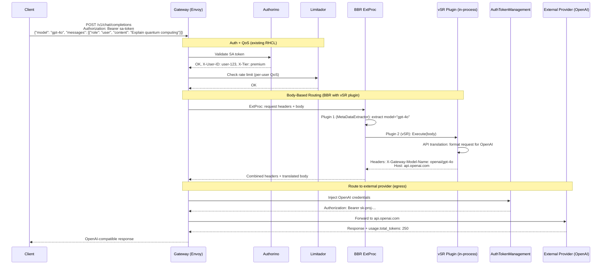
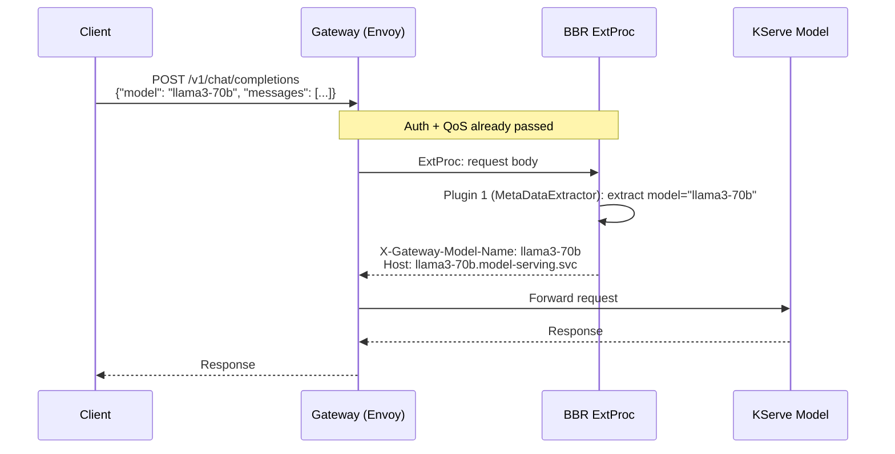

# Extending MaaS with Egress Inference and Intelligent Routing

## vSR Integration with OpenShift Gateway Egress

**Version**: 1.2
**Document Status**: Draft
**Date**: February 2026
**Author**: Noy Itzikowitz
**Release Target**: RHOAI 3.4 Developer Preview
**MVP Driver**: Customer demand for egress + local model routing
**Previous Versions**: [v1.0](https://github.com/noyitz/maas-designs) (Dec 2025), [v1.1](https://github.com/noyitz/maas-designs) (Jan 2026)

---

## Executive Summary

This document describes how MaaS is extended to support external model providers by combining two complementary capabilities. The MVP focuses on **OpenAI and Anthropic** -- the two providers already supported by vSR with production-ready adapters. Additional providers (AWS Bedrock, Google Gemini) are addressed in future releases:

1. **OpenShift Gateway Egress** -- Istio already supports egress via ServiceEntry and DestinationRule. These APIs allow for the explicit registration of external services in the mesh, and for the configuration of connection properties such as DNS resolution, protocols, TLS and mTLS. This design leverages these existing capabilities without introducing new connectivity or trust primitives. An AuthTokenManagement (ATM) layer is added on top to handle provider credential injection (API keys, AWS SigV4, etc.) passively at the gateway.

2. **vSR as a BBR Plugin in IGW** -- vSR is called as part of the IGW ExtProc in BBR to provide API translation and body-based routing capabilities. The plugin runs in-process within the BBR plugin chain using the GIE BBR pluggable framework. This eliminates the need for a separate ExtProc hop, avoids WASM complexity, and provides a natural extension point for future body-based capabilities (security filtering, intelligent model selection, semantic caching, additional guardrails, advanced classification).

The gateway handles **network plumbing** (egress connectivity, TLS, credentials). The vSR BBR plugin handles **application intelligence** (API translation, body-based routing) as part of the BBR plugin chain inside IGW, with security filtering and intelligent model selection planned for future releases.

**MVP scope for RHOAI 3.4 developer preview:**
- Egress to **OpenAI and Anthropic** -- these are the providers already supported by vSR with production-ready adapters (`pkg/openai/`, `pkg/anthropic/`)
- vSR BBR plugin for body-based model extraction, API translation, and routing within BBR
- AuthPolicy + RateLimitPolicy for access control and QoS
- Prometheus metrics capturing model selection and token usage

**Explicitly out of scope for MVP (per Feb 10 alignment):**
- Security filtering (PII detection, jailbreak prevention) -- future release
- Intelligent model selection ("MoM" / Mixture of Models routing) -- future release
- Semantic cache (stays in vSR standalone -- not for 3.4 dev preview)
- Per-model RBAC and billing
- Stateful Responses API support

---

## 1. Foundation: OpenShift Gateway Egress and IGW/GIE Architecture

This design builds directly on the Egress Inference Support for OpenShift Gateway proposal and integrates with the Inference Gateway (IGW) architecture. The gateway proposal provides four capabilities for external services:

| Capability | Mechanism | Status |
|------------|-----------|--------|
| **Connectivity and Trust** | Istio ServiceEntry + DestinationRule. Existing APIs for registering external services, configuring DNS, TLS, mTLS. No new primitives. | Existing in Istio |
| **Auth Token Management** | New AuthTokenManagement (ATM) API. Source+destination discrimination for credential injection. Built with RHCL/Kuadrant WASM + Authorino, or standalone WASM/dynamic module. | Being built by gateway team |
| **Inference API Translation** | Middleware to convert OpenAI Chat Completions to provider-native APIs (Bedrock, Anthropic, Gemini). vSR handles this as part of the BBR plugin using existing adapters for OpenAI and Anthropic. | vSR BBR plugin (MVP: OpenAI, Anthropic) |
| **Routing** | Header-based routing via HTTPRoute. Body-based routing (BBR) needed to extract model name from JSON payload. vSR provides classification and model selection as a BBR plugin. | vSR plugin extends BBR |

### 1.1 What the Gateway Provides (No Changes Needed)

Istio already supports egress. For Phase 1, we leverage these existing capabilities directly:

```yaml
# ServiceEntry: register an external AI provider in the mesh
apiVersion: networking.istio.io/v1
kind: ServiceEntry
metadata:
  name: openai-api
spec:
  hosts:
    - "api.openai.com"
  location: MESH_EXTERNAL
  ports:
    - number: 443
      name: https
      protocol: TLS
  resolution: DNS
---
apiVersion: networking.istio.io/v1
kind: ServiceEntry
metadata:
  name: anthropic-api
spec:
  hosts:
    - "api.anthropic.com"
  location: MESH_EXTERNAL
  ports:
    - number: 443
      name: https
      protocol: TLS
  resolution: DNS
```

These are standard Istio resources. No new CRDs, no new controllers.

### 1.2 What the Gateway Is Building (ATM)

The gateway team is building AuthTokenManagement to passively inject provider credentials based on destination:

```yaml
# Conceptual -- exact API TBD by gateway team
apiVersion: gateway.openshift.io/v1alpha1
kind: AuthTokenManagement
metadata:
  name: openai-auth
spec:
  targetRef:
    kind: ServiceEntry
    name: openai-api
  authentication:
    type: api-key
    secretRef:
      name: openai-credentials
    headerName: "Authorization"
    headerPrefix: "Bearer "
```

This uses existing Kuadrant/Authorino patterns for source+destination token discrimination. The MCP gateway's Vault integration and PAT patterns are reused -- no new auth framework is designed.

### 1.3 What Is Missing: Body-Based Routing

The OpenShift Gateway today supports only **path-based and header-based routing**. It cannot examine request bodies.

OpenAI's Chat Completions API places the model name inside the JSON payload:

```json
POST /v1/chat/completions
{"model": "gpt-4o", "messages": [{"role": "user", "content": "..."}]}
```

The model name is not in the URL path or headers. Without body-based routing, the gateway cannot route this request to the correct backend. This is where the BBR ExtProc -- and the vSR plugin within it -- come in.

### 1.4 IGW/GIE and the BBR Plugin Chain

The Inference Gateway (IGW) provides a Body-Based Router (BBR) that runs as an Envoy ExtProc. The BBR pluggable framework allows custom plugins to be compiled into the BBR process and executed as part of a plugin chain.

Each plugin implements the `BBRPlugin` interface:

```go
type BBRPlugin interface {
    plugins.Plugin  // TypedName()
    RequiresFullParsing() bool
    Execute(requestBodyBytes []byte) (headers map[string]string, mutatedBodyBytes []byte, err error)
}
```

The BBR plugin chain for this design:

| Order | Plugin | Type | Purpose |
|-------|--------|------|---------|
| 1 | MetaDataExtractor | Default | Extracts model name from JSON body, promotes to header |
| 2 | vSR SemanticRouterPlugin | Guardrail | Classification (category/intent), PII detection, jailbreak detection |
| 3 | *(future)* TrustyAI plugin | Guardrail | Red Hat's AI safety guardrails |
| 4 | *(future)* Nvidia NeMo plugin | Guardrail | Nvidia guardrails integration |

All plugins run **in-process** within the single BBR ExtProc. There is no additional network hop -- the vSR classifier code is compiled directly into the BBR binary via CGO (Candle/ModernBERT Rust bindings called from Go).

---

## 2. How vSR Extends the Gateway (BBR Plugin)

### 2.1 vSR as a BBR Guardrail Plugin

vSR is integrated as a BBR plugin inside the IGW's BBR ExtProc. The plugin provides API translation and body-based routing in the MVP, with the plugin architecture designed to add security filtering and intelligent model selection in future releases.

The plugin implements the GIE `BBRPlugin` interface and runs within the BBR plugin chain:

| Capability | Default BBR (MetaDataExtractor) | vSR BBR Plugin | Status |
|------------|--------------------------------|----------------|--------|
| Extract model name from JSON body | Yes | No (handled by MetaDataExtractor) | MVP |
| Promote model name to routing header | Yes | No (handled by MetaDataExtractor) | MVP |
| API translation (OpenAI, Anthropic) | No | Yes (existing adapters in `pkg/openai/`, `pkg/anthropic/`) | MVP |
| Semantic classification (domain, intent, complexity) | No | Yes (ModernBERT via Candle CGO, ~20ms) | Future |
| PII detection | No | Yes (ModernBERT token classifier) | Future |
| Jailbreak prevention | No | Yes (ModernBERT binary classifier) | Future |
| Intelligent model selection ("MoM") | No | Yes (classification-based routing) | Future |
| Semantic caching | No | No (stays in vSR standalone, not in BBR plugin) | Future |

For the RHOAI 3.4 MVP, the vSR BBR plugin's role is:
- **Body-based model extraction** and header injection for routing
- **API translation** for external providers (OpenAI and Anthropic adapters handle request/response format conversion in-process)

Future releases will add:
- **Security filtering** (PII detection, jailbreak prevention) blocking malicious requests before they reach model backends
- **Model selection** when the client specifies a virtual model like "MoM" (Mixture of Models)

The plugin runs inside the BBR ExtProc process, returning `X-Gateway-*` headers and mutated request bodies as needed.

### 2.2 Request Flow



Key difference from the previous design: there is a **single ExtProc call** to BBR. The vSR API translation runs in-process as part of the BBR plugin chain -- no second ExtProc hop.

### 2.3 Internal Model Flow (KServe)

When the BBR plugin chain routes to an internal model, the flow is simpler -- no egress, ATM, or API translation involved:



### 2.4 Request Flow Headers

The vSR BBR plugin uses `X-Gateway-*` headers rather than custom `X-VSR-*` headers. This aligns with the GIE convention where all BBR plugins contribute to a common gateway header namespace.

In the MVP, the client specifies the model explicitly. The vSR plugin handles API translation for external providers and passes through to internal models.

**Example A: External provider (OpenAI)**

```http
# Client Request
POST /v1/chat/completions
Authorization: Bearer sa-token-xyz
Content-Type: application/json
{"model": "gpt-4o", "messages": [{"role": "user", "content": "Explain quantum computing"}]}

# After Auth + QoS (Authorino + Limitador)
X-User-ID: user-123
X-Tier: premium

# After BBR ExtProc (MetaDataExtractor + vSR plugin)
X-Gateway-Model-Name: openai/gpt-4o           # Model resolved from body
Host: api.openai.com                           # Routing target

# After ATM (gateway injects provider credentials)
Authorization: Bearer sk-proj-...              # OpenAI API key (replaces SA token)

# Response
HTTP/1.1 200 OK
{"model": "gpt-4o", "choices": [...], "usage": {"prompt_tokens": 50, "completion_tokens": 200, "total_tokens": 250}}
```

**Example B: Internal model (KServe)**

```http
# Client Request
POST /v1/chat/completions
Authorization: Bearer sa-token-xyz
Content-Type: application/json
{"model": "llama3-70b", "messages": [{"role": "user", "content": "What is the derivative of x²?"}]}

# After BBR ExtProc (MetaDataExtractor resolves model)
X-Gateway-Model-Name: llama3-70b              # Internal model
Host: llama3-70b.model-serving.svc             # Routing target

# Response
HTTP/1.1 200 OK
{"model": "llama3-70b", "choices": [...], "usage": {"prompt_tokens": 20, "completion_tokens": 150, "total_tokens": 170}}
```

**Header reference:**

| Header | Description | Example | Status |
|--------|-------------|---------|--------|
| `X-Gateway-Model-Name` | Selected model name | `llama3-70b` | MVP |
| `X-Gateway-Intent-Category` | Classified category | `mathematics` | Future |
| `X-Gateway-Intent-Confidence` | Classification confidence (0.0-1.0) | `0.9200` | Future |
| `X-Gateway-Intent-Latency-Ms` | Classification latency | `18` | Future |
| `X-Gateway-PII-Detected` | Whether PII was found | `true` / `false` | Future |
| `X-Gateway-PII-Types` | Types of PII detected | `EMAIL,PHONE` | Future |
| `X-Gateway-PII-Blocked` | Whether request was blocked due to PII | `true` / `false` | Future |
| `X-Gateway-PII-Latency-Ms` | PII detection latency | `12` | Future |
| `X-Gateway-Security-Threat` | Type of security threat detected | `jailbreak` | Future |
| `X-Gateway-Security-Blocked` | Whether request was blocked | `true` / `false` | Future |
| `X-Gateway-Security-Confidence` | Jailbreak detection confidence | `0.9700` | Future |
| `X-Gateway-Security-Latency-Ms` | Jailbreak detection latency | `15` | Future |

---

## 3. Auth and QoS (Existing RHCL -- Configuration Only)

Authentication and rate limiting use existing Kuadrant/RHCL with no code changes. The only change is the policy `targetRef` points to the gateway route that fronts the BBR ExtProc.

### 3.1 AuthPolicy -- Gateway Access

```yaml
apiVersion: kuadrant.io/v1
kind: AuthPolicy
metadata:
  name: vsr-access-policy
  namespace: gateway-system
spec:
  targetRef:
    group: gateway.networking.k8s.io
    kind: HTTPRoute
    name: inference-route
  rules:
    authentication:
      sa-token:
        kubernetesTokenReview:
          audiences: [vsr-api]
    metadata:
      user-tier:
        http:
          url: "http://maas-api.redhat-ods-applications.svc:8080/api/v1/tier"
          method: GET
          headers:
            Authorization:
              selector: auth.identity.token
    response:
      success:
        headers:
          x-user-id:
            plain:
              selector: auth.identity.username
          x-tier:
            plain:
              selector: auth.metadata.user-tier.tier
```

This reuses existing MCP gateway auth patterns and Kuadrant's source+destination token discrimination.

### 3.2 RateLimitPolicy -- QoS Protection

```yaml
apiVersion: kuadrant.io/v1
kind: RateLimitPolicy
metadata:
  name: vsr-qos-rate-limit
  namespace: gateway-system
spec:
  targetRef:
    group: gateway.networking.k8s.io
    kind: HTTPRoute
    name: inference-route
  limits:
    tier-free:
      rates:
        - limit: 10
          window: 1m
      counters:
        - expression: auth.identity.username
      when:
        - predicate: auth.metadata.user-tier.tier == 'free'
    tier-premium:
      rates:
        - limit: 60
          window: 1m
      counters:
        - expression: auth.identity.username
      when:
        - predicate: auth.metadata.user-tier.tier == 'premium'
    tier-enterprise:
      rates:
        - limit: 300
          window: 1m
      counters:
        - expression: auth.identity.username
      when:
        - predicate: auth.metadata.user-tier.tier == 'enterprise'
```

Rate limits are **request-count-based only** for the MVP. Token-based rate limiting (TokenRateLimitPolicy) is deferred. QoS protects against abuse; it does not track spend.

---

## 4. BBR Plugin Configuration

The vSR BBR plugin is configured via a ConfigMap mounted into the BBR ExtProc deployment:

```yaml
apiVersion: v1
kind: ConfigMap
metadata:
  name: bbr-vsr-config
  namespace: gateway-system
data:
  config.yaml: |
    plugin:
      name: vsr-semantic-router
      type: Guardrail

    classifier:
      enabled: true
      threshold: 0.7

    pii:
      enabled: true
      threshold: 0.8
      block_on_detection: true

    jailbreak:
      enabled: true
      threshold: 0.9
      block_on_detection: true
```

### 4.1 Model Pool Configuration

Model routing decisions are driven by a model pool section in the same ConfigMap or a separate one:

```yaml
# Model pool for Phase 1 MVP
endpoints:
  # Internal (KServe cluster services)
  llama3-70b:
    type: internal
    url: "llama3-70b.model-serving.svc.cluster.local"
  llama3-8b:
    type: internal
    url: "llama3-8b.model-serving.svc.cluster.local"
  granite-code-34b:
    type: internal
    url: "granite-code-34b.model-serving.svc.cluster.local"

  # External -- MVP (OpenAI-compatible APIs, API key auth)
  openai/gpt-4o:
    type: external
    provider: openai
    host: "api.openai.com"
  openai/gpt-4o-mini:
    type: external
    provider: openai
    host: "api.openai.com"
  anthropic/claude-sonnet:
    type: external
    provider: anthropic
    host: "api.anthropic.com"

  # Future (not in MVP -- no vSR adapter today)
  # bedrock/claude-sonnet:
  #   type: external
  #   provider: aws-bedrock
  #   host: "bedrock-runtime.us-east-1.amazonaws.com"
  #   model_id: "anthropic.claude-3-5-sonnet-20241022-v2:0"
```

When a client sends `{"model": "MoM"}`, the vSR plugin classifies the request, selects the best model from the pool, and sets `X-Gateway-Model-Name` and routing headers accordingly. When a client sends a specific model name like `{"model": "gpt-4o"}`, the MetaDataExtractor plugin handles the model extraction and the vSR plugin runs security checks only. In both cases, the gateway handles egress connectivity and credential injection.

### 4.2 BBR Plugin Registration

The vSR plugin is registered in the BBR plugin chain at startup. The BBR binary is built with the vSR plugin compiled in:

```go
// BBR startup -- register plugin chain
registry := framework.NewPluginRegistry()

// Plugin 1: Default model extraction
registry.RegisterFactory(bbrplugins.DefaultPluginType, bbrplugins.NewDefaultMetaDataExtractor)

// Plugin 2: vSR semantic router (Guardrail)
registry.RegisterFactory(plugin.PluginType, plugin.NewSemanticRouterPlugin)

// Build chain
chain := framework.NewPluginsChain()
chain.AddPlugin(bbrplugins.DefaultPluginType)  // MetaDataExtractor
chain.AddPlugin(plugin.PluginType)              // vSR Guardrail
```

---

## 5. Observability

### 5.1 Prometheus Metrics

The vSR BBR plugin emits metrics from within the BBR ExtProc process. Metrics are exposed on the BBR metrics port:

```yaml
# Requests processed by vSR BBR plugin
- name: bbr_vsr_requests_total
  type: counter
  labels: [user_id, tier, model_selected, provider, status]

# Classification results
- name: bbr_vsr_classification_total
  type: counter
  labels: [category, model_selected]

# Classification latency
- name: bbr_vsr_classification_duration_seconds
  type: histogram
  labels: [category]
  buckets: [0.005, 0.01, 0.025, 0.05, 0.1, 0.25]

# PII detections
- name: bbr_vsr_pii_detections_total
  type: counter
  labels: [pii_type, blocked]

# Jailbreak detections
- name: bbr_vsr_jailbreak_detections_total
  type: counter
  labels: [threat_type, blocked]

# Tokens consumed (parsed from response body)
- name: bbr_vsr_tokens_consumed_total
  type: counter
  labels: [user_id, tier, model_selected, provider, token_type]
  # token_type: "prompt", "completion", "total"

# External provider latency
- name: bbr_vsr_external_latency_seconds
  type: histogram
  labels: [provider, model_selected]
  buckets: [0.1, 0.25, 0.5, 1, 2.5, 5, 10, 30, 60]
```

The `provider` label distinguishes internal KServe (`kserve`) from external (`openai`, `anthropic`, `aws-bedrock`), giving immediate visibility into traffic and cost distribution. The `bbr_vsr_` prefix scopes all vSR plugin metrics within the BBR process namespace.

### 5.2 Grafana Panels

| Panel | Metric | Purpose |
|-------|--------|---------|
| Requests per provider (pie) | `bbr_vsr_requests_total` by `provider` | Internal vs external traffic split |
| Classification distribution (bar) | `bbr_vsr_classification_total` by `category` | Request category breakdown |
| Classification latency (heatmap) | `bbr_vsr_classification_duration_seconds` | ML inference performance |
| PII/jailbreak blocks (timeseries) | `bbr_vsr_pii_detections_total`, `bbr_vsr_jailbreak_detections_total` | Security filter activity |
| Tokens per provider (timeseries) | `bbr_vsr_tokens_consumed_total` | Cost distribution before billing exists |
| External provider latency (heatmap) | `bbr_vsr_external_latency_seconds` | Egress performance monitoring |
| Per-user token usage (table) | `bbr_vsr_tokens_consumed_total` by `user_id` | Identify heavy users |
| Rate limit rejections (timeseries) | Limitador metrics | QoS policy effectiveness |

---

## 6. MVP Provider Support

### 6.1 MVP: OpenAI + Anthropic

These providers have similar APIs, simple API key authentication, and -- critically -- are the two providers that vSR already supports with production-ready adapters in `pkg/openai/` and `pkg/anthropic/`. This means MVP egress requires no new adapter development in vSR.

| Aspect | OpenAI | Anthropic |
|--------|--------|-----------|
| API format | OpenAI Chat Completions (native) | Similar but different field names (`input_tokens`/`output_tokens`) |
| Auth | API key in `Authorization: Bearer` header | API key in `x-api-key` header |
| ATM config | Straightforward header injection | Straightforward header injection |
| API translation needed | No (native format) | Minimal (field name mapping in response) |
| vSR adapter | Existing (`pkg/openai/`) | Existing (`pkg/anthropic/`) |

### 6.2 Future: AWS Bedrock (Not in MVP)

Bedrock is significantly more complex and vSR does not have a Bedrock adapter today:

| Aspect | Challenge |
|--------|-----------|
| Auth | AWS SigV4 with dynamic key generation based on time. Not a simple API key. |
| API format | Non-OpenAI-compatible. Different endpoint structure (`/model/{id}/invoke`), different body format. |
| "OpenAI-compatible" mode | Exists but differs in key/signature methods from actual OpenAI. |
| Translation layer | Full request/response transformation required. |
| vSR adapter | Does not exist -- new development required. |

Bedrock support requires both a new vSR adapter and either the gateway's API Translation WASM plugin or extended vSR translation logic. Targeted for a future release.

---

## 7. Kubernetes Resources

```
gateway-system namespace:
├── Deployment: bbr-extproc              # BBR ExtProc with vSR plugin compiled in
├── Service: bbr-extproc                 # ClusterIP, port 9002 (gRPC)
├── Service: bbr-metrics                 # ClusterIP, port 8080
├── ServiceMonitor: bbr-vsr-metrics      # Prometheus scrape
├── ConfigMap: bbr-vsr-config            # vSR plugin config (classifier, PII, jailbreak thresholds)
├── ConfigMap: bbr-model-pool            # Model pool config (endpoints)
├── HTTPRoute: inference-route           # Gateway API route
├── AuthPolicy: vsr-access-policy        # Kuadrant auth (config only)
└── RateLimitPolicy: vsr-qos-rate-limit  # Kuadrant QoS (config only)

gateway namespace (gateway team owns):
├── ServiceEntry: openai-api             # Egress to api.openai.com
├── ServiceEntry: anthropic-api          # Egress to api.anthropic.com
├── AuthTokenManagement: openai-auth     # API key injection for OpenAI
├── AuthTokenManagement: anthropic-auth  # API key injection for Anthropic
├── Secret: openai-credentials           # OpenAI API key
└── Secret: anthropic-credentials        # Anthropic API key
```

The BBR ExtProc deployment uses a custom image (`ghcr.io/vllm-project/bbr-with-vsr:latest`) that bundles the BBR binary with the vSR Guardrail plugin and ModernBERT classifier models:

```yaml
apiVersion: apps/v1
kind: Deployment
metadata:
  name: bbr-extproc
  namespace: gateway-system
spec:
  replicas: 2
  selector:
    matchLabels:
      app: bbr-extproc
  template:
    metadata:
      labels:
        app: bbr-extproc
    spec:
      containers:
      - name: bbr
        image: ghcr.io/vllm-project/bbr-with-vsr:latest
        ports:
        - name: grpc
          containerPort: 9002
          protocol: TCP
        - name: health
          containerPort: 8080
          protocol: TCP
        env:
        - name: VSR_CONFIG_PATH
          value: /config/config.yaml
        - name: VSR_MODELS_PATH
          value: /models
        volumeMounts:
        - name: config
          mountPath: /config
          readOnly: true
        - name: models
          mountPath: /models
          readOnly: true
        resources:
          requests:
            cpu: "2"
            memory: "4Gi"
          limits:
            cpu: "4"
            memory: "8Gi"
      volumes:
      - name: config
        configMap:
          name: bbr-vsr-config
      - name: models
        persistentVolumeClaim:
          claimName: vsr-models
```

---

## 8. Error Handling

Standard OpenAI-compatible error responses:

| Scenario | HTTP Status | Error Code |
|----------|------------|------------|
| Invalid SA token | 401 | `invalid_api_key` |
| Rate limit exceeded | 429 | `rate_limit_exceeded` |
| External provider error | 502 | `upstream_error` |
| External provider timeout | 504 | `gateway_timeout` |
| Model not found in pool | 404 | `model_not_found` |
| PII detected (blocked) | 400 | `content_policy_violation` | *(future)* |
| Jailbreak detected (blocked) | 400 | `content_policy_violation` | *(future)* |

No fallback logic in MVP. If the selected model is unavailable, the request fails. Intelligent fallback is a future extension.

---

## 9. Security

### 9.1 Trust Boundaries

```
UNTRUSTED: Client
  - SA token (validated by Authorino)
  - Request body (passed to BBR ExtProc)
      │
      │ Gateway strips X-Gateway-* from incoming requests
      ▼
TRUSTED: Internal (BBR ExtProc process)
  - X-User-ID, X-Tier (set by Authorino)
  - X-Gateway-Model-Name (set by vSR plugin inside BBR)
  - API translation runs in-process (no network boundary)
      │
      │ ATM injects provider credentials
      ▼
TRUSTED: Egress
  - Provider credentials (managed by gateway ATM, never exposed to BBR or client)
  - TLS to external provider
```

Key security properties:
- **vSR plugin runs inside the BBR process.** There is no separate service with its own network attack surface. The plugin code runs in the same process as BBR, reducing the trust boundary surface.
- **No additional network hop.** Unlike a standalone ExtProc, the vSR plugin does not require a separate gRPC connection -- API translation and routing are in-process function calls.
- **BBR never touches provider credentials.** The gateway's ATM handles credential injection.
- **Provider credentials never reach the client.** ATM replaces the client's SA token with provider credentials at the egress boundary.
- **Gateway strips `X-Gateway-*` headers** from incoming requests to prevent spoofing.

---

## 10. Team Responsibilities

| Team | Phase 1 Tasks |
|------|--------------|
| **Gateway / Networking** | Egress connectivity (ServiceEntry, DestinationRule). AuthTokenManagement API + controller for OpenAI + Anthropic. |
| **vSR / Semantic Router** | BBR plugin: API translation adapters (OpenAI, Anthropic -- existing), body-based model extraction. Plugin implements GIE `BBRPlugin` interface. Prometheus metrics from plugin. Future: classification, PII detection, jailbreak detection via Candle/ModernBERT CGO bindings. |
| **IGW / GIE** | BBR pluggable framework. Plugin registry, plugin chain execution, `BBRPlugin` interface stability. |
| **MaaS / RHOAI** | AuthPolicy + RateLimitPolicy configuration. MaaS GA stability (dev preview does not impact GA). |
| **Kuadrant / RHCL** | Authorino + Limitador configuration for the gateway route. Validate ATM aligns with existing Kuadrant patterns. |

### Critical Path

1. **GIE BBR pluggable framework** must be merged and stable for the vSR plugin to compile against.
2. The gateway team's ATM and ServiceEntry work must be ready for routing to external providers. If ATM is delayed, the BBR ExtProc can fall back to self-managed egress (mounting provider credential Secrets directly), with a clean transition to gateway-native ATM when available.

---

## 11. Future Extensions (Post-MVP)

These capabilities extend the architecture but are **not included in the RHOAI 3.4 dev preview**:

| Capability | Architecture | Why Deferred | When |
|------------|-------------|-------------|------|
| Security filtering (PII, jailbreak) | PII detection and jailbreak prevention as part of the vSR BBR plugin. Blocks malicious requests before they reach model backends. | Not critical for MVP -- can be added after initial integration is proven. | Post-summit |
| Intelligent model selection ("MoM") | Classification-based routing when the client specifies a virtual model. vSR classifies the request and selects the best backend. | Requires classifier models validated in BBR context. Not critical for MVP. | Post-summit |
| Semantic cache | Stays in vSR standalone. Not a BBR plugin -- requires persistent state and HNSW index. | Requires classifier models -- not for 3.4 dev preview | Post-summit |
| Additional guardrail plugins | TrustyAI and Nvidia NeMo as separate BBR Guardrail plugins. Each team builds their own `BBRPlugin` implementation, registered in the plugin chain alongside vSR. | Must align with TrustyAI framework. | Post-summit |
| Semantic classification | Full 14-domain classification in the BBR plugin. Currently the POC supports a subset of categories. | Requires all ModernBERT classifiers validated in BBR context. | Post-summit |
| Bedrock / Gemini full support | Complex auth (SigV4) + API translation. Depends on gateway WASM or vSR adapter work. | No vSR adapter today. | 3.5+ |
| Per-model RBAC | Requires MaaS API `accessible-models` endpoint. | | Phase 2 |
| Token-based rate limiting | Requires TokenRateLimitPolicy + response body parsing. | | Phase 2 |
| Billing / cost tracking | Requires metering integration (not a feature of RHAIE today). Prometheus metrics from MVP provide data foundation. | | Phase 3 |
| Stateful Responses API | Significant complexity. Full implementation 12+ months out. | | Future |

### Design Options

Two integration approaches are being evaluated:

1. **Classifier-only plugin** (current POC approach): Extract only the classifier portions of vSR (category, PII, jailbreak) as a BBR plugin. The rest of vSR (semantic cache, full routing engine, adapters) remains as standalone components where needed.

2. **Entire vSR as plugin**: Make the entire vSR a BBR plugin. This would include the routing engine, adapters, and cache within BBR. More integrated but higher coupling and complexity.

The current design follows option 1. Code commonality between vSR and the BBR plugin is maintained by sharing the classifier interfaces and Candle bindings as Go modules.

The MVP Prometheus metrics (`bbr_vsr_tokens_consumed_total` by model, user, tier, provider) serve as the data collection period for future billing and quota policy tuning.

---

## 12. Conclusion

This design extends MaaS to support external model providers by composing existing capabilities with the new BBR plugin architecture:

- **Istio egress** (ServiceEntry + DestinationRule) provides connectivity and trust to external services without new primitives
- **vSR as a BBR plugin** provides API translation and body-based routing inside the IGW's BBR ExtProc -- a single ExtProc call handles model extraction and API translation, with no additional network hop

The integration is minimal:
- **Zero RHCL code changes** -- AuthPolicy + RateLimitPolicy are configuration only
- **Zero MaaS API changes** -- reuses existing tier resolution
- **Zero new Istio primitives** -- uses existing ServiceEntry + DestinationRule
- **Single ExtProc** -- vSR runs in-process as a BBR plugin, not as a separate service
- **Standard GIE interface** -- the vSR plugin implements the upstream `BBRPlugin` interface from the GIE pluggable framework
- **Gateway team builds ATM** -- credential injection for external providers

The architecture supports incremental extension: security filtering (PII, jailbreak), intelligent model selection, and additional guardrail plugins (TrustyAI, Nvidia NeMo) are added in future releases as the BBR plugin matures. Semantic cache and full vSR routing capabilities remain as standalone components outside BBR.
