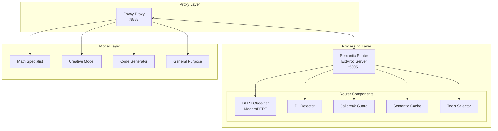
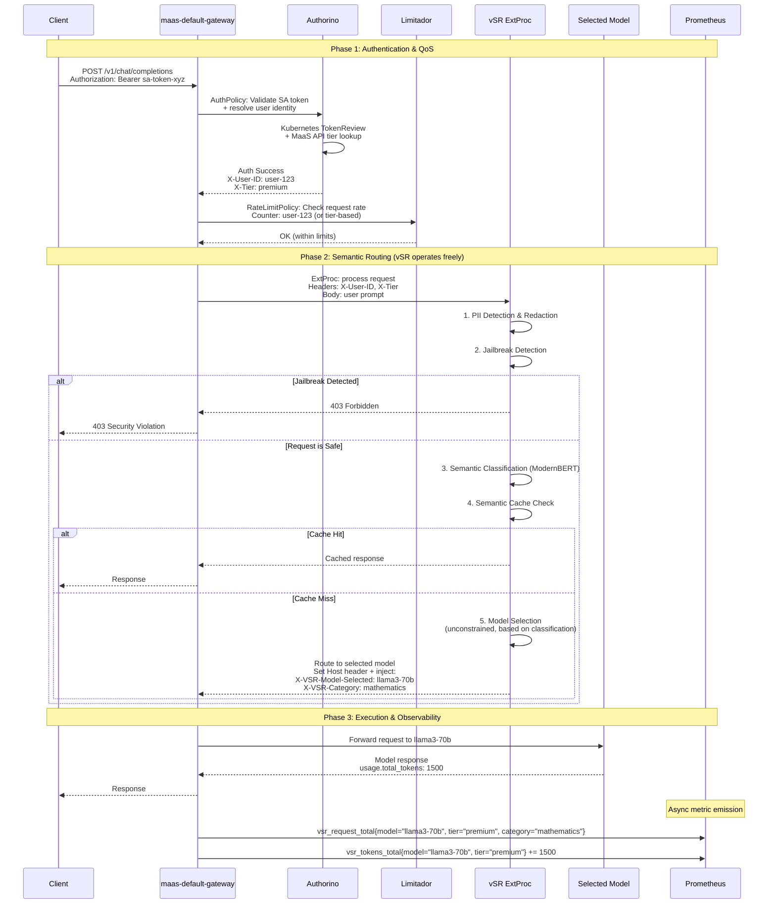
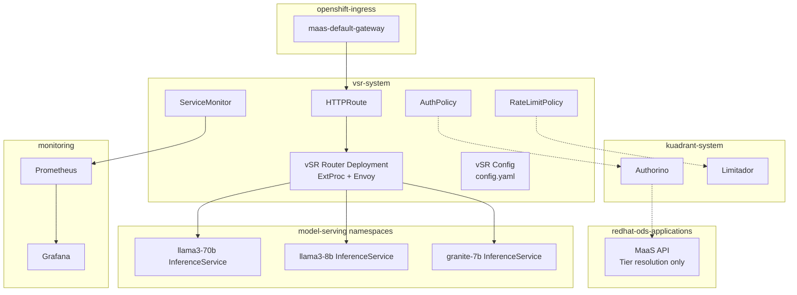

# Design Proposal: vLLM Semantic Router (vSR) Integration with Models-as-a-Service (MaaS)

## Phase 1: Simplified Integration

**Version**: 1.2
**Document Status**: Draft
**Date**: February 2026
**Author**: Noy Itzikowitz
**Previous Versions**: [v1.0](https://github.com/noyitz/maas-designs) (Dec 2025), [v1.1](https://github.com/noyitz/maas-designs) (Jan 2026)

---

## Executive Summary

This document defines the **Phase 1** integration strategy for vLLM Semantic Router (vSR) with the Models-as-a-Service (MaaS) platform. Phase 1 prioritizes a minimal, production-ready integration that gets vSR running behind MaaS security and QoS policies with the least amount of new development.

**Key design decisions for Phase 1:**

- **AuthPolicy protects vSR access** -- a single authorization check determines whether the user can use the semantic router. No per-model RBAC at the gateway level.
- **RateLimitPolicy provides QoS protection** -- rate limiting applies to the entire vSR endpoint to prevent DDoS and abuse. It is not used for per-model accounting or billing.
- **No model lists or quotas in headers** -- vSR receives no `X-Accessible-Models` or `X-Model-Quotas` headers. It routes freely based on its own semantic classification and configured model pool.
- **Observability captures model selection and token usage** -- the actual model selected by vSR and the tokens consumed are emitted as Prometheus metrics for monitoring and future billing readiness. This is capture-only, not enforcement.

**What Phase 1 defers to later phases:**
- Per-model RBAC and quota-constrained routing (Phase 2)
- Token-based rate limiting via Limitador (Phase 2)
- Smart cache invalidation and usage tracking APIs (Phase 2)
- Dynamic billing and cost allocation (Phase 3)

---

## 1. Architecture Overview

### 1.1 Phase 1 Design Principles

- **Simplicity over completeness**: Ship a working integration with minimal new components
- **Security first**: Users must authenticate before reaching vSR
- **QoS over accounting**: Rate limits prevent abuse, not track spend
- **Observability from day one**: Capture routing decisions and token usage in Prometheus so future phases have data to build on
- **No header pollution**: Keep the request flow clean -- vSR operates with its own intelligence, unconstrained by gateway-injected model lists

### 1.2 Phase 1 vs. Previous Proposals

| Aspect | v1.0 (Dec 2025) | v1.1 (Jan 2026) | v1.2 Phase 1 (Feb 2026) |
|--------|-----------------|-----------------|------------------------|
| Auth scope | Per-model (Phase 3 re-auth) | Per-model (via X-Accessible-Models) | **vSR access only** (binary: allowed/denied) |
| Rate limiting | Per-model + token quotas | Per-model + token quotas via MaaS API | **Entire vSR endpoint** (QoS/DDoS only) |
| Model constraints | Header injection + fallback | X-Accessible-Models + X-Model-Quotas | **None** -- vSR routes freely |
| Fallback logic | Phase 4.5 circuit breaker | Implicit via constrained selection | **Not applicable** -- no model constraints to fall back from |
| Usage tracking | Phase 5 smart cache + billing API | Usage tracking API + cache invalidation | **Prometheus metrics only** (capture, not enforce) |
| RHCL changes | WASM/Lua circuit breaker | No changes | **No changes** |
| MaaS API changes | Multiple new endpoints | accessible-models + usage APIs | **No new endpoints** |
| vSR changes | ExtProc + fallback API | Header parsing + constrained selection | **Metric emission only** |

### 1.3 Current Platform Architectures

#### MaaS Platform


#### vSR Platform



---

## 2. Phase 1 Integration Architecture

### 2.1 Integration Flow Overview

Phase 1 implements a **three-phase flow**: authenticate, protect, route, execute, and observe.

```mermaid
graph TB
    subgraph "Phase 1: Authentication & QoS ✅ EXISTING"
        P1A[AuthPolicy: Can user access vSR?<br/>Authorino validates SA token]
        P1B[RateLimitPolicy: QoS Protection<br/>Limitador enforces request rate limits]
    end

    subgraph "Phase 2: Semantic Routing ✅ EXISTING vSR"
        P2[vSR ExtProc<br/>Classification + Security + Model Selection<br/>No external constraints]
    end

    subgraph "Phase 3: Execution & Observability"
        P3A[KServe Model Execution ✅ EXISTING]
        P3B[Prometheus Metric Capture 🆕 NEW<br/>Model selected + tokens consumed]
    end

    P1A --> P1B
    P1B --> P2
    P2 --> P3A
    P3A --> P3B
```



**Legend:**
- ✅ **EXISTING**: Components that exist today and require no changes (or minimal config)
- 🆕 **NEW**: New components to be implemented

### 2.2 Detailed Sequence



### 2.3 Phase-by-Phase Detail

#### Phase 1: Authentication & QoS Protection

Uses existing RHCL (Kuadrant/Authorino/Limitador) with standard configuration. **No code changes to RHCL components.**

**AuthPolicy** -- vSR Access Authorization:

```yaml
apiVersion: kuadrant.io/v1
kind: AuthPolicy
metadata:
  name: vsr-access-policy
  namespace: vsr-system
spec:
  targetRef:
    group: gateway.networking.k8s.io
    kind: HTTPRoute
    name: vsr-route
  rules:
    authentication:
      sa-token:
        kubernetesTokenReview:
          audiences:
            - vsr-api
    metadata:
      user-tier:
        http:
          url: "http://maas-api.redhat-ods-applications.svc:8080/api/v1/tier"
          method: GET
          headers:
            Authorization:
              selector: auth.identity.token
          credentials:
            authorizationHeader:
              prefix: Bearer
    response:
      success:
        headers:
          x-user-id:
            plain:
              selector: auth.identity.username
          x-tier:
            plain:
              selector: auth.metadata.user-tier.tier
```

This is the same pattern MaaS uses today. The only difference is the `targetRef` points to the vSR HTTPRoute instead of a model-specific route.

**RateLimitPolicy** -- QoS / DDoS Protection:

```yaml
apiVersion: kuadrant.io/v1
kind: RateLimitPolicy
metadata:
  name: vsr-qos-rate-limit
  namespace: vsr-system
spec:
  targetRef:
    group: gateway.networking.k8s.io
    kind: HTTPRoute
    name: vsr-route
  limits:
    global-qos:
      rates:
        - limit: 100
          window: 1m
      counters:
        - expression: auth.identity.username
    tier-free:
      rates:
        - limit: 10
          window: 1m
      counters:
        - expression: auth.identity.username
      when:
        - predicate: auth.metadata.user-tier.tier == 'free'
    tier-premium:
      rates:
        - limit: 60
          window: 1m
      counters:
        - expression: auth.identity.username
      when:
        - predicate: auth.metadata.user-tier.tier == 'premium'
    tier-enterprise:
      rates:
        - limit: 300
          window: 1m
      counters:
        - expression: auth.identity.username
      when:
        - predicate: auth.metadata.user-tier.tier == 'enterprise'
```

**Key design choice**: Rate limits are **request-count-based only** (not token-based). This is intentional for Phase 1:
- Token-based rate limiting requires response-body parsing (TokenRateLimitPolicy) which adds complexity
- QoS/DDoS protection is effectively achieved by capping request frequency
- Token consumption is captured via Prometheus for visibility, but not enforced at the gateway

#### Phase 2: Semantic Routing (vSR)

vSR operates as it does today with **no constraints from MaaS**. It receives the authenticated request with `X-User-ID` and `X-Tier` headers (for cache namespacing and observability) but no model lists or quotas.

**What vSR does (unchanged from standalone operation):**
1. PII detection and redaction
2. Jailbreak detection (blocks malicious prompts with 403)
3. Semantic classification via ModernBERT (domain, intent, complexity)
4. Semantic cache lookup (namespaced by `X-User-ID` for multi-tenant isolation)
5. Model selection based on classification result and configured routing rules

**What vSR adds for Phase 1 (new):**
- Injects `X-VSR-Model-Selected` header with the chosen model name
- Injects `X-VSR-Category` header with the classification result
- These headers are used downstream for Prometheus metric labeling only

**Multi-tenant cache isolation:**

Even in Phase 1, the semantic cache must be namespaced by user to prevent cross-tenant data leakage. vSR uses `X-User-ID` to scope cache entries:

```
Cache key: hash(X-User-ID + prompt_embedding)
```

This ensures User A never receives cached routing decisions from User B's similar prompts.

#### Phase 3: Execution & Observability

**Model Execution** -- KServe handles inference as it does today. No changes.

**Prometheus Metric Capture** -- The new component in Phase 1. After the response returns from KServe, metrics are emitted capturing the routing decision and token consumption.

### 2.4 Request Flow Headers

```http
# Client Request
POST /v1/chat/completions
Authorization: Bearer sa-token-xyz
Content-Type: application/json
{"messages": [{"role": "user", "content": "Solve this calculus problem..."}]}

# After Phase 1: Auth + QoS (✅ EXISTING headers)
POST /v1/chat/completions
Authorization: Bearer sa-token-xyz
X-User-ID: math-user-123             # ✅ User identity (from Authorino)
X-Tier: premium                      # ✅ Subscription tier (from Authorino)

# After Phase 2: vSR Semantic Routing (no model constraints injected)
POST /v1/chat/completions
Authorization: Bearer sa-token-xyz
X-User-ID: math-user-123             # ✅ Passed through
X-Tier: premium                      # ✅ Passed through
X-VSR-Model-Selected: llama3-70b     # 🆕 vSR's unconstrained model choice
X-VSR-Category: mathematics          # 🆕 Semantic classification result
Host: llama3-70b-service             # 🆕 Routing target (set by vSR ExtProc)

# Phase 3: Response (after model execution)
HTTP/1.1 200 OK
Content-Type: application/json
X-VSR-Model-Selected: llama3-70b     # Passed through for client visibility
{"choices": [...], "usage": {"prompt_tokens": 50, "completion_tokens": 1450, "total_tokens": 1500}}
```

**Headers NOT present in Phase 1** (deferred to Phase 2+):
- ~~`X-Accessible-Models`~~ -- No model list injection
- ~~`X-Model-Quotas`~~ -- No per-model quota information
- ~~`X-MaaS-Model-Selected`~~ -- Replaced by `X-VSR-Model-Selected` (vSR decides, not MaaS)
- ~~`X-Tokens-Estimated`~~ -- No pre-estimation needed when there are no quota constraints
- ~~`X-MaaS-Quota-Remaining`~~ -- No quota enforcement in Phase 1

---

## 3. Observability Architecture

### 3.1 Prometheus Metrics

Phase 1 introduces metrics that capture vSR routing decisions and model token consumption. These metrics serve dual purposes: operational monitoring today, and billing/quota data source for future phases.

#### Metric Definitions

```yaml
# Counter: Total requests processed by vSR
- name: vsr_requests_total
  type: counter
  labels: [user_id, tier, category, model_selected, status]
  description: "Total requests routed through vSR"

# Counter: Total tokens consumed across all vSR requests
- name: vsr_tokens_consumed_total
  type: counter
  labels: [user_id, tier, model_selected, token_type]
  description: "Total tokens consumed (prompt + completion)"
  # token_type: "prompt", "completion", "total"

# Histogram: vSR classification latency
- name: vsr_classification_duration_seconds
  type: histogram
  labels: [category]
  buckets: [0.005, 0.01, 0.025, 0.05, 0.1, 0.25]
  description: "Time spent in semantic classification"

# Histogram: End-to-end request latency through vSR
- name: vsr_request_duration_seconds
  type: histogram
  labels: [tier, model_selected, cache_hit]
  buckets: [0.1, 0.25, 0.5, 1, 2.5, 5, 10, 30]
  description: "Total request duration including model inference"

# Counter: Security events (PII detections, jailbreak blocks)
- name: vsr_security_events_total
  type: counter
  labels: [user_id, tier, event_type]
  description: "Security events detected by vSR"
  # event_type: "pii_detected", "pii_redacted", "jailbreak_blocked"

# Counter: Semantic cache performance
- name: vsr_cache_operations_total
  type: counter
  labels: [tier, operation]
  description: "Semantic cache hits and misses"
  # operation: "hit", "miss"

# Gauge: Models currently available in vSR routing pool
- name: vsr_available_models
  type: gauge
  labels: [model]
  description: "Models available for routing"
```

#### Where Metrics Are Emitted


**Token capture approach**: vSR's ExtProc response filter parses the `usage` object from the OpenAI-compatible response body. This is already supported by vSR's response filter pipeline -- no new parsing logic is needed. The token counts are emitted as Prometheus counter increments labeled by model and user.

### 3.2 Grafana Dashboard Panels (Recommended)

| Panel | Metric Source | Purpose |
|-------|--------------|---------|
| Requests per model (timeseries) | `vsr_requests_total` | See which models vSR is routing to |
| Tokens per model per tier (timeseries) | `vsr_tokens_consumed_total` | Understand cost distribution before billing exists |
| Classification distribution (pie chart) | `vsr_requests_total` by `category` | Validate semantic classification accuracy |
| Cache hit ratio (gauge) | `vsr_cache_operations_total` | Measure cache effectiveness |
| Security events (timeseries) | `vsr_security_events_total` | Monitor PII and jailbreak detections |
| P50/P95/P99 latency (heatmap) | `vsr_request_duration_seconds` | End-to-end performance monitoring |
| Rate limit rejections (timeseries) | Limitador metrics | Monitor QoS policy effectiveness |
| Per-user token usage (table) | `vsr_tokens_consumed_total` | Identify heavy users (pre-billing insight) |

---

## 4. Implementation Requirements

### 4.1 Component Change Summary

#### RHCL (Kuadrant / Authorino / Limitador) -- No Code Changes

| Component | Change | Status |
|-----------|--------|--------|
| Authorino | AuthPolicy targeting vSR HTTPRoute | ✅ Configuration only |
| Limitador | RateLimitPolicy for QoS (request-count based) | ✅ Configuration only |
| Kuadrant Operator | No changes | ✅ Existing |
| WASM Shim | No changes | ✅ Existing |

The RHCL stack is deployed and configured exactly as it is for MaaS today. The only difference is the policy `targetRef` points to the vSR HTTPRoute.

#### MaaS API -- No Code Changes

| Component | Change | Status |
|-----------|--------|--------|
| Tier resolution endpoint | Already exists, vSR reuses it via Authorino metadata | ✅ Existing |
| Token management | Existing SA token + API key infrastructure | ✅ Existing |
| Model discovery | Not needed in Phase 1 (vSR has its own model pool config) | Deferred |
| Accessible-models API | Not needed in Phase 1 | Deferred |
| Usage tracking API | Not needed in Phase 1 (Prometheus replaces this) | Deferred |

#### vSR (Semantic Router) -- Minimal Changes

| Component | Change | Status |
|-----------|--------|--------|
| ExtProc service | No changes to core routing logic | ✅ Existing |
| PII / Jailbreak detection | No changes | ✅ Existing |
| Semantic classification | No changes | ✅ Existing |
| Semantic cache | Namespace by `X-User-ID` for multi-tenant isolation | 🆕 Enhancement |
| `X-VSR-Model-Selected` header | Inject selected model name into response headers | 🆕 Enhancement |
| `X-VSR-Category` header | Inject classification result into response headers | 🆕 Enhancement |
| Prometheus metrics | Emit routing + token metrics (see Section 3.1) | 🆕 New |

#### Gateway / Envoy -- Configuration Only

| Component | Change | Status |
|-----------|--------|--------|
| HTTPRoute for vSR | New route definition pointing to vSR service | 🆕 Configuration |
| ExtProc filter | Configure Envoy to call vSR ExtProc | 🆕 Configuration |
| Header sanitization | Strip `X-VSR-*` headers from incoming client requests | 🆕 Configuration |

### 4.2 Gateway Configuration

#### HTTPRoute

```yaml
apiVersion: gateway.networking.k8s.io/v1
kind: HTTPRoute
metadata:
  name: vsr-route
  namespace: vsr-system
spec:
  parentRefs:
    - name: maas-default-gateway
      namespace: openshift-ingress
  hostnames:
    - "vsr.${CLUSTER_DOMAIN}"
  rules:
    - matches:
        - path:
            type: PathPrefix
            value: /v1/chat/completions
      backendRefs:
        - name: vsr-envoy
          port: 8888
```

#### Header Sanitization

The gateway must strip any `X-VSR-*` headers from incoming requests to prevent clients from spoofing routing metadata:

```yaml
# Envoy route config filter
request_headers_to_remove:
  - "x-vsr-model-selected"
  - "x-vsr-category"
  - "x-user-id"
  - "x-tier"
```

### 4.3 Kubernetes Resources

```
vsr-system namespace:
├── Deployment: vsr-router           # vSR ExtProc + Envoy sidecar
├── Service: vsr-envoy               # ClusterIP, port 8888
├── Service: vsr-extproc             # ClusterIP, port 50051
├── Service: vsr-metrics             # ClusterIP, port 9190 (Prometheus scrape)
├── ServiceMonitor: vsr-metrics      # Prometheus ServiceMonitor
├── ConfigMap: vsr-config            # vSR routing config (config.yaml)
├── HTTPRoute: vsr-route             # Gateway API route
├── AuthPolicy: vsr-access-policy    # Kuadrant auth policy
└── RateLimitPolicy: vsr-qos-rate-limit  # Kuadrant rate limit policy
```

---

## 5. Error Handling

Phase 1 uses standard OpenAI-compatible error responses. Error handling is simpler than v1.0/v1.1 because there are no model constraints or fallback chains.

### 5.1 Error Responses

**Authentication Failure (Authorino rejects):**
```json
{
  "error": {
    "message": "Invalid authentication credentials",
    "type": "invalid_request_error",
    "code": "invalid_api_key"
  }
}
```
HTTP Status: `401 Unauthorized`

**Rate Limited (Limitador rejects):**
```json
{
  "error": {
    "message": "Rate limit exceeded. Please slow down.",
    "type": "rate_limit_error",
    "code": "rate_limit_exceeded"
  }
}
```
HTTP Status: `429 Too Many Requests`
Headers: `Retry-After: 60`

**Security Violation (vSR jailbreak detection):**
```json
{
  "error": {
    "message": "Request blocked for safety violations",
    "type": "policy_violation",
    "code": "content_policy_violation"
  }
}
```
HTTP Status: `403 Forbidden`

**Model Unavailable (KServe backend down):**
```json
{
  "error": {
    "message": "The selected model is currently unavailable. Please try again.",
    "type": "server_error",
    "code": "model_unavailable"
  }
}
```
HTTP Status: `503 Service Unavailable`

### 5.2 Error Flow


**No fallback logic in Phase 1.** If the model vSR selects is unavailable, the request fails with 503. Intelligent fallback is deferred to Phase 2.

---

## 6. Security Considerations

### 6.1 Trust Boundaries

```
┌─────────────────────────────────────────────────────┐
│ UNTRUSTED: Client / External                        │
│  - SA token (validated by Authorino)                │
│  - Request body (scanned by vSR for PII/jailbreak)  │
└──────────────────────┬──────────────────────────────┘
                       │ Gateway strips X-VSR-*, X-User-ID, X-Tier
                       ▼
┌─────────────────────────────────────────────────────┐
│ TRUSTED: Internal (after Authorino validation)      │
│  - X-User-ID, X-Tier (set by Authorino)             │
│  - X-VSR-Model-Selected (set by vSR ExtProc)        │
│  - X-VSR-Category (set by vSR ExtProc)              │
└─────────────────────────────────────────────────────┘
```

### 6.2 Phase 1 Security Model

| Threat | Mitigation | Component |
|--------|-----------|-----------|
| Unauthenticated access | AuthPolicy validates SA token via Kubernetes TokenReview | Authorino |
| DDoS / request flooding | RateLimitPolicy caps request rate per user and tier | Limitador |
| Prompt injection / jailbreak | ModernBERT jailbreak classifier (96.7% accuracy) | vSR |
| PII in prompts | ModernBERT PII detector (95.7% F1) with redaction | vSR |
| Header spoofing | Gateway strips X-VSR-*, X-User-ID, X-Tier from incoming requests | Envoy |
| Cross-tenant cache leakage | Semantic cache namespaced by X-User-ID | vSR |
| Unauthorized model access | Not enforced in Phase 1 (vSR routes to its own configured pool) | Deferred to Phase 2 |

### 6.3 What Phase 1 Does NOT Protect Against

- **Unauthorized access to specific models**: Any authenticated user with vSR access can potentially be routed to any model in vSR's pool. Per-model RBAC is deferred to Phase 2.
- **Token overconsumption**: No per-model or per-user token quotas are enforced. A user could consume large amounts of tokens within the request rate limit. Prometheus metrics provide visibility but not enforcement.
- **Cost-based abuse**: Without billing enforcement, a free-tier user could be routed to an expensive model. This is acceptable in Phase 1 because the vSR model pool should be curated to match the intended audience.

**Mitigation for Phase 1**: Operators should configure vSR's model pool (`config.yaml`) to only include models appropriate for the expected user base. This is a deployment-time control, not a runtime policy.

---

## 7. Deployment Topology

### 7.1 Namespace Layout



### 7.2 vSR Model Pool Configuration

In Phase 1, vSR's model pool is configured statically in `config.yaml`. This replaces the dynamic `X-Accessible-Models` approach from v1.1:

```yaml
# vSR config.yaml -- Phase 1 model pool
models:
  domains:
    mathematics:
      model: llama3-70b
      reasoning: true
      system_prompt: "You are a mathematics expert..."
      plugins: [system_prompt, semantic-cache]
    coding:
      model: granite-code-34b
      reasoning: false
      system_prompt: "You are a code assistant..."
      plugins: [system_prompt, semantic-cache]
    general:
      model: llama3-8b
      reasoning: false
      plugins: [semantic-cache]

# Model endpoints (KServe services)
endpoints:
  llama3-70b: "llama3-70b.model-serving.svc.cluster.local"
  llama3-8b: "llama3-8b.model-serving.svc.cluster.local"
  granite-code-34b: "granite-code-34b.model-serving.svc.cluster.local"
```

---

## 8. Phase 1 to Phase 2 Transition Path

Phase 1 is designed so that every component can be extended without rework when Phase 2 adds per-model authorization and quota enforcement.

| Phase 1 Component | Phase 2 Extension |
|-------------------|-------------------|
| AuthPolicy (vSR access) | Add per-model RBAC via MaaS API `accessible-models` endpoint |
| RateLimitPolicy (QoS only) | Add TokenRateLimitPolicy for per-model token quotas |
| Prometheus metrics (capture) | Metrics become input to billing system and quota enforcement |
| vSR static model pool | Replace with dynamic model list from MaaS API headers |
| No fallback logic | Add constrained re-routing when quota-limited models are exhausted |
| `X-VSR-Model-Selected` header | Becomes `X-MaaS-Model-Selected` after MaaS validates the selection |

**Data continuity**: The Prometheus metrics collected in Phase 1 (`vsr_tokens_consumed_total` by model, user, tier) provide the historical data needed to configure accurate per-model token quotas when Phase 2 launches. This means Phase 1 is not throwaway -- it is the data collection period for Phase 2 policy tuning.

---

## 9. Conclusion

Phase 1 delivers a production-ready vSR integration with MaaS by making the minimum viable set of changes:

| Category | Scope |
|----------|-------|
| RHCL changes | **Zero** -- configuration only (AuthPolicy + RateLimitPolicy) |
| MaaS API changes | **Zero** -- reuses existing tier resolution endpoint |
| vSR changes | **Minimal** -- cache namespacing + header injection + Prometheus metrics |
| Gateway changes | **Configuration** -- HTTPRoute + header sanitization + ExtProc filter |

The architecture follows a deliberate strategy: **observe before you enforce**. By capturing model selection and token consumption in Prometheus before building enforcement policies, Phase 1 provides real usage data to inform Phase 2's per-model quotas and billing rates. This avoids the common pitfall of designing quota policies based on assumptions rather than actual traffic patterns.

Phase 1 is not a prototype -- it is the first production layer. Every component deployed in Phase 1 remains in place as Phase 2 adds authorization depth and cost controls on top of it.
