# Design Proposal: vLLM Semantic Router (vSR) Integration with Models-as-a-Service (MaaS)

## Phase 1: Simplified Integration

**Version**: 1.2
**Document Status**: Draft
**Date**: February 2026
**Author**: Noy Itzikowitz
**Previous Versions**: [v1.0](https://github.com/noyitz/maas-designs) (Dec 2025), [v1.1](https://github.com/noyitz/maas-designs) (Jan 2026)
**Release Target**: Dev Preview on top of MaaS GA (not blocking MaaS GA release)
**MVP Driver**: Wells Fargo -- combination of egress + local model routing

---

## Executive Summary

This document defines the **Phase 1** integration strategy for vLLM Semantic Router (vSR) with the Models-as-a-Service (MaaS) platform. Phase 1 is a **dev preview** that gets vSR running behind MaaS security and QoS policies with the least amount of new development, without impacting MaaS GA stability.

This design reflects the outcomes of the Feb 6, 2026 AI Routing alignment meeting, which established clear ownership boundaries between the OpenShift Gateway team (egress plumbing), vSR team (routing intelligence), TrustyAI team (guardrails), and MaaS team (policy configuration and GA stability).

**Key design decisions for Phase 1:**

- **Dev preview positioning** -- Phase 1 is staged as a preview/demo capability on top of MaaS GA core. It does not block or destabilize the MaaS GA release.
- **AuthPolicy protects vSR access** -- a single authorization check determines whether the user can use the semantic router. No per-model RBAC at the gateway level. Reuses existing authentication patterns from MCP gateway and Kuadrant (source+destination discrimination).
- **RateLimitPolicy provides QoS protection** -- rate limiting applies to the entire vSR endpoint to prevent DDoS and abuse. It is not used for per-model accounting or billing.
- **No model lists or quotas in headers** -- vSR receives no `X-Accessible-Models` or `X-Model-Quotas` headers. It routes freely based on its own semantic classification and configured model pool.
- **vSR is the body-based routing (BBR++) layer** -- the OpenShift Gateway cannot examine request bodies today. vSR provides body-based model extraction plus semantic intelligence (classification, caching, security). This is essential for OpenAI API compatibility, which requires extracting the model name from the JSON payload.
- **Internal and external models** -- vSR routes to both internal KServe models and external providers through a unified architecture. Egress plumbing (connectivity, trust, auth token management) is owned by the OpenShift Gateway team. vSR only sets routing headers.
- **MVP providers: OpenAI + Anthropic** -- these are the primary targets for Phase 1. AWS Bedrock and Google Gemini are stretch goals due to additional complexity (non-OpenAI-compatible APIs, dynamic key generation).
- **Guardrails align with TrustyAI** -- vSR's PII detection and jailbreak prevention plugins are designed as composable components that align with the TrustyAI gateway guardrail integration being built by the TrustyAI + Gateway teams.
- **Observability captures model selection and token usage** -- the actual model selected by vSR and the tokens consumed are emitted as Prometheus metrics for monitoring and future billing readiness. This is capture-only, not enforcement.

**What Phase 1 defers to later phases:**
- Per-model RBAC and quota-constrained routing (Phase 2)
- Token-based rate limiting via Limitador (Phase 2)
- Smart cache invalidation and usage tracking APIs (Phase 2)
- Dynamic billing and cost allocation (Phase 3)
- Per-provider cost tracking and budget enforcement (Phase 3)
- Full Bedrock/Gemini support with API translation (Phase 2, pending gateway WASM readiness)

---

## 1. Architecture Overview

### 1.1 Phase 1 Design Principles

- **Dev preview, not GA**: Ship as a preview capability on top of MaaS GA without impacting GA stability
- **Simplicity over completeness**: Ship a working integration with minimal new components
- **Security first**: Users must authenticate before reaching vSR
- **Reuse existing patterns**: Leverage MCP gateway auth patterns, Kuadrant source+destination discrimination, and existing Istio egress capabilities -- don't build new auth or egress from scratch
- **QoS over accounting**: Rate limits prevent abuse, not track spend
- **Composable plugins**: vSR's features (security, routing, caching, enhancement) are independently selectable plugins -- operators cherry-pick what they need for their deployment
- **Clear ownership boundaries**: vSR = routing intelligence, Gateway = network plumbing, TrustyAI = guardrail framework, MaaS = policy configuration
- **Observability from day one**: Capture routing decisions and token usage in Prometheus so future phases have data to build on
- **No header pollution**: Keep the request flow clean -- vSR operates with its own intelligence, unconstrained by gateway-injected model lists

### 1.2 Phase 1 vs. Previous Proposals

| Aspect | v1.0 (Dec 2025) | v1.1 (Jan 2026) | v1.2 Phase 1 (Feb 2026) |
|--------|-----------------|-----------------|------------------------|
| Auth scope | Per-model (Phase 3 re-auth) | Per-model (via X-Accessible-Models) | **vSR access only** (binary: allowed/denied) |
| Rate limiting | Per-model + token quotas | Per-model + token quotas via MaaS API | **Entire vSR endpoint** (QoS/DDoS only) |
| Model constraints | Header injection + fallback | X-Accessible-Models + X-Model-Quotas | **None** -- vSR routes freely |
| Fallback logic | Phase 4.5 circuit breaker | Implicit via constrained selection | **Not applicable** -- no model constraints to fall back from |
| Usage tracking | Phase 5 smart cache + billing API | Usage tracking API + cache invalidation | **Prometheus metrics only** (capture, not enforce) |
| RHCL changes | WASM/Lua circuit breaker | No changes | **No changes** |
| MaaS API changes | Multiple new endpoints | accessible-models + usage APIs | **No new endpoints** |
| vSR changes | ExtProc + fallback API | Header parsing + constrained selection | **Metric emission only** |
| External models | Not addressed | Not addressed | **Egress support for AWS Bedrock, Azure OpenAI, etc.** |

### 1.3 Current Platform Architectures

#### MaaS Platform


#### vSR Platform -- Composable Plugin Architecture

vSR implements a composable plugin system organized into four layers. Operators can cherry-pick which plugins to enable per deployment:


**Plugin configurability:**
```yaml
vsr_composition:
  security_pipeline:           # Aligns with TrustyAI guardrail framework
    pii_detection: true
    jailbreak_prevention: true
  routing_pipeline:            # BBR++ -- the gateway cannot do this today
    semantic_classification: true
    model_selection: true
  optimization_pipeline:
    semantic_cache: true
    tool_selection: false       # Disabled if MCP Gateway handles this
  enhancement_pipeline:
    reasoning_mode: true
```

> **Why vSR is essential for OpenAI API compatibility**: The OpenShift Gateway today supports only path-based routing. It cannot examine request bodies. OpenAI's Chat Completions API places the model name inside the JSON payload (`{"model": "gpt-4o", ...}`), not in the URL path. vSR's ExtProc reads the request body, extracts the model, and performs semantic classification on top -- making it a "BBR++" (body-based router with intelligence). Without vSR (or equivalent), the gateway cannot route OpenAI-compatible requests by model.

---

## 2. Phase 1 Integration Architecture

### 2.1 Integration Flow Overview

Phase 1 implements a **three-phase flow**: authenticate, protect, route, execute, and observe.

```mermaid
graph TB
    subgraph "Phase 1: Authentication & QoS ✅ EXISTING"
        P1A[AuthPolicy: Can user access vSR?<br/>Authorino validates SA token]
        P1B[RateLimitPolicy: QoS Protection<br/>Limitador enforces request rate limits]
    end

    subgraph "Phase 2: Semantic Routing ✅ EXISTING vSR"
        P2[vSR ExtProc<br/>Classification + Security + Model Selection<br/>No external constraints]
    end

    subgraph "Phase 3: Execution & Observability"
        P3A{Internal or<br/>External Model?}
        P3B[KServe Execution ✅ EXISTING]
        P3C[External Provider Egress 🆕 NEW<br/>AWS Bedrock / Azure OpenAI / etc.]
        P3D[Prometheus Metric Capture 🆕 NEW<br/>Model + provider + tokens consumed]
    end

    P1A --> P1B
    P1B --> P2
    P2 --> P3A
    P3A -->|Internal| P3B
    P3A -->|External| P3C
    P3B --> P3D
    P3C --> P3D
```



**Legend:**
- ✅ **EXISTING**: Components that exist today and require no changes (or minimal config)
- 🆕 **NEW**: New components to be implemented

### 2.2 Detailed Sequence


#### External Model Sequence (AWS Bedrock Example)


### 2.3 Phase-by-Phase Detail

#### Phase 1: Authentication & QoS Protection

Uses existing RHCL (Kuadrant/Authorino/Limitador) with standard configuration. **No code changes to RHCL components.**

**AuthPolicy** -- vSR Access Authorization:

```yaml
apiVersion: kuadrant.io/v1
kind: AuthPolicy
metadata:
  name: vsr-access-policy
  namespace: vsr-system
spec:
  targetRef:
    group: gateway.networking.k8s.io
    kind: HTTPRoute
    name: vsr-route
  rules:
    authentication:
      sa-token:
        kubernetesTokenReview:
          audiences:
            - vsr-api
    metadata:
      user-tier:
        http:
          url: "http://maas-api.redhat-ods-applications.svc:8080/api/v1/tier"
          method: GET
          headers:
            Authorization:
              selector: auth.identity.token
          credentials:
            authorizationHeader:
              prefix: Bearer
    response:
      success:
        headers:
          x-user-id:
            plain:
              selector: auth.identity.username
          x-tier:
            plain:
              selector: auth.metadata.user-tier.tier
```

This is the same pattern MaaS uses today. The only difference is the `targetRef` points to the vSR HTTPRoute instead of a model-specific route. Per the Feb 6 alignment meeting, this reuses existing authentication patterns from the MCP gateway (Vault integration, PATs) and Kuadrant's source+destination token discrimination (confirmed by Sanjeev Rampal as already supported). No new auth framework is needed.

**RateLimitPolicy** -- QoS / DDoS Protection:

```yaml
apiVersion: kuadrant.io/v1
kind: RateLimitPolicy
metadata:
  name: vsr-qos-rate-limit
  namespace: vsr-system
spec:
  targetRef:
    group: gateway.networking.k8s.io
    kind: HTTPRoute
    name: vsr-route
  limits:
    global-qos:
      rates:
        - limit: 100
          window: 1m
      counters:
        - expression: auth.identity.username
    tier-free:
      rates:
        - limit: 10
          window: 1m
      counters:
        - expression: auth.identity.username
      when:
        - predicate: auth.metadata.user-tier.tier == 'free'
    tier-premium:
      rates:
        - limit: 60
          window: 1m
      counters:
        - expression: auth.identity.username
      when:
        - predicate: auth.metadata.user-tier.tier == 'premium'
    tier-enterprise:
      rates:
        - limit: 300
          window: 1m
      counters:
        - expression: auth.identity.username
      when:
        - predicate: auth.metadata.user-tier.tier == 'enterprise'
```

**Key design choice**: Rate limits are **request-count-based only** (not token-based). This is intentional for Phase 1:
- Token-based rate limiting requires response-body parsing (TokenRateLimitPolicy) which adds complexity
- QoS/DDoS protection is effectively achieved by capping request frequency
- Token consumption is captured via Prometheus for visibility, but not enforced at the gateway

#### Phase 2: Semantic Routing (vSR as BBR++)

vSR operates as it does today with **no constraints from MaaS**. It receives the authenticated request with `X-User-ID` and `X-Tier` headers (for cache namespacing and observability) but no model lists or quotas.

**What vSR does (composable plugin pipeline):**

1. **Security layer** (aligns with TrustyAI guardrail framework):
   - PII detection and redaction
   - Jailbreak detection (blocks malicious prompts with 403)
   - These plugins are designed to be compatible with the TrustyAI gateway guardrail integration being built by the TrustyAI + Gateway teams. In future phases, these may be consolidated into a shared guardrail framework.

2. **Routing layer** (BBR++ -- unique to vSR):
   - Body-based model extraction from OpenAI-format JSON payload
   - Semantic classification via ModernBERT (domain, intent, complexity)
   - Model selection based on classification result and configured routing rules

3. **Optimization layer**:
   - Semantic cache lookup (namespaced by `X-User-ID` for multi-tenant isolation)

**What vSR adds for Phase 1 (new):**
- Injects `X-VSR-Model-Selected` header with the chosen model name
- Injects `X-VSR-Provider` header with the provider type
- Injects `X-VSR-Category` header with the classification result
- These headers are used downstream for gateway egress routing and Prometheus metric labeling

**Multi-tenant cache isolation:**

Even in Phase 1, the semantic cache must be namespaced by user to prevent cross-tenant data leakage. vSR uses `X-User-ID` to scope cache entries:

```
Cache key: hash(X-User-ID + prompt_embedding)
```

This ensures User A never receives cached routing decisions from User B's similar prompts.

#### Phase 3: Execution & Observability

**Model Execution** -- KServe handles inference as it does today. No changes.

**Prometheus Metric Capture** -- The new component in Phase 1. After the response returns from KServe, metrics are emitted capturing the routing decision and token consumption.

### 2.4 Request Flow Headers

```http
# Client Request
POST /v1/chat/completions
Authorization: Bearer sa-token-xyz
Content-Type: application/json
{"messages": [{"role": "user", "content": "Solve this calculus problem..."}]}

# After Phase 1: Auth + QoS (✅ EXISTING headers)
POST /v1/chat/completions
Authorization: Bearer sa-token-xyz
X-User-ID: math-user-123             # ✅ User identity (from Authorino)
X-Tier: premium                      # ✅ Subscription tier (from Authorino)

# After Phase 2: vSR Semantic Routing (no model constraints injected)
# Example A: Internal model selected
POST /v1/chat/completions
Authorization: Bearer sa-token-xyz
X-User-ID: math-user-123             # ✅ Passed through
X-Tier: premium                      # ✅ Passed through
X-VSR-Model-Selected: llama3-70b     # 🆕 vSR's unconstrained model choice
X-VSR-Provider: kserve               # 🆕 Internal provider
X-VSR-Category: mathematics          # 🆕 Semantic classification result
Host: llama3-70b-service             # 🆕 Routing target (set by vSR ExtProc)

# Example B: External model selected
POST /v1/chat/completions
Authorization: Bearer sa-token-xyz
X-User-ID: math-user-123             # ✅ Passed through
X-Tier: premium                      # ✅ Passed through
X-VSR-Model-Selected: bedrock/claude-sonnet  # 🆕 External model choice
X-VSR-Provider: aws-bedrock          # 🆕 External provider
X-VSR-Category: advanced_reasoning   # 🆕 Semantic classification result
# Host/routing handled internally by vSR (egress to Bedrock endpoint)

# Phase 3: Response (after model execution)
HTTP/1.1 200 OK
Content-Type: application/json
X-VSR-Model-Selected: llama3-70b     # Passed through for client visibility
{"choices": [...], "usage": {"prompt_tokens": 50, "completion_tokens": 1450, "total_tokens": 1500}}
```

**Headers NOT present in Phase 1** (deferred to Phase 2+):
- ~~`X-Accessible-Models`~~ -- No model list injection
- ~~`X-Model-Quotas`~~ -- No per-model quota information
- ~~`X-MaaS-Model-Selected`~~ -- Replaced by `X-VSR-Model-Selected` (vSR decides, not MaaS)
- ~~`X-Tokens-Estimated`~~ -- No pre-estimation needed when there are no quota constraints
- ~~`X-MaaS-Quota-Remaining`~~ -- No quota enforcement in Phase 1

---

## 3. Egress & External Model Architecture

### 3.1 Overview

Phase 1 supports routing to external LLM providers alongside internal KServe models. From the client's perspective, the experience is identical -- the same `/v1/chat/completions` endpoint, the same auth flow, the same OpenAI-compatible response format. vSR decides whether an internal or external model is the best fit based on semantic classification.

**Phase 1 MVP providers:**

| Provider | Authentication | Endpoint Pattern | Phase 1 Status |
|----------|---------------|-----------------|----------------|
| OpenAI | API Key | `api.openai.com` | **MVP** -- OpenAI-compatible, simplest integration |
| Anthropic | API Key | `api.anthropic.com` | **MVP** -- API key auth, well-understood format |
| AWS Bedrock | IAM (SigV4) + dynamic key generation | `bedrock-runtime.{region}.amazonaws.com` | **Stretch goal** -- non-OpenAI-compatible, complex auth (SigV4 with time-based key rotation) |
| Google Gemini | API Key or OAuth2 | `generativelanguage.googleapis.com` | **Stretch goal** -- non-OpenAI-compatible API |
| Azure OpenAI | API Key or Azure AD | `{resource}.openai.azure.com` | **Phase 2** -- OpenAI-compatible but Azure AD auth adds complexity |

> **Why Bedrock is harder**: Per the Feb 6 alignment meeting (Sanjeev Rampal), even Bedrock's "OpenAI-compatible" endpoints differ significantly in key and signature methods, requiring dynamic key generation based on time of day. This requires dedicated translation logic that is TBD between vSR adapters and gateway WASM plugins.

### 3.2 Two Egress Models: Gateway-Native vs. vSR-Managed

The OpenShift Gateway team (Shane Utt, Morgan Foster, Sanjeev Rampal) is **actively building** egress inference support into the OpenShift Gateway (Istio/Envoy). Per the Feb 6 alignment meeting, Shane's team is finalizing the requirements document and building the AuthTokenManagement (ATM) API and controller. This work is complementary to vSR -- the gateway handles **infrastructure plumbing** while vSR handles **routing intelligence**.

**Phase 1 treats gateway-native egress as the primary path.** vSR-managed egress is the fallback only if the gateway team's timeline slips.

#### Separation of Concerns

| Responsibility | vSR (Intelligence) | Gateway (Plumbing) |
|----------------|--------------------|--------------------|
| Semantic classification | **vSR owns** | -- |
| Model selection decision | **vSR owns** | -- |
| PII detection / jailbreak | **vSR owns** | -- |
| Semantic caching | **vSR owns** | -- |
| Connectivity & trust to external services | -- | **Gateway owns** |
| Auth token injection (SigV4, API keys) | -- | **Gateway owns** |
| Inference API translation (OpenAI -> Bedrock) | -- | **Gateway owns** |
| Body-based routing (model name extraction) | -- | **Gateway owns** |
| TLS termination and certificate management | -- | **Gateway owns** |

**vSR's role is simple**: classify the request, select the best model, set a routing header (`X-VSR-Model-Selected`). It does not need to know how to authenticate to Bedrock or translate request formats. The gateway handles all of that.

#### Option A: Gateway-Native Egress (Preferred -- aligns with OpenShift Gateway proposal)


**How it works:**

1. vSR classifies the request and sets `X-VSR-Model-Selected: bedrock/claude-sonnet`
2. The gateway's HTTPRoute matches the model header and routes to the appropriate egress backend
3. The **AuthTokenManagement** (ATM) component (Authorino/WASM) matches the destination and injects provider credentials (SigV4, API key, etc.) into the request
4. The **Inference API Translation** layer (WASM plugin) converts the OpenAI-format request body to the provider's native format (e.g., Bedrock's Invoke API)
5. The egress gateway sends the request over TLS to the external provider
6. The response flows back through the translation layer (provider-native -> OpenAI format) and returns to the client

**What vSR does NOT need to do in this model:**
- No credential management (no Secrets mounted in vSR pod)
- No AWS SigV4 signing
- No request/response format translation
- No NetworkPolicy or ServiceEntry configuration
- No provider-specific adapters

**What vSR DOES do:**
- Semantic classification and model selection (its core value)
- Sets `X-VSR-Model-Selected` and `X-VSR-Provider` headers
- PII detection and redaction (before the request reaches the gateway egress)
- Prometheus metric emission (model, provider, category, tokens)

#### Option B: vSR-Managed Egress (Fallback -- if Gateway egress proposal is not ready)

If the OpenShift Gateway egress proposal has not landed yet, vSR can handle egress directly. This is the same architecture from the previous version of this document:


In this model, vSR takes on additional responsibilities:
- Provider credential management (K8s Secrets mounted in pod)
- AWS SigV4 signing (or delegates to AWS SDK)
- Request translation (OpenAI -> provider-native)
- Response normalization (provider-native -> OpenAI)
- vSR already has adapters for OpenAI and Anthropic in `pkg/openai/` and `pkg/anthropic/`; Bedrock and Vertex AI adapters would need to be added

### 3.3 Comparison: Gateway-Native vs. vSR-Managed Egress

| Aspect | Option A: Gateway-Native (Preferred) | Option B: vSR-Managed (Fallback) |
|--------|--------------------------------------|----------------------------------|
| vSR complexity | **Minimal** -- classification + headers only | Higher -- adapters, credential mgmt, signing |
| Credential security | Gateway manages credentials (Authorino/ATM) | vSR pod mounts Secrets directly |
| API translation | Gateway WASM plugin (shared infra) | vSR Go code (per-adapter) |
| New providers | Gateway team adds support once, all consumers benefit | vSR team must add adapter per provider |
| Dependency | Requires OpenShift Gateway egress proposal to land | Works today with existing vSR capabilities |
| Separation of concerns | Clean: vSR = intelligence, gateway = plumbing | Blurred: vSR does both intelligence and plumbing |
| Reusability | Gateway egress benefits all OpenShift workloads, not just vSR | Egress logic is vSR-specific |

**Recommendation**: Start with **Option A** (gateway-native) as the target architecture. If the gateway egress proposal timeline slips, **Option B** is a proven fallback -- vSR already has the adapter infrastructure. The transition from B to A is straightforward: remove provider adapters/secrets from vSR, configure gateway egress, and vSR continues setting the same routing headers.

### 3.4 Gateway Egress Configuration (Option A)

When using the gateway-native egress model, the following resources are needed. These are owned by the gateway/platform team, not the vSR team:

**Connectivity (Istio ServiceEntry + DestinationRule):**

```yaml
apiVersion: networking.istio.io/v1
kind: ServiceEntry
metadata:
  name: aws-bedrock
spec:
  hosts:
    - "bedrock-runtime.us-east-1.amazonaws.com"
  location: MESH_EXTERNAL
  ports:
    - number: 443
      name: https
      protocol: TLS
  resolution: DNS
---
apiVersion: networking.istio.io/v1
kind: ServiceEntry
metadata:
  name: openai-api
spec:
  hosts:
    - "api.openai.com"
  location: MESH_EXTERNAL
  ports:
    - number: 443
      name: https
      protocol: TLS
  resolution: DNS
```

**Auth Token Management (new API from gateway proposal):**

```yaml
# Conceptual -- exact API TBD by gateway proposal
apiVersion: gateway.openshift.io/v1alpha1
kind: AuthTokenManagement
metadata:
  name: bedrock-auth
spec:
  targetRef:
    kind: ServiceEntry
    name: aws-bedrock
  authentication:
    type: aws-sigv4
    secretRef:
      name: aws-bedrock-credentials
    # Or IRSA:
    serviceAccountRef:
      name: gateway-egress-sa
      roleArn: "arn:aws:iam::123456789012:role/bedrock-access"
---
apiVersion: gateway.openshift.io/v1alpha1
kind: AuthTokenManagement
metadata:
  name: openai-auth
spec:
  targetRef:
    kind: ServiceEntry
    name: openai-api
  authentication:
    type: api-key
    secretRef:
      name: openai-credentials
    headerName: "Authorization"
    headerPrefix: "Bearer "
```

**Inference API Translation (gateway WASM plugin):**

The gateway proposal includes a WASM plugin for translating OpenAI Chat Completions format to provider-native formats. This handles:

| Direction | Translation |
|-----------|------------|
| Request: OpenAI -> Bedrock | `POST /v1/chat/completions` -> `POST /model/{id}/invoke` + Bedrock body format |
| Request: OpenAI -> Anthropic | `POST /v1/chat/completions` -> `POST /v1/messages` + Anthropic body format |
| Response: Bedrock -> OpenAI | `inputTokenCount`/`outputTokenCount` -> `usage.prompt_tokens`/`usage.completion_tokens` |
| Response: Anthropic -> OpenAI | `usage.input_tokens`/`usage.output_tokens` -> `usage.prompt_tokens`/`usage.completion_tokens` |

### 3.5 vSR-Managed Egress Configuration (Option B Fallback)

If the gateway egress proposal is not available, vSR handles egress directly. This requires additional configuration in the vSR namespace:

**Provider Credentials (K8s Secrets):**

```yaml
apiVersion: v1
kind: Secret
metadata:
  name: vsr-aws-bedrock-credentials
  namespace: vsr-system
type: Opaque
data:
  AWS_ACCESS_KEY_ID: <base64>
  AWS_SECRET_ACCESS_KEY: <base64>
  AWS_REGION: dXMtZWFzdC0x  # us-east-1
---
apiVersion: v1
kind: Secret
metadata:
  name: vsr-openai-credentials
  namespace: vsr-system
type: Opaque
data:
  OPENAI_API_KEY: <base64>
```

**AWS IRSA (preferred over long-lived keys):**

```yaml
apiVersion: v1
kind: ServiceAccount
metadata:
  name: vsr-router
  namespace: vsr-system
  annotations:
    eks.amazonaws.com/role-arn: "arn:aws:iam::123456789012:role/vsr-bedrock-access"
```

**Network Egress (NetworkPolicy):**

```yaml
apiVersion: networking.k8s.io/v1
kind: NetworkPolicy
metadata:
  name: vsr-egress-allow-providers
  namespace: vsr-system
spec:
  podSelector:
    matchLabels:
      app: vsr-router
  policyTypes:
    - Egress
  egress:
    - to: []
      ports:
        - { protocol: UDP, port: 53 }
        - { protocol: TCP, port: 53 }
    - to:
        - namespaceSelector: {}
    - to:
        - ipBlock:
            cidr: 0.0.0.0/0
            except: [10.0.0.0/8, 172.16.0.0/12, 192.168.0.0/16]
      ports:
        - { protocol: TCP, port: 443 }
```

### 3.6 External Model Routing Decision

Regardless of which egress model is used (gateway-native or vSR-managed), the routing decision is the same. vSR's semantic classification determines whether to route internally or externally based on the `config.yaml` model pool:

```yaml
# vSR config.yaml -- Internal + External model pool
models:
  domains:
    mathematics:
      model: llama3-70b                    # Internal KServe
      reasoning: true
      plugins: [system_prompt, semantic-cache]
    advanced_reasoning:
      model: bedrock/claude-sonnet         # External AWS Bedrock
      reasoning: true
      plugins: [system_prompt, semantic-cache]
    coding:
      model: granite-code-34b             # Internal KServe
      plugins: [system_prompt, semantic-cache]
    creative_writing:
      model: openai/gpt-4o                # External OpenAI
      plugins: [system_prompt, semantic-cache]
    general:
      model: llama3-8b                    # Internal KServe
      plugins: [semantic-cache]

endpoints:
  # Internal (KServe cluster services)
  llama3-70b:
    type: internal
    url: "llama3-70b.model-serving.svc.cluster.local"
  llama3-8b:
    type: internal
    url: "llama3-8b.model-serving.svc.cluster.local"
  granite-code-34b:
    type: internal
    url: "granite-code-34b.model-serving.svc.cluster.local"

  # External (cloud providers)
  bedrock/claude-sonnet:
    type: external
    provider: aws-bedrock
    model_id: "anthropic.claude-3-5-sonnet-20241022-v2:0"
    # Option A (gateway-native): no credentials_secret needed here
    # Option B (vSR-managed): credentials_secret: vsr-aws-bedrock-credentials
  openai/gpt-4o:
    type: external
    provider: openai
    model_id: "gpt-4o"
    # Option A: no credentials_secret needed
    # Option B: credentials_secret: vsr-openai-credentials
```

**Routing criteria**: vSR selects between internal and external models purely based on semantic fit. The `config.yaml` defines which domains map to which models, and the operator configures this at deployment time. The key difference between egress options is only who handles credentials and translation -- not who makes the routing decision.

### 3.7 Transition Path: Option B -> Option A

When the OpenShift Gateway egress proposal lands, transitioning from vSR-managed to gateway-native egress requires:

1. **Deploy gateway egress resources**: ServiceEntry, AuthTokenManagement, API translation WASM plugin
2. **Remove from vSR**: Provider credential Secrets, NetworkPolicy, adapter code for external providers
3. **Update vSR config**: Remove `credentials_secret` from external endpoint configs
4. **No changes to**: vSR classification, model selection, header injection, Prometheus metrics, client API

vSR continues setting `X-VSR-Model-Selected: bedrock/claude-sonnet` exactly as before. The only change is that the gateway now handles the downstream plumbing instead of vSR's internal adapters.

---

## 4. Observability Architecture

### 4.1 Prometheus Metrics

Phase 1 introduces metrics that capture vSR routing decisions and model token consumption. These metrics serve dual purposes: operational monitoring today, and billing/quota data source for future phases.

#### Metric Definitions

```yaml
# Counter: Total requests processed by vSR
- name: vsr_requests_total
  type: counter
  labels: [user_id, tier, category, model_selected, provider, status]
  description: "Total requests routed through vSR"
  # provider: "kserve", "aws-bedrock", "azure-openai", "openai", "anthropic", "vertex-ai"

# Counter: Total tokens consumed across all vSR requests
- name: vsr_tokens_consumed_total
  type: counter
  labels: [user_id, tier, model_selected, provider, token_type]
  description: "Total tokens consumed (prompt + completion)"
  # token_type: "prompt", "completion", "total"
  # provider: "kserve", "aws-bedrock", "azure-openai", "openai", "anthropic", "vertex-ai"

# Histogram: vSR classification latency
- name: vsr_classification_duration_seconds
  type: histogram
  labels: [category]
  buckets: [0.005, 0.01, 0.025, 0.05, 0.1, 0.25]
  description: "Time spent in semantic classification"

# Histogram: End-to-end request latency through vSR
- name: vsr_request_duration_seconds
  type: histogram
  labels: [tier, model_selected, cache_hit]
  buckets: [0.1, 0.25, 0.5, 1, 2.5, 5, 10, 30]
  description: "Total request duration including model inference"

# Counter: Security events (PII detections, jailbreak blocks)
- name: vsr_security_events_total
  type: counter
  labels: [user_id, tier, event_type]
  description: "Security events detected by vSR"
  # event_type: "pii_detected", "pii_redacted", "jailbreak_blocked"

# Counter: Semantic cache performance
- name: vsr_cache_operations_total
  type: counter
  labels: [tier, operation]
  description: "Semantic cache hits and misses"
  # operation: "hit", "miss"

# Gauge: Models currently available in vSR routing pool
- name: vsr_available_models
  type: gauge
  labels: [model, provider]
  description: "Models available for routing (internal and external)"

# Counter: External provider egress requests
- name: vsr_external_requests_total
  type: counter
  labels: [provider, model_selected, status]
  description: "Requests sent to external providers via egress"
  # status: "success", "error", "timeout"

# Histogram: External provider response latency
- name: vsr_external_latency_seconds
  type: histogram
  labels: [provider, model_selected]
  buckets: [0.1, 0.25, 0.5, 1, 2.5, 5, 10, 30, 60]
  description: "Latency for external provider responses (includes network egress)"
```

#### Where Metrics Are Emitted


**Token capture approach**: vSR's ExtProc response filter parses the `usage` object from the OpenAI-compatible response body. This is already supported by vSR's response filter pipeline -- no new parsing logic is needed. The token counts are emitted as Prometheus counter increments labeled by model and user.

### 4.2 Grafana Dashboard Panels (Recommended)

| Panel | Metric Source | Purpose |
|-------|--------------|---------|
| Requests per model (timeseries) | `vsr_requests_total` | See which models vSR is routing to |
| Tokens per model per tier (timeseries) | `vsr_tokens_consumed_total` | Understand cost distribution before billing exists |
| Classification distribution (pie chart) | `vsr_requests_total` by `category` | Validate semantic classification accuracy |
| Cache hit ratio (gauge) | `vsr_cache_operations_total` | Measure cache effectiveness |
| Security events (timeseries) | `vsr_security_events_total` | Monitor PII and jailbreak detections |
| P50/P95/P99 latency (heatmap) | `vsr_request_duration_seconds` | End-to-end performance monitoring |
| Rate limit rejections (timeseries) | Limitador metrics | Monitor QoS policy effectiveness |
| Per-user token usage (table) | `vsr_tokens_consumed_total` | Identify heavy users (pre-billing insight) |
| Internal vs external routing (pie) | `vsr_requests_total` by `provider` | See traffic split between KServe and external providers |
| External provider latency (heatmap) | `vsr_external_latency_seconds` | Monitor egress performance per provider |
| External provider errors (timeseries) | `vsr_external_requests_total{status="error"}` | Detect provider outages or credential issues |
| Token cost by provider (table) | `vsr_tokens_consumed_total` by `provider` | Pre-billing cost estimation across providers |

---

## 5. Implementation Requirements

### 5.1 Component Change Summary

#### RHCL (Kuadrant / Authorino / Limitador) -- No Code Changes

| Component | Change | Status |
|-----------|--------|--------|
| Authorino | AuthPolicy targeting vSR HTTPRoute | ✅ Configuration only |
| Limitador | RateLimitPolicy for QoS (request-count based) | ✅ Configuration only |
| Kuadrant Operator | No changes | ✅ Existing |
| WASM Shim | No changes | ✅ Existing |

The RHCL stack is deployed and configured exactly as it is for MaaS today. The only difference is the policy `targetRef` points to the vSR HTTPRoute.

#### MaaS API -- No Code Changes

| Component | Change | Status |
|-----------|--------|--------|
| Tier resolution endpoint | Already exists, vSR reuses it via Authorino metadata | ✅ Existing |
| Token management | Existing SA token + API key infrastructure | ✅ Existing |
| Model discovery | Not needed in Phase 1 (vSR has its own model pool config) | Deferred |
| Accessible-models API | Not needed in Phase 1 | Deferred |
| Usage tracking API | Not needed in Phase 1 (Prometheus replaces this) | Deferred |

#### vSR (Semantic Router) -- Minimal Changes

| Component | Change | Option A (GW Egress) | Option B (vSR Egress) |
|-----------|--------|---------------------|----------------------|
| ExtProc service | No changes to core routing logic | ✅ Existing | ✅ Existing |
| PII / Jailbreak detection | No changes | ✅ Existing | ✅ Existing |
| Semantic classification | No changes | ✅ Existing | ✅ Existing |
| External provider adapters | Request/response translation | **Not needed** | 🆕 Enhancement |
| AWS SigV4 signing | Credential handling for Bedrock | **Not needed** | 🆕 New |
| Semantic cache | Namespace by `X-User-ID` | 🆕 Enhancement | 🆕 Enhancement |
| `X-VSR-Model-Selected` header | Inject model name | 🆕 Enhancement | 🆕 Enhancement |
| `X-VSR-Provider` header | Inject provider type | 🆕 New | 🆕 New |
| `X-VSR-Category` header | Inject classification result | 🆕 Enhancement | 🆕 Enhancement |
| Prometheus metrics | Routing + token metrics with provider labels | 🆕 New | 🆕 New |

With **Option A (Gateway-native egress)**, vSR's scope is strictly classification, model selection, and header injection. No provider-specific code is needed in vSR.

#### Gateway / Envoy

| Component | Change | Option A (GW Egress) | Option B (vSR Egress) |
|-----------|--------|---------------------|----------------------|
| HTTPRoute for vSR | Route to vSR service | 🆕 Configuration | 🆕 Configuration |
| ExtProc filter | Envoy calls vSR ExtProc | 🆕 Configuration | 🆕 Configuration |
| Header sanitization | Strip `X-VSR-*` from client requests | 🆕 Configuration | 🆕 Configuration |
| ServiceEntry (per provider) | Declare external hosts | 🆕 Gateway team owns | 🆕 vSR team configures |
| AuthTokenManagement | Credential injection per provider | 🆕 Gateway team owns | **Not needed** |
| API Translation WASM | OpenAI -> provider-native | 🆕 Gateway team owns | **Not needed** |
| Egress routing (HTTPRoute) | Route by `X-VSR-Model-Selected` to external backends | 🆕 Gateway team owns | **Not needed** |

#### Egress & External Providers (Option B only)

These resources are only needed if using vSR-managed egress (Option B fallback):

| Component | Change | Status |
|-----------|--------|--------|
| Provider credential Secrets | K8s Secrets for AWS, Azure, OpenAI, Anthropic keys | 🆕 Configuration |
| AWS IRSA (if on ROSA/EKS) | ServiceAccount annotation for IAM role binding | 🆕 Configuration |
| NetworkPolicy (egress) | Allow vSR pods to reach external HTTPS endpoints | 🆕 Configuration |
| vSR model pool config | Add `credentials_secret` to external endpoint entries | 🆕 Configuration |

### 5.2 Gateway Configuration

#### HTTPRoute

```yaml
apiVersion: gateway.networking.k8s.io/v1
kind: HTTPRoute
metadata:
  name: vsr-route
  namespace: vsr-system
spec:
  parentRefs:
    - name: maas-default-gateway
      namespace: openshift-ingress
  hostnames:
    - "vsr.${CLUSTER_DOMAIN}"
  rules:
    - matches:
        - path:
            type: PathPrefix
            value: /v1/chat/completions
      backendRefs:
        - name: vsr-envoy
          port: 8888
```

#### Header Sanitization

The gateway must strip any `X-VSR-*` headers from incoming requests to prevent clients from spoofing routing metadata:

```yaml
# Envoy route config filter
request_headers_to_remove:
  - "x-vsr-model-selected"
  - "x-vsr-category"
  - "x-user-id"
  - "x-tier"
```

### 5.3 Kubernetes Resources

**Option A: Gateway-native egress (preferred)**
```
vsr-system namespace:                       # vSR team owns
├── Deployment: vsr-router                  # vSR ExtProc + Envoy sidecar
├── Service: vsr-envoy                      # ClusterIP, port 8888
├── Service: vsr-extproc                    # ClusterIP, port 50051
├── Service: vsr-metrics                    # ClusterIP, port 9190 (Prometheus scrape)
├── ServiceMonitor: vsr-metrics             # Prometheus ServiceMonitor
├── ConfigMap: vsr-config                   # vSR routing config (config.yaml)
├── HTTPRoute: vsr-route                    # Gateway API route
├── AuthPolicy: vsr-access-policy           # Kuadrant auth policy
└── RateLimitPolicy: vsr-qos-rate-limit     # Kuadrant rate limit policy

gateway namespace:                          # Gateway/platform team owns
├── ServiceEntry: aws-bedrock               # External host declaration
├── ServiceEntry: openai-api                # External host declaration
├── ServiceEntry: anthropic-api             # External host declaration
├── AuthTokenManagement: bedrock-auth       # AWS SigV4 credential injection
├── AuthTokenManagement: openai-auth        # API key injection
├── AuthTokenManagement: anthropic-auth     # API key injection
├── Secret: aws-bedrock-credentials         # Provider credentials
├── Secret: openai-credentials              # Provider credentials
├── Secret: anthropic-credentials           # Provider credentials
└── WasmPlugin: api-translation             # OpenAI -> provider-native translation
```

**Option B: vSR-managed egress (fallback)**
```
vsr-system namespace:                       # vSR team owns everything
├── Deployment: vsr-router                  # vSR ExtProc + Envoy sidecar
├── ServiceAccount: vsr-router              # With IRSA annotation for AWS (if applicable)
├── Service: vsr-envoy                      # ClusterIP, port 8888
├── Service: vsr-extproc                    # ClusterIP, port 50051
├── Service: vsr-metrics                    # ClusterIP, port 9190 (Prometheus scrape)
├── ServiceMonitor: vsr-metrics             # Prometheus ServiceMonitor
├── ConfigMap: vsr-config                   # vSR routing config (config.yaml)
├── Secret: vsr-aws-bedrock-credentials     # AWS Bedrock credentials
├── Secret: vsr-openai-credentials          # OpenAI API key
├── Secret: vsr-anthropic-credentials       # Anthropic API key
├── NetworkPolicy: vsr-egress-allow-providers  # Egress to external HTTPS endpoints
├── ServiceEntry: aws-bedrock               # (Istio only) External host declaration
├── ServiceEntry: openai-api                # (Istio only) External host declaration
├── ServiceEntry: anthropic-api             # (Istio only) External host declaration
├── HTTPRoute: vsr-route                    # Gateway API route
├── AuthPolicy: vsr-access-policy           # Kuadrant auth policy
└── RateLimitPolicy: vsr-qos-rate-limit     # Kuadrant rate limit policy
```

---

## 6. Error Handling

Phase 1 uses standard OpenAI-compatible error responses. Error handling is simpler than v1.0/v1.1 because there are no model constraints or fallback chains.

### 6.1 Error Responses

**Authentication Failure (Authorino rejects):**
```json
{
  "error": {
    "message": "Invalid authentication credentials",
    "type": "invalid_request_error",
    "code": "invalid_api_key"
  }
}
```
HTTP Status: `401 Unauthorized`

**Rate Limited (Limitador rejects):**
```json
{
  "error": {
    "message": "Rate limit exceeded. Please slow down.",
    "type": "rate_limit_error",
    "code": "rate_limit_exceeded"
  }
}
```
HTTP Status: `429 Too Many Requests`
Headers: `Retry-After: 60`

**Security Violation (vSR jailbreak detection):**
```json
{
  "error": {
    "message": "Request blocked for safety violations",
    "type": "policy_violation",
    "code": "content_policy_violation"
  }
}
```
HTTP Status: `403 Forbidden`

**Model Unavailable (KServe backend down):**
```json
{
  "error": {
    "message": "The selected model is currently unavailable. Please try again.",
    "type": "server_error",
    "code": "model_unavailable"
  }
}
```
HTTP Status: `503 Service Unavailable`

### 6.2 Error Flow


**No fallback logic in Phase 1.** If the model vSR selects is unavailable, the request fails with 503. Intelligent fallback is deferred to Phase 2.

---

## 7. Security Considerations

### 7.1 Trust Boundaries

```
┌─────────────────────────────────────────────────────┐
│ UNTRUSTED: Client / External                        │
│  - SA token (validated by Authorino)                │
│  - Request body (scanned by vSR for PII/jailbreak)  │
└──────────────────────┬──────────────────────────────┘
                       │ Gateway strips X-VSR-*, X-User-ID, X-Tier
                       ▼
┌─────────────────────────────────────────────────────┐
│ TRUSTED: Internal (after Authorino validation)      │
│  - X-User-ID, X-Tier (set by Authorino)             │
│  - X-VSR-Model-Selected (set by vSR ExtProc)        │
│  - X-VSR-Category (set by vSR ExtProc)              │
└─────────────────────────────────────────────────────┘
```

### 7.2 Phase 1 Security Model

| Threat | Mitigation | Component |
|--------|-----------|-----------|
| Unauthenticated access | AuthPolicy validates SA token via Kubernetes TokenReview | Authorino |
| DDoS / request flooding | RateLimitPolicy caps request rate per user and tier | Limitador |
| Prompt injection / jailbreak | ModernBERT jailbreak classifier (96.7% accuracy) | vSR |
| PII in prompts | ModernBERT PII detector (95.7% F1) with redaction | vSR |
| Header spoofing | Gateway strips X-VSR-*, X-User-ID, X-Tier from incoming requests | Envoy |
| Cross-tenant cache leakage | Semantic cache namespaced by X-User-ID | vSR |
| Unauthorized model access | Not enforced in Phase 1 (vSR routes to its own configured pool) | Deferred to Phase 2 |
| Credential leakage (external providers) | **Option A**: Gateway manages credentials -- vSR pod has no provider secrets. **Option B**: Credentials in K8s Secrets with namespace RBAC; IRSA preferred for AWS | Gateway ATM / K8s Secrets |
| Uncontrolled egress | **Option A**: Gateway controls egress via ServiceEntry. **Option B**: NetworkPolicy restricts vSR pod egress | Gateway / NetworkPolicy |
| PII sent to external providers | PII detection and redaction runs in vSR before model routing -- applies equally to internal and external models | vSR |
| External provider MITM | All egress uses TLS; provider certificates validated by system trust store | Gateway / Envoy TLS |
| External provider data retention | Out of scope for Phase 1 -- governed by provider contracts (BAA, DPA) | Operational |

### 7.3 Egress Security Controls

**Option A (Gateway-native egress)** provides the strongest security posture because vSR never touches provider credentials:

```
┌─────────────────────────────────────────────────────────────┐
│ vSR Pod                                                     │
│  - NO provider credentials in pod                           │
│  - Only sets routing headers (X-VSR-Model-Selected)         │
│  - PII redacted before request leaves vSR                   │
└──────────────────────┬──────────────────────────────────────┘
                       │ X-VSR-Model-Selected: bedrock/claude-sonnet
                       ▼
┌─────────────────────────────────────────────────────────────┐
│ Gateway Egress (Istio/Envoy)                                │
│  - AuthTokenManagement injects SigV4/API key                │
│  - API Translation WASM converts request format             │
│  - ServiceEntry restricts allowed external hosts            │
│  - Credentials never exposed to application layer           │
└──────────────────────┬──────────────────────────────────────┘
                       │ TLS + provider auth
                       ▼
               External Providers
```

**Option B (vSR-managed egress)** requires additional security controls:

```
┌─────────────────────────────────────────────────────────────┐
│ vSR Pod                                                     │
│  - Mounts provider credential Secrets (read-only)           │
│  - IRSA ServiceAccount for AWS (no static keys in pod)      │
│  - Credentials never logged, never in headers to client     │
└──────────────────────┬──────────────────────────────────────┘
                       │
        ┌──────────────┴──────────────┐
        │ NetworkPolicy / ServiceEntry │
        │ ALLOW:                       │
        │  - *.amazonaws.com:443       │
        │  - *.openai.azure.com:443    │
        │  - api.openai.com:443        │
        │  - api.anthropic.com:443     │
        │ DENY: everything else        │
        └──────────────┬──────────────┘
                       │ TLS only
                       ▼
               External Providers
```

**Credential rotation**: For Option A, the gateway team manages credential rotation independently of vSR. For Option B, Kubernetes Secrets support rotation. AWS IRSA credentials are automatically rotated by the token webhook. API key-based providers should be rotated periodically, and vSR should re-read credentials without restart (via Secret volume mount with `fsnotify` or periodic reload).

**PII protection for external routing**: This is critical when routing to external providers. The PII detection/redaction step in vSR runs before model selection, which means sensitive data is redacted before it ever leaves the cluster. This applies regardless of which egress model is used -- vSR's PII filter always runs first.

### 7.4 What Phase 1 Does NOT Protect Against

- **Unauthorized access to specific models**: Any authenticated user with vSR access can potentially be routed to any model in vSR's pool (internal or external). Per-model RBAC is deferred to Phase 2.
- **Token overconsumption**: No per-model or per-user token quotas are enforced. A user could consume large amounts of tokens within the request rate limit. Prometheus metrics provide visibility but not enforcement.
- **Cost-based abuse**: Without billing enforcement, a free-tier user could be routed to an expensive external model (e.g., GPT-4o via OpenAI). This is acceptable in Phase 1 because the vSR model pool should be curated to match the intended audience.
- **External provider cost overruns**: No budget caps on external API spend. Prometheus captures usage but does not enforce limits.

**Mitigation for Phase 1**: Operators should configure vSR's model pool (`config.yaml`) to only include models appropriate for the expected user base and budget. This is a deployment-time control, not a runtime policy. For external providers, operators should set provider-side spending limits (e.g., AWS Bedrock quotas, OpenAI usage limits) as a backstop.

---

## 8. Deployment Topology

### 8.1 Namespace Layout


### 8.2 vSR Model Pool Configuration

In Phase 1, vSR's model pool is configured statically in `config.yaml`. This replaces the dynamic `X-Accessible-Models` approach from v1.1. The configuration supports both internal (KServe) and external (cloud provider) models uniformly.

See Section 3.7 for the full configuration example including both internal and external endpoints.

**Operator responsibilities for external models:**
- Provision and configure provider credentials as Kubernetes Secrets
- Set provider-side spending limits as a backstop (e.g., AWS Bedrock service quotas, OpenAI usage limits)
- Configure NetworkPolicy or ServiceEntry for egress to each provider
- Choose appropriate models per domain based on cost, latency, and capability trade-offs

---

## 9. Phase 1 to Phase 2 Transition Path

Phase 1 is designed so that every component can be extended without rework when Phase 2 adds per-model authorization and quota enforcement.

| Phase 1 Component | Phase 2 Extension |
|-------------------|-------------------|
| AuthPolicy (vSR access) | Add per-model RBAC via MaaS API `accessible-models` endpoint |
| RateLimitPolicy (QoS only) | Add TokenRateLimitPolicy for per-model token quotas |
| Prometheus metrics (capture) | Metrics become input to billing system and quota enforcement |
| vSR static model pool | Replace with dynamic model list from MaaS API headers |
| No fallback logic | Add constrained re-routing when quota-limited models are exhausted |
| `X-VSR-Model-Selected` header | Becomes `X-MaaS-Model-Selected` after MaaS validates the selection |
| External model egress (Option A: gateway / Option B: vSR) | Converge on gateway-native egress; MaaS API manages external provider registry; dynamic provider discovery |
| Provider-side spending limits only | Per-provider budget enforcement via Limitador + MaaS billing engine |
| No cost differentiation | Cost-aware routing: vSR considers per-model cost when selecting (internal cheaper than external) |
| vSR PII/jailbreak plugins (standalone) | Consolidate into shared TrustyAI guardrail framework |
| MVP providers (OpenAI + Anthropic) | Add Bedrock, Gemini via gateway API translation WASM |
| Dev preview | Promote to GA based on Phase 1 operational data |

**Data continuity**: The Prometheus metrics collected in Phase 1 (`vsr_tokens_consumed_total` by model, user, tier, provider) provide the historical data needed to configure accurate per-model token quotas and per-provider budgets when Phase 2 launches. This means Phase 1 is not throwaway -- it is the data collection period for Phase 2 policy tuning. The `provider` label on all metrics gives immediate visibility into internal vs. external cost distribution.

---

## 10. Team Responsibilities

Ownership boundaries were established in the Feb 6, 2026 AI Routing alignment meeting. Each team has clear, non-overlapping responsibilities for Phase 1.

### 10.1 Ownership Matrix

| Team | Key People | Phase 1 Responsibilities |
|------|-----------|-------------------------|
| **OpenShift Networking / Gateway** | Shane Utt, Morgan Foster | Egress connectivity & trust (ServiceEntry, DestinationRule). AuthTokenManagement (ATM) API + controller for provider credential injection. Higher-level API composing underlying Istio resources. Body-based routing (BBR) primitives at gateway level. API translation WASM plugin for non-OpenAI providers (Bedrock, Gemini -- stretch goal). |
| **vSR / Semantic Router** | Huamin Chen | ExtProc plugin system: semantic classification, model selection, semantic cache. BBR++ intelligence (semantic classification beyond simple model extraction). Provider adapters for API translation (OpenAI, Anthropic -- vSR has these today). `X-VSR-Model-Selected` + `X-VSR-Provider` + `X-VSR-Category` header injection. Prometheus metric emission (model, provider, tokens, category). Multi-tenant cache namespacing by `X-User-ID`. |
| **vSR Control Plane** | Ryan Cook | Operator for provisioning and lifecycle management of the semantic router deployment. |
| **Guardrails / TrustyAI** | Rob (TrustyAI), Shane Utt | Guardrail integration framework with the gateway. Coordinate with vSR team to ensure PII/jailbreak plugins are composable and aligned with the TrustyAI framework. |
| **MaaS / RHOAI** | Roy Nissim, Noy Itzikowitz | MaaS GA stability -- ensure vSR integration does not disrupt core GA release. AuthPolicy + RateLimitPolicy configuration for vSR access and QoS. Tier resolution endpoint (existing, no changes). Position vSR integration as **dev preview** on top of GA. Customer requirements gathering and MVP prioritization (Wells Fargo). |
| **Kuadrant / RHCL** | Guilherme Cassolato, Sanjeev Rampal | Authorino configuration for vSR access authentication. Limitador configuration for QoS rate limiting. Source+destination token discrimination (already supported). Validate ATM patterns align with existing Kuadrant capabilities. |
| **API Translation / Envoy AI GW** | Daniele Zonca | Finalize requirements for API translation layer (OpenAI compatibility, Bedrock/Anthropic format conversion). Advise on WASM plugin vs ExtProc for translation. Composability analysis with Envoy AI Gateway. |

### 10.2 What Each Team Does NOT Own in Phase 1

| Team | Explicitly Out of Scope |
|------|------------------------|
| Gateway team | Does NOT do semantic classification, model selection intelligence, or caching |
| vSR team | Does NOT manage provider credentials or TLS trust (gateway owns that). Does NOT build its own auth framework (reuses Kuadrant). |
| MaaS team | Does NOT build new API endpoints for Phase 1. Does NOT modify existing GA code paths. |
| Guardrails/TrustyAI | Does NOT replace vSR's existing PII/jailbreak plugins in Phase 1 -- alignment and consolidation happen in Phase 2 |
| Kuadrant team | Does NOT build new CRDs -- uses existing AuthPolicy, RateLimitPolicy with new configuration |

### 10.3 Cross-Team Dependencies


**Critical path**: The gateway team's ATM and ServiceEntry work must be ready for vSR to route to external providers. If ATM is delayed, vSR falls back to Option B (self-managed egress with provider adapters).

---

## 11. Conclusion

Phase 1 delivers a **dev preview** of vSR integration with MaaS, staged on top of MaaS GA without impacting its stability:

| Category | Scope |
|----------|-------|
| RHCL changes | **Zero** -- configuration only (AuthPolicy + RateLimitPolicy) |
| MaaS API changes | **Zero** -- reuses existing tier resolution endpoint |
| vSR changes | **Minimal** -- composable plugin pipeline + cache namespacing + header injection + Prometheus metrics |
| Gateway changes | **Gateway team builds**: ATM, ServiceEntry, egress routing. **Config only for vSR**: HTTPRoute + header sanitization + ExtProc filter |
| Egress / External models | **Gateway-native** (primary): Gateway team owns egress plumbing; vSR sets routing headers. **vSR-managed** (fallback): vSR adapters + Secrets if gateway is not ready |
| MVP providers | **OpenAI + Anthropic** (MVP). Bedrock + Gemini (stretch, pending API translation) |
| Guardrails | vSR PII/jailbreak plugins **aligned with TrustyAI** framework; consolidation in Phase 2 |

The architecture follows a deliberate strategy: **observe before you enforce**. By capturing model selection and token consumption in Prometheus (with `provider` labels distinguishing internal KServe from external OpenAI, Anthropic, etc.) before building enforcement policies, Phase 1 provides real usage data to inform Phase 2's per-model quotas, per-provider budgets, and billing rates.

vSR fills a critical gap that no other component provides today: **body-based routing with semantic intelligence**. The OpenShift Gateway cannot examine request bodies -- it needs vSR (or equivalent) to route OpenAI-compatible requests by model name, classify them semantically, and apply content-level security filters. The gateway and vSR are complementary, not competing: the gateway handles network-level plumbing, vSR handles application-level intelligence.

Phase 1 is the first production layer, deployed as a dev preview. Every component remains in place as Phase 2 adds authorization depth, guardrail consolidation, and cost controls on top of it.
