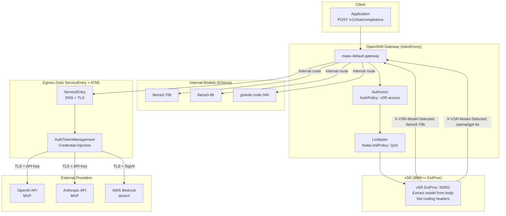
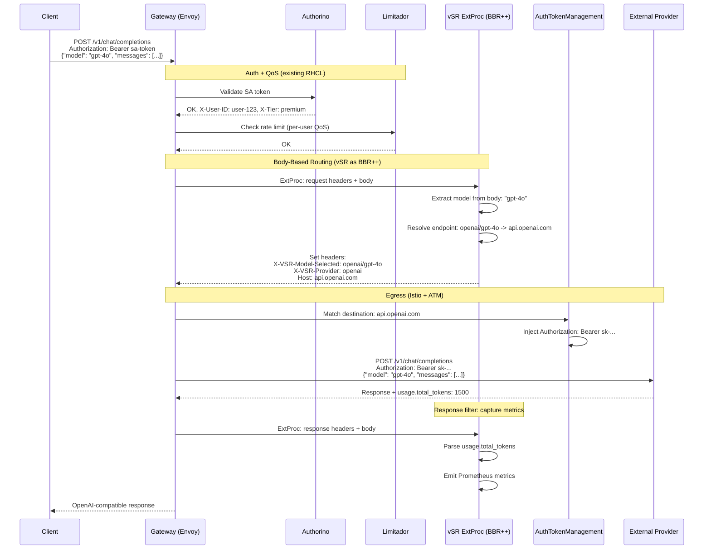

# Extending MaaS with Egress Inference and Intelligent Routing

## vSR Integration with OpenShift Gateway Egress

**Version**: 1.2
**Document Status**: Draft
**Date**: February 2026
**Author**: Noy Itzikowitz
**Release Target**: RHOAI 3.4 Developer Preview
**MVP Driver**: Wells Fargo -- egress + local model routing
**Previous Versions**: [v1.0](https://github.com/noyitz/maas-designs) (Dec 2025), [v1.1](https://github.com/noyitz/maas-designs) (Jan 2026)

---

## Executive Summary

This document describes how MaaS is extended to support external model providers (OpenAI, Anthropic, AWS Bedrock, etc.) by combining two complementary capabilities:

1. **OpenShift Gateway Egress** ([proposal by Foster/Rampal/Utt](https://docs.google.com/document/d/1...)) -- leverages existing Istio ServiceEntry and DestinationRule for connectivity and trust to external services, and introduces AuthTokenManagement (ATM) for provider credential injection. No new connectivity or trust primitives are introduced.

2. **vLLM Semantic Router (vSR)** -- provides body-based routing with semantic intelligence (BBR++), acting as a drop-in replacement for basic BBR within the gateway architecture. vSR reads the request payload, extracts the model name, classifies the request, and sets routing headers that the gateway uses to direct traffic to the correct backend (internal KServe or external provider).

The gateway handles **network plumbing** (egress connectivity, TLS, credentials). vSR handles **application intelligence** (which model to route to and why). Neither replaces the other.

**MVP scope for RHOAI 3.4 developer preview:**
- Egress to **OpenAI and Anthropic** (similar APIs, API key auth)
- vSR as BBR++ for body-based model extraction and routing
- AuthPolicy + RateLimitPolicy for access control and QoS
- Prometheus metrics capturing model selection and token usage
- AWS Bedrock and Google Gemini as stretch goals (complex auth, non-OpenAI APIs)

**Explicitly out of scope for MVP (per Feb 10 alignment):**
- Semantic cache (requires classifier models -- not for 3.4 dev preview)
- Guardrails / PII / jailbreak detection (can wait until after summit)
- Per-model RBAC and billing
- Stateful Responses API support

---

## 1. Foundation: OpenShift Gateway Egress Proposal

This design builds directly on the [Egress Inference Support for OpenShift Gateway](https://docs.google.com/document/d/1...) proposal. The gateway proposal provides four capabilities for external services:

| Capability | Mechanism | Status |
|------------|-----------|--------|
| **Connectivity and Trust** | Istio ServiceEntry + DestinationRule. Existing APIs for registering external services, configuring DNS, TLS, mTLS. No new primitives. | Existing in Istio |
| **Auth Token Management** | New AuthTokenManagement (ATM) API. Source+destination discrimination for credential injection. Built with RHCL/Kuadrant WASM + Authorino, or standalone WASM/dynamic module. | Being built by gateway team |
| **Inference API Translation** | Middleware to convert OpenAI Chat Completions to provider-native APIs (Bedrock, Anthropic, Gemini). WASM plugin or ExtProc. vSR has this capability today. | TBD -- vSR adapters available now |
| **Routing** | Header-based routing via HTTPRoute. Body-based routing (BBR) needed to extract model name from JSON payload. vSR provides BBR++. | vSR extends this |

### 1.1 What the Gateway Provides (No Changes Needed)

Istio already supports egress. For Phase 1, we leverage these existing capabilities directly:

```yaml
# ServiceEntry: register an external AI provider in the mesh
apiVersion: networking.istio.io/v1
kind: ServiceEntry
metadata:
  name: openai-api
spec:
  hosts:
    - "api.openai.com"
  location: MESH_EXTERNAL
  ports:
    - number: 443
      name: https
      protocol: TLS
  resolution: DNS
---
apiVersion: networking.istio.io/v1
kind: ServiceEntry
metadata:
  name: anthropic-api
spec:
  hosts:
    - "api.anthropic.com"
  location: MESH_EXTERNAL
  ports:
    - number: 443
      name: https
      protocol: TLS
  resolution: DNS
```

These are standard Istio resources. No new CRDs, no new controllers.

### 1.2 What the Gateway Is Building (ATM)

The gateway team is building AuthTokenManagement to passively inject provider credentials based on destination:

```yaml
# Conceptual -- exact API TBD by gateway team
apiVersion: gateway.openshift.io/v1alpha1
kind: AuthTokenManagement
metadata:
  name: openai-auth
spec:
  targetRef:
    kind: ServiceEntry
    name: openai-api
  authentication:
    type: api-key
    secretRef:
      name: openai-credentials
    headerName: "Authorization"
    headerPrefix: "Bearer "
```

This uses existing Kuadrant/Authorino patterns for source+destination token discrimination (confirmed as already supported by Sanjeev Rampal, Feb 6 meeting). The MCP gateway's Vault integration and PAT patterns are reused -- no new auth framework is designed.

### 1.3 What Is Missing: Body-Based Routing

The OpenShift Gateway today supports only **path-based and header-based routing**. It cannot examine request bodies.

OpenAI's Chat Completions API places the model name inside the JSON payload:

```json
POST /v1/chat/completions
{"model": "gpt-4o", "messages": [{"role": "user", "content": "..."}]}
```

The model name is not in the URL path or headers. Without body-based routing, the gateway cannot route this request to the correct backend. This is where vSR comes in.

---

## 2. How vSR Extends the Gateway (BBR++)

### 2.1 vSR as a Drop-In BBR Replacement

vSR operates as an Envoy ExtProc (External Processor) service. It receives the request body from Envoy, extracts the model name, and sets routing headers that the gateway uses for downstream routing.

Basic BBR extracts the model name from the payload and promotes it to a header. vSR does this **plus** semantic intelligence:

| Capability | Basic BBR | vSR (BBR++) |
|------------|-----------|-------------|
| Extract model name from JSON body | Yes | Yes |
| Promote model name to routing header | Yes | Yes |
| Semantic classification (domain, intent, complexity) | No | Yes (ModernBERT, ~20ms) |
| Intelligent model selection (best model for this query) | No | Yes (14 domain categories) |
| API translation (OpenAI -> Anthropic/Bedrock) | No | Yes (existing adapters) |
| Semantic caching | No | Yes (future -- not in MVP) |
| PII detection / jailbreak prevention | No | Yes (future -- not in MVP) |

For the RHOAI 3.4 MVP, vSR's role is focused on:
- **Body-based model extraction** and header injection
- **Model selection** when the client doesn't specify a model (or specifies a virtual model like "best")
- **API translation** for providers with non-OpenAI-compatible APIs (stretch goal)

Future extensions (post-MVP) add semantic cache, guardrails, and richer classification without changing the integration architecture.

### 2.2 Integration Architecture



### 2.3 Request Flow



### 2.4 Internal Model Flow (KServe)

When vSR routes to an internal model, the flow is simpler -- no egress or ATM involved:


### 2.5 Request Flow Headers

```http
# Client Request (same for internal and external)
POST /v1/chat/completions
Authorization: Bearer sa-token-xyz
Content-Type: application/json
{"model": "gpt-4o", "messages": [{"role": "user", "content": "Explain quantum computing"}]}

# After Auth + QoS (Authorino + Limitador)
X-User-ID: user-123
X-Tier: premium

# After vSR ExtProc (BBR++)
X-VSR-Model-Selected: openai/gpt-4o    # Extracted from body by vSR
X-VSR-Provider: openai                  # Provider type for routing + metrics
Host: api.openai.com                    # Routing target

# After ATM (gateway injects provider credentials)
Authorization: Bearer sk-proj-...       # OpenAI API key (replaces SA token)

# Response
HTTP/1.1 200 OK
{"choices": [...], "usage": {"prompt_tokens": 50, "completion_tokens": 200, "total_tokens": 250}}
```

---

## 3. Auth and QoS (Existing RHCL -- Configuration Only)

Authentication and rate limiting use existing Kuadrant/RHCL with no code changes. The only change is the policy `targetRef` points to the vSR route.

### 3.1 AuthPolicy -- vSR Access

```yaml
apiVersion: kuadrant.io/v1
kind: AuthPolicy
metadata:
  name: vsr-access-policy
  namespace: vsr-system
spec:
  targetRef:
    group: gateway.networking.k8s.io
    kind: HTTPRoute
    name: vsr-route
  rules:
    authentication:
      sa-token:
        kubernetesTokenReview:
          audiences: [vsr-api]
    metadata:
      user-tier:
        http:
          url: "http://maas-api.redhat-ods-applications.svc:8080/api/v1/tier"
          method: GET
          headers:
            Authorization:
              selector: auth.identity.token
    response:
      success:
        headers:
          x-user-id:
            plain:
              selector: auth.identity.username
          x-tier:
            plain:
              selector: auth.metadata.user-tier.tier
```

This reuses existing MCP gateway auth patterns and Kuadrant's source+destination token discrimination.

### 3.2 RateLimitPolicy -- QoS Protection

```yaml
apiVersion: kuadrant.io/v1
kind: RateLimitPolicy
metadata:
  name: vsr-qos-rate-limit
  namespace: vsr-system
spec:
  targetRef:
    group: gateway.networking.k8s.io
    kind: HTTPRoute
    name: vsr-route
  limits:
    tier-free:
      rates:
        - limit: 10
          window: 1m
      counters:
        - expression: auth.identity.username
      when:
        - predicate: auth.metadata.user-tier.tier == 'free'
    tier-premium:
      rates:
        - limit: 60
          window: 1m
      counters:
        - expression: auth.identity.username
      when:
        - predicate: auth.metadata.user-tier.tier == 'premium'
    tier-enterprise:
      rates:
        - limit: 300
          window: 1m
      counters:
        - expression: auth.identity.username
      when:
        - predicate: auth.metadata.user-tier.tier == 'enterprise'
```

Rate limits are **request-count-based only** for the MVP. Token-based rate limiting (TokenRateLimitPolicy) is deferred. QoS protects against abuse; it does not track spend.

---

## 4. vSR Model Pool Configuration

vSR's routing decisions are driven by a static `config.yaml` that maps model names to endpoints:

```yaml
# config.yaml -- model pool for Phase 1 MVP
endpoints:
  # Internal (KServe cluster services)
  llama3-70b:
    type: internal
    url: "llama3-70b.model-serving.svc.cluster.local"
  llama3-8b:
    type: internal
    url: "llama3-8b.model-serving.svc.cluster.local"
  granite-code-34b:
    type: internal
    url: "granite-code-34b.model-serving.svc.cluster.local"

  # External -- MVP (OpenAI-compatible APIs, API key auth)
  openai/gpt-4o:
    type: external
    provider: openai
    host: "api.openai.com"
  openai/gpt-4o-mini:
    type: external
    provider: openai
    host: "api.openai.com"
  anthropic/claude-sonnet:
    type: external
    provider: anthropic
    host: "api.anthropic.com"

  # External -- Stretch (non-OpenAI API, complex auth)
  bedrock/claude-sonnet:
    type: external
    provider: aws-bedrock
    host: "bedrock-runtime.us-east-1.amazonaws.com"
    model_id: "anthropic.claude-3-5-sonnet-20241022-v2:0"
```

When a client sends `{"model": "gpt-4o"}`, vSR looks up the endpoint, sets `Host: api.openai.com` and `X-VSR-Provider: openai`, and the gateway egress handles the rest.

---

## 5. Observability

### 5.1 Prometheus Metrics

vSR emits metrics from its ExtProc response filter after parsing the `usage` object from the model response:

```yaml
# Requests routed through vSR
- name: vsr_requests_total
  type: counter
  labels: [user_id, tier, model_selected, provider, status]

# Tokens consumed
- name: vsr_tokens_consumed_total
  type: counter
  labels: [user_id, tier, model_selected, provider, token_type]
  # token_type: "prompt", "completion", "total"

# External provider latency
- name: vsr_external_latency_seconds
  type: histogram
  labels: [provider, model_selected]
  buckets: [0.1, 0.25, 0.5, 1, 2.5, 5, 10, 30, 60]

# Request duration (end-to-end)
- name: vsr_request_duration_seconds
  type: histogram
  labels: [tier, model_selected, provider]
  buckets: [0.1, 0.25, 0.5, 1, 2.5, 5, 10, 30]
```

The `provider` label distinguishes internal KServe (`kserve`) from external (`openai`, `anthropic`, `aws-bedrock`), giving immediate visibility into traffic and cost distribution.

### 5.2 Grafana Panels

| Panel | Metric | Purpose |
|-------|--------|---------|
| Requests per provider (pie) | `vsr_requests_total` by `provider` | Internal vs external traffic split |
| Tokens per provider (timeseries) | `vsr_tokens_consumed_total` | Cost distribution before billing exists |
| External provider latency (heatmap) | `vsr_external_latency_seconds` | Egress performance monitoring |
| Per-user token usage (table) | `vsr_tokens_consumed_total` by `user_id` | Identify heavy users |
| Rate limit rejections (timeseries) | Limitador metrics | QoS policy effectiveness |

---

## 6. MVP Provider Support

### 6.1 MVP: OpenAI + Anthropic

These providers have similar APIs and simple API key authentication. They are the primary targets for RHOAI 3.4.

| Aspect | OpenAI | Anthropic |
|--------|--------|-----------|
| API format | OpenAI Chat Completions (native) | Similar but different field names (`input_tokens`/`output_tokens`) |
| Auth | API key in `Authorization: Bearer` header | API key in `x-api-key` header |
| ATM config | Straightforward header injection | Straightforward header injection |
| API translation needed | No (native format) | Minimal (field name mapping in response) |
| vSR adapter | Existing (`pkg/openai/`) | Existing (`pkg/anthropic/`) |

### 6.2 Stretch: AWS Bedrock

Bedrock is significantly more complex (per Sanjeev Rampal, Feb 6 + Feb 10 meetings):

| Aspect | Challenge |
|--------|-----------|
| Auth | AWS SigV4 with dynamic key generation based on time. Not a simple API key. |
| API format | Non-OpenAI-compatible. Different endpoint structure (`/model/{id}/invoke`), different body format. |
| "OpenAI-compatible" mode | Exists but differs in key/signature methods from actual OpenAI. |
| Translation layer | Full request/response transformation required. |

Bedrock support requires either the gateway's API Translation WASM plugin or vSR's adapter layer to be extended. This is a stretch goal for 3.4, with full support in a later release.

### 6.3 Stretch: Google Gemini

Similar complexity to Bedrock -- non-OpenAI API format, different auth (OAuth2 or API key), different response structure. Deferred to the same timeline as Bedrock.

---

## 7. Kubernetes Resources

```
vsr-system namespace:
├── Deployment: vsr-router               # vSR ExtProc
├── Service: vsr-extproc                 # ClusterIP, port 50051
├── Service: vsr-metrics                 # ClusterIP, port 9190
├── ServiceMonitor: vsr-metrics          # Prometheus scrape
├── ConfigMap: vsr-config                # Model pool config (config.yaml)
├── HTTPRoute: vsr-route                 # Gateway API route
├── AuthPolicy: vsr-access-policy        # Kuadrant auth (config only)
└── RateLimitPolicy: vsr-qos-rate-limit  # Kuadrant QoS (config only)

gateway namespace (gateway team owns):
├── ServiceEntry: openai-api             # Egress to api.openai.com
├── ServiceEntry: anthropic-api          # Egress to api.anthropic.com
├── AuthTokenManagement: openai-auth     # API key injection for OpenAI
├── AuthTokenManagement: anthropic-auth  # API key injection for Anthropic
├── Secret: openai-credentials           # OpenAI API key
└── Secret: anthropic-credentials        # Anthropic API key
```

---

## 8. Error Handling

Standard OpenAI-compatible error responses:

| Scenario | HTTP Status | Error Code |
|----------|------------|------------|
| Invalid SA token | 401 | `invalid_api_key` |
| Rate limit exceeded | 429 | `rate_limit_exceeded` |
| External provider error | 502 | `upstream_error` |
| External provider timeout | 504 | `gateway_timeout` |
| Model not found in pool | 404 | `model_not_found` |

No fallback logic in MVP. If the selected model is unavailable, the request fails. Intelligent fallback is a future extension.

---

## 9. Security

### 9.1 Trust Boundaries

```
UNTRUSTED: Client
  - SA token (validated by Authorino)
  - Request body (passed to vSR ExtProc)
      │
      │ Gateway strips X-VSR-* from incoming requests
      ▼
TRUSTED: Internal
  - X-User-ID, X-Tier (set by Authorino)
  - X-VSR-Model-Selected (set by vSR)
      │
      │ ATM injects provider credentials
      ▼
TRUSTED: Egress
  - Provider credentials (managed by gateway ATM, never exposed to vSR or client)
  - TLS to external provider
```

Key security properties:
- **vSR never touches provider credentials.** The gateway's ATM handles credential injection.
- **Provider credentials never reach the client.** ATM replaces the client's SA token with provider credentials at the egress boundary.
- **Gateway strips `X-VSR-*` headers** from incoming requests to prevent spoofing.

---

## 10. Team Responsibilities

| Team | Key People | Phase 1 Scope |
|------|-----------|---------------|
| **Gateway / Networking** | Shane Utt, Morgan Foster | Egress connectivity (ServiceEntry, DestinationRule). AuthTokenManagement API + controller. API Translation WASM (stretch -- for Bedrock/Gemini). |
| **vSR / Semantic Router** | Huamin Chen | ExtProc: body-based model extraction, routing header injection, Prometheus metrics. API translation adapters (OpenAI, Anthropic -- existing). Future: semantic cache, classification, guardrails. |
| **vSR Control Plane** | Ryan Cook | Operator for vSR deployment lifecycle. |
| **MaaS / RHOAI** | Roy Nissim, Noy Itzikowitz | AuthPolicy + RateLimitPolicy configuration. MaaS GA stability (dev preview does not impact GA). Customer requirements (Wells Fargo). |
| **Kuadrant / RHCL** | Guilherme Cassolato, Sanjeev Rampal | Authorino + Limitador configuration for vSR. Validate ATM aligns with existing Kuadrant patterns. |
| **API Translation** | Daniele Zonca, Sanjeev Rampal | Requirements for translation layer. Evaluate GIE (Envoy AI Gateway) components for reuse. |

### What Each Team Does NOT Own

| Team | Out of Scope |
|------|-------------|
| Gateway | Does not do model selection intelligence, semantic classification, or caching |
| vSR | Does not manage provider credentials (gateway ATM owns that). Does not build auth framework (reuses Kuadrant). |
| MaaS | Does not build new API endpoints for Phase 1. Does not modify GA code paths. |

### Critical Path

The gateway team's ATM and ServiceEntry work must be ready for vSR to route to external providers. If ATM is delayed, vSR can fall back to self-managed egress (mounting provider credential Secrets directly and handling auth in its adapters), with a clean transition to gateway-native ATM when available.

---

## 11. Future Extensions (Post-MVP)

These capabilities are designed into vSR's composable plugin architecture but are **not included in the RHOAI 3.4 dev preview**:

| Capability | Why Deferred | When |
|------------|-------------|------|
| Semantic cache | Requires classifier models -- not for 3.4 dev preview (per Jessica Forrester, Feb 10) | Post-summit |
| Guardrails (PII, jailbreak) | Can wait until after summit (per Ron Haberman, Feb 10). Must align with TrustyAI framework. | Post-summit |
| Semantic classification | Requires ModernBERT classifier. Same concern as semantic cache. | Post-summit |
| Bedrock / Gemini full support | Complex auth (SigV4) + API translation. Depends on gateway WASM or vSR adapter work. | 3.5+ |
| Per-model RBAC | Requires MaaS API `accessible-models` endpoint. | Phase 2 |
| Token-based rate limiting | Requires TokenRateLimitPolicy + response body parsing. | Phase 2 |
| Billing / cost tracking | Requires metering integration (not a feature of RHAIE today). Prometheus metrics from MVP provide data foundation. | Phase 3 |
| Stateful Responses API | Significant complexity (per Jason Greene, Feb 10). Full implementation 12+ months out. | Future |

The MVP Prometheus metrics (`vsr_tokens_consumed_total` by model, user, tier, provider) serve as the data collection period for future billing and quota policy tuning.

---

## 12. Conclusion

This design extends MaaS to support external model providers by composing two existing capabilities:

- **Istio egress** (ServiceEntry + DestinationRule) provides connectivity and trust to external services without new primitives
- **vSR ExtProc** provides body-based routing (BBR++) that the gateway cannot do today, enabling OpenAI API compatibility by extracting the model name from the request payload

The integration is minimal:
- **Zero RHCL code changes** -- AuthPolicy + RateLimitPolicy are configuration only
- **Zero MaaS API changes** -- reuses existing tier resolution
- **Zero new Istio primitives** -- uses existing ServiceEntry + DestinationRule
- **vSR scope is focused** -- body-based model extraction, routing headers, Prometheus metrics
- **Gateway team builds ATM** -- credential injection for external providers

The architecture is designed for incremental extension: semantic cache, guardrails, classification, and richer provider support are added as composable vSR plugins in future releases without changing the integration pattern.
